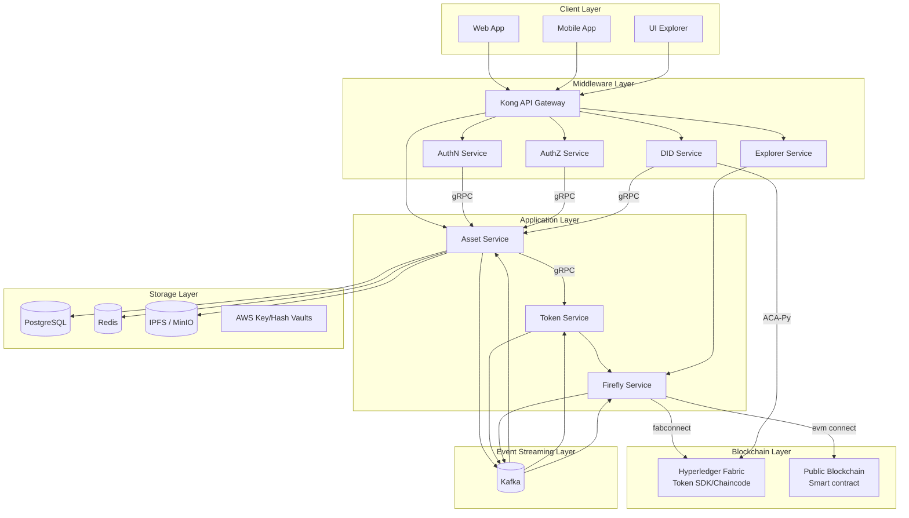
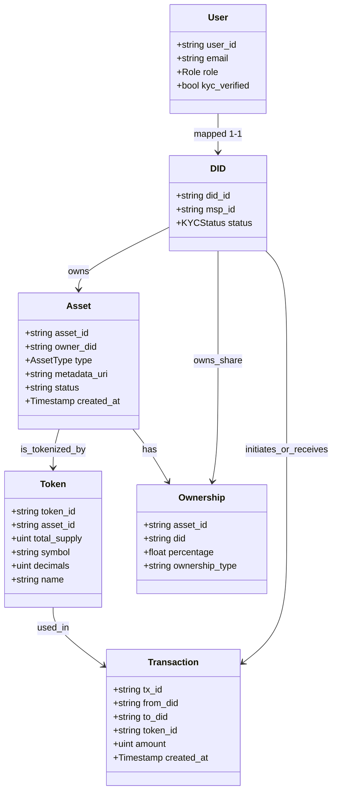
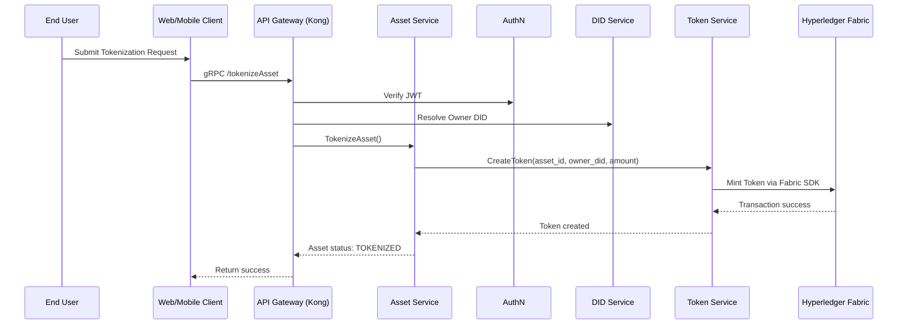
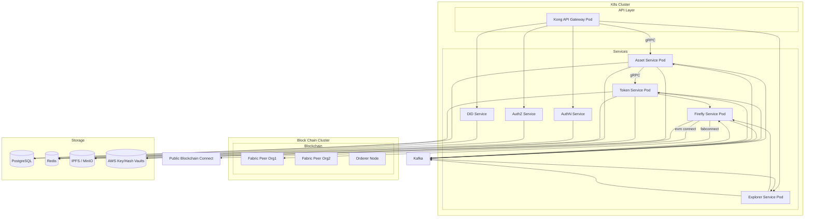

# 📐 Architecture Design Document
### Digital Asset Management System

---

## 1. 📘 Overview

Hệ thống Digital Asset Management là nền tảng quản lý, token hóa và giao dịch tài sản số, tích hợp đa tầng với các thành phần chính:
- **Client Layer:** Web App, Mobile App, UI Explorer cho người dùng cuối.
- **Middleware Layer:** API Gateway (Kong), AuthN/AuthZ Service, DID Service, Explorer Service giúp chuẩn hóa, xác thực và phân quyền truy cập.
- **Application Layer:** Asset Service, Token Service, Firefly Service (cầu nối blockchain), xử lý nghiệp vụ tài sản, token hóa, kết nối blockchain.
- **Blockchain Layer:** Hyperledger Fabric (private), Public Blockchain (smart contract) cho lưu trữ, xác thực giao dịch on-chain.
- **Storage Layer:** PostgreSQL, Redis, IPFS/MinIO, AWS Key/Hash Vaults cho lưu trữ dữ liệu, file, khóa bảo mật.
- **Event Streaming Layer:** Kafka hỗ trợ giao tiếp sự kiện bất đồng bộ giữa các service.

Hệ thống hỗ trợ:
- Token hóa tài sản vật lý/số, quản lý quyền sở hữu, giao dịch minh bạch.
- Xác thực định danh phi tập trung (DID), phân quyền RBAC, bảo mật mTLS.
- Tích hợp đa blockchain (Fabric, Public Chain) qua Firefly Service.
- Chuẩn hóa dữ liệu cho UI/Explorer, hỗ trợ truy vấn lịch sử, trạng thái tài sản.
- Mở rộng dễ dàng với event-driven, microservices, cloud-native.

---

## 2. 🧱 Kiến trúc tầng (Layered Architecture)

---

## 3. 🧩 Component Design

### 3.1 Gateway (Kong)
- API routing, rate limit, auth enforcement
- Swagger/OpenAPI exposure

### 3.2 AuthN / AuthZ
- JWT issuance and validation
- Role-Based Access Control (RBAC)
- Session & token management (via Redis)

### 3.3 DID Service
- Tích hợp với ACA-Py & AnonCreds
- Quản lý định danh DID, định danh người dùng và chứng chỉ
- Tạo/mapping định danh với keystore Hyperledger Fabric (MSP ID)

### 3.4 Asset Service
- Quản lý vòng đời tài sản: tạo, cập nhật, yêu cầu sửa
- Xác minh quyền sở hữu thông qua DID
- Giao tiếp với Token Service để thực hiện token hóa
- Gửi/nhận sự kiện qua gRPC

### 3.5 Token Service
- Tạo và quản lý token đại diện tài sản
- Thực hiện các hành vi: mint, burn, transfer
- Giao tiếp gRPC với Asset Service và Blockchain layer

### 3.6 Fabric Blockchain Layer
- Hyperledger Fabric RAFT-based network
- Token SDK for managing token logic
- Chaincode viết bằng Golang

### 3.7 Firefly Service
- Đóng vai trò cầu nối giữa Token Service và các blockchain (Fabric, Public Blockchain)
- Chuẩn hóa, chuyển tiếp giao dịch token hóa, chuyển token, ghi nhận sự kiện on-chain/off-chain
- Kết nối với Fabric qua fabconnect, với Public Blockchain qua evm connect
- Hỗ trợ gửi/nhận sự kiện bất đồng bộ qua Kafka

### 3.8 Explorer Service
- Cung cấp API tổng hợp, chuẩn hóa dữ liệu cho UI Explorer
- Truy vấn, tổng hợp dữ liệu từ các service khác (Asset, Token, Firefly)
- Hỗ trợ các truy vấn lịch sử, trạng thái, sự kiện tài sản/token cho người dùng cuối

### 3.9 Public Blockchain
- Lưu trữ, xác thực các giao dịch công khai, minh bạch
- Triển khai smart contract cho các nghiệp vụ mở rộng (nếu có)
- Kết nối với Firefly Service qua evm connect

### 3.10 AWS Key/Hash Vaults
- Lưu trữ khóa bí mật, hash, chứng chỉ an toàn
- Đảm bảo bảo mật cho các thao tác ký số, mã hóa dữ liệu
- Tích hợp với các service cần truy xuất khóa (Asset, Token, Firefly...)

### 3.x 🗂️ Domain Model Diagram theo Layered Architecture

Sơ đồ dưới đây mô tả các thực thể chính và phân lớp theo kiến trúc tầng:

**Chú thích:**
- **Client Layer:** User
- **Middleware Layer:** DID
- **Application Layer:** Asset, Token, Ownership
- **Blockchain Layer:** Transaction
- Các mối quan hệ thể hiện luồng dữ liệu và quyền sở hữu giữa các tầng.

---

## 4. 🗄️ Data & Storage Design

| Layer | Tech | Purpose |
|-------|------|---------|
| Database | PostgreSQL | Tài sản, lịch sử, trạng thái |
| Cache | Redis | Session, caching real-time data |
| Storage | IPFS / MinIO | File đính kèm, chứng chỉ, metadata |

---

## 5. 📡 Protocols & Communication

| Service | Protocol | Description |
|---------|----------|-------------|
| Frontend → Gateway | HTTPS (REST/gRPC-web) | Truy cập dịch vụ backend |
| Gateway → Services | gRPC | Hiệu suất cao, typed APIs |
| Token ↔ Fabric | Fabric SDK | Submit & query transaction |
| DID ↔ ACA-Py | HTTPS (REST) | API định danh với Aries agent |

---

## 6. 🔒 Security Considerations

- mTLS giữa các service (gRPC mutual TLS)
- Token validation tại gateway và middleware
- DID resolution + validation để gắn identity
- RBAC enforced by AuthZ per route & action
- Audit log với trace ID theo chuẩn JSON logging

---

## 7. 📈 Scalability

- Horizontal scaling: gateway, services
- Independent deployment: Asset / Token service
- Stateless gRPC services + Redis session caching
- Asynchronous events: chuẩn bị tích hợp Kafka / NATS

---

## 8. 🔄 Sequence Diagrams

### 8.1 Asset Tokenization Flow

---

## 9. 🖥️ Deployment Diagram

## 10. Optional Extensions

| Diagram | Description |
|---------|-------------|
| ✅ Use Case Diagram | Đã thể hiện ở RD |
| ✅ Component Diagram | Bao phủ trong phần "Component Design" |
| ✅ Domain Model Diagram | Đã bổ sung, làm rõ các thực thể: Asset, Token, DID, User, Transaction, Ownership |
| ✅ Event Flow Diagram | Đã bổ sung, minh họa các event chính (AssetCreated, TokenMinted, OwnershipTransferred...) và các service liên quan qua Kafka |
| ✅ Metrics / Logging Flow | Đã mô tả trong phần Monitoring |
| ⏳ Public Blockchain Integration | Mở rộng tích hợp các smart contract, bridge, oracle với public chain qua Firefly |
| ⏳ Key/Hash Vault Integration | Bổ sung các luồng bảo mật, quản lý khóa, ký số qua AWS Key/Hash Vaults |
| ⏳ Explorer/Analytics Extension | Mở rộng dashboard, truy vấn lịch sử, phân tích dữ liệu tài sản/token cho người dùng cuối |