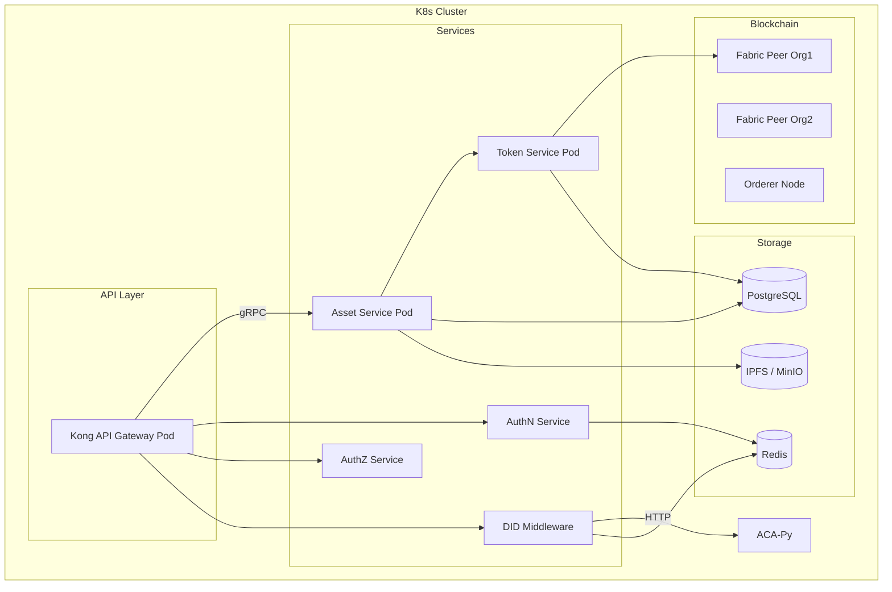

# 📐 Architecture Design Document
### Digital Asset Management System

---

## 1. 📘 Overview

Hệ thống Digital Asset Management gồm các thành phần phục vụ:
- Token hóa tài sản (Asset Tokenization)
- Xác thực định danh DID
- Phân quyền và xác thực người dùng
- Tương tác với blockchain Hyperledger Fabric
- Lưu trữ dữ liệu off-chain: metadata, tài liệu, cache

---

## 2. 🧱 Kiến trúc tầng (Layered Architecture)

```mermaid
graph TD
    subgraph "Client Layer"
        Web[Web App]
        Mobile[Mobile App]
        API[API Client]
    end

    subgraph "Middleware Layer"
        Gateway[Kong API Gateway]
        AuthN[AuthN Service]
        AuthZ[AuthZ Service]
        DID[DID Middleware (ACA-Py)]
    end

    subgraph "Application Layer"
        Asset[Asset Service]
        Token[Token Service]
    end

    subgraph "Blockchain Layer"
        Fabric[Hyperledger Fabric + Token SDK]
    end

    subgraph "Storage Layer"
        DB[(PostgreSQL)]
        Cache[(Redis)]
        Storage[(IPFS / MinIO)]
    end

    Web --> Gateway
    Mobile --> Gateway
    API --> Gateway

    Gateway --> AuthN
    Gateway --> AuthZ
    Gateway --> Asset
    Gateway --> DID

    AuthN --> Asset
    AuthZ --> Asset
    DID --> Asset

    Asset --> Token
    Token --> Fabric

    Asset --> DB
    Asset --> Cache
    Asset --> Storage
    DID -->|via ACA-Py| Fabric
```

---

## 3. 🧩 Component Design

### 3.1 Gateway (Kong)
- API routing, rate limit, auth enforcement
- Swagger/OpenAPI exposure

### 3.2 AuthN / AuthZ
- JWT issuance and validation
- Role-Based Access Control (RBAC)
- Session & token management (via Redis)

### 3.3 DID Middleware
- Tích hợp với ACA-Py & Indy
- Quản lý định danh DID, định danh người dùng và chứng chỉ
- Tạo/mapping định danh với keystore Hyperledger Fabric (MSP ID)

### 3.4 Asset Service
- Quản lý vòng đời tài sản: tạo, cập nhật, yêu cầu sửa
- Xác minh quyền sở hữu thông qua DID
- Giao tiếp với Token Service để thực hiện token hóa
- Gửi/nhận sự kiện qua gRPC

### 3.5 Token Service
- Tạo và quản lý token đại diện tài sản
- Thực hiện các hành vi: mint, burn, transfer
- Giao tiếp gRPC với Asset Service và Blockchain layer

### 3.6 Fabric Blockchain Layer
- Hyperledger Fabric RAFT-based network
- Token SDK for managing token logic
- Chaincode viết bằng Golang

---

## 4. 🗄️ Data & Storage Design

| Layer | Tech | Purpose |
|-------|------|---------|
| Database | PostgreSQL | Tài sản, lịch sử, trạng thái |
| Cache | Redis | Session, caching real-time data |
| Storage | IPFS / MinIO | File đính kèm, chứng chỉ, metadata |

---

## 5. 📡 Protocols & Communication

| Service | Protocol | Description |
|---------|----------|-------------|
| Frontend → Gateway | HTTPS (REST/gRPC-web) | Truy cập dịch vụ backend |
| Gateway → Services | gRPC | Hiệu suất cao, typed APIs |
| Token ↔ Fabric | Fabric SDK | Submit & query transaction |
| DID ↔ ACA-Py | HTTPS (REST) | API định danh với Aries agent |

---

## 6. 🔒 Security Considerations

- mTLS giữa các service (gRPC mutual TLS)
- Token validation tại gateway và middleware
- DID resolution + validation để gắn identity
- RBAC enforced by AuthZ per route & action
- Audit log với trace ID theo chuẩn JSON logging

---

## 7. 📈 Scalability

- Horizontal scaling: gateway, services
- Independent deployment: Asset / Token service
- Stateless gRPC services + Redis session caching
- Asynchronous events: chuẩn bị tích hợp Kafka / NATS

---

## 8. 🔄 Sequence Diagrams

### 8.1 Asset Tokenization Flow


---

## 9. 🖥️ Deployment Diagram



---

## 10. Optional Extensions

| Diagram | Description |
|---------|-------------|
| ✅ Use Case Diagram | Đã thể hiện ở RD |
| ✅ Component Diagram | Bao phủ trong phần "Component Design" |
| ⏳ Domain Model Diagram | Có thể thêm nếu cần xác định rõ các thực thể: Asset, Token, DID |
| ⏳ Event Flow Diagram | Đề xuất thêm khi có Kafka / NATS tích hợp |
| ✅ Metrics / Logging Flow | Đã mô tả trong phần Monitoring
