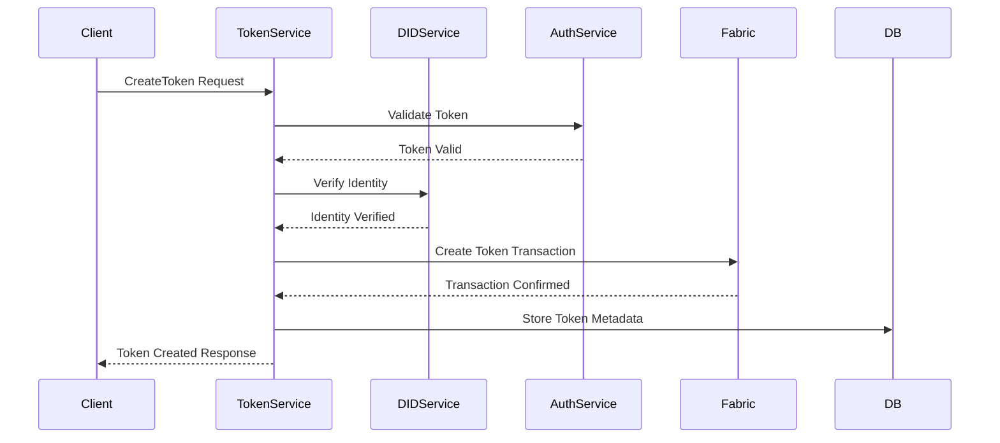
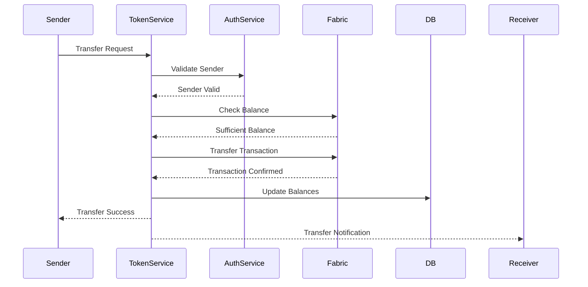
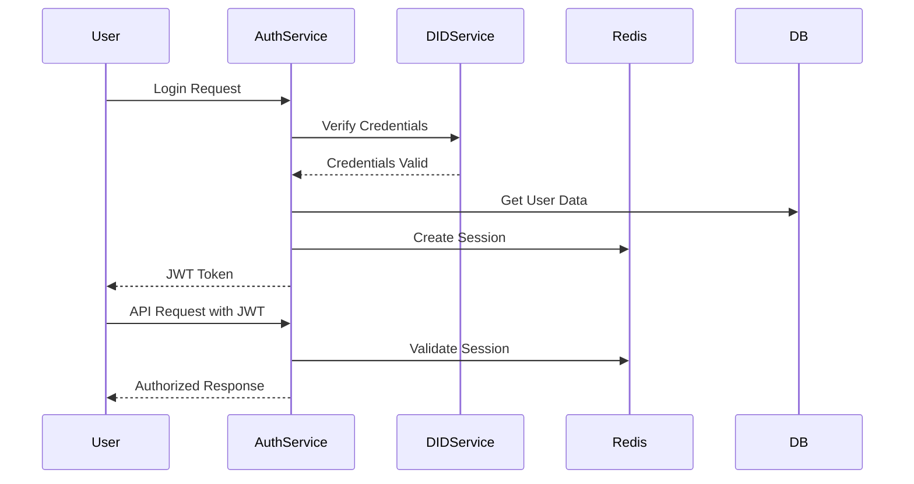
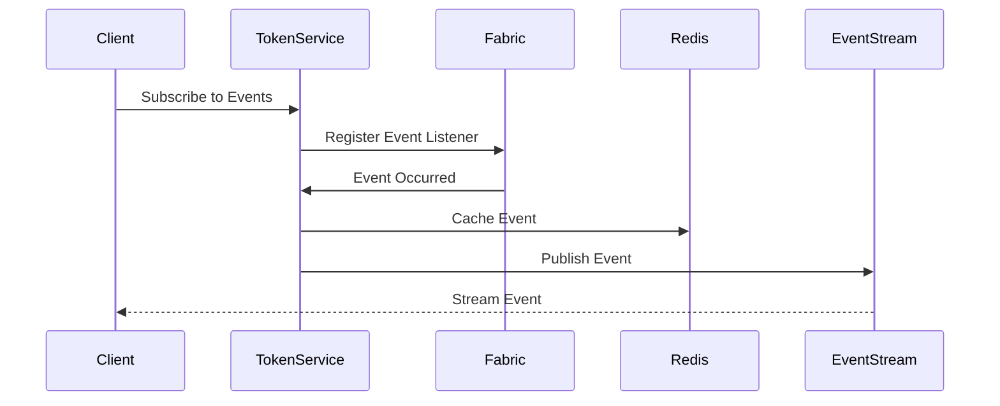
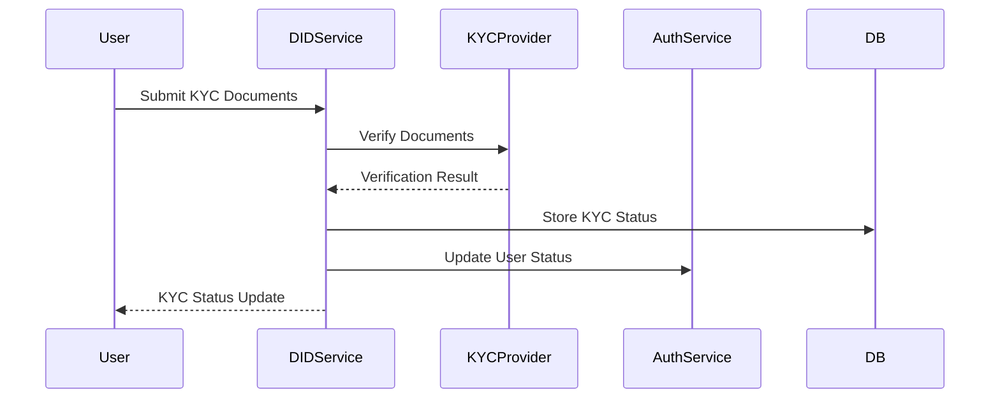
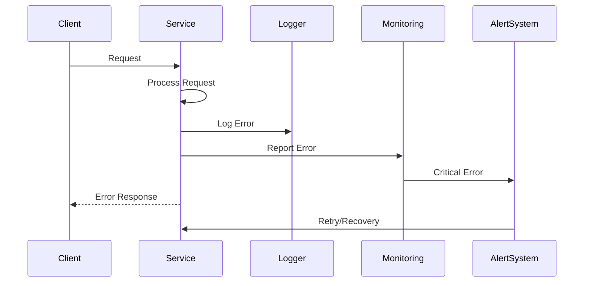
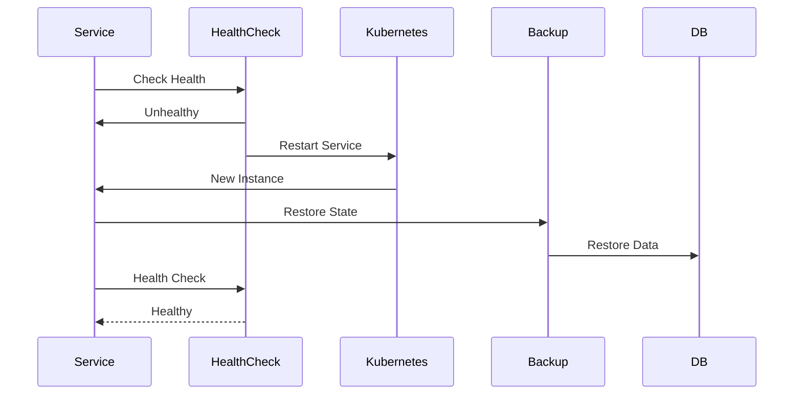

# Flow Diagram - Digital Asset Management System

## 1. Token Creation Flow

## 2. Token Transfer Flow

## 3. Authentication Flow

## 4. Real-time Event Flow

## 5. KYC/AML Flow

## 6. Error Handling Flow

## 7. System Recovery Flow

*Last Updated: 31/05/2025* 