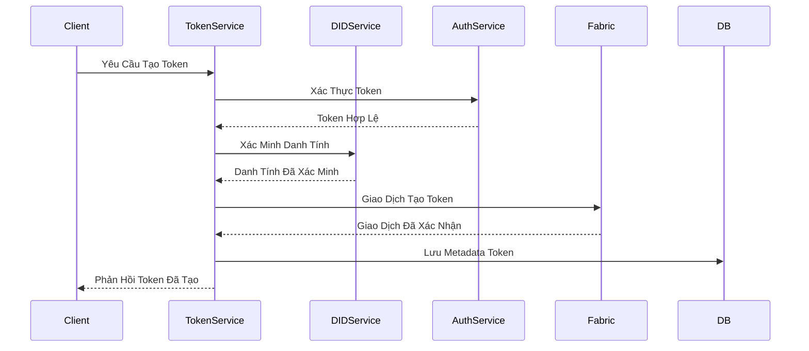
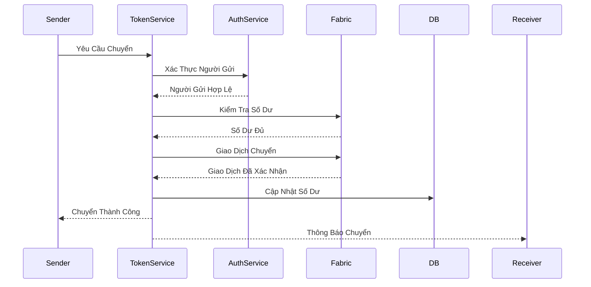
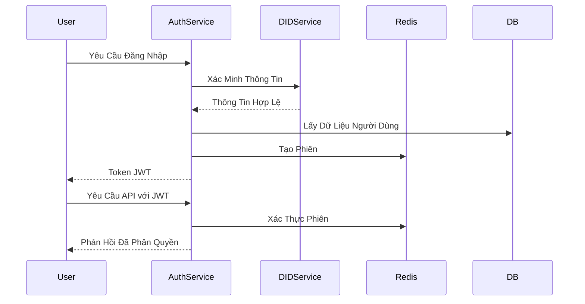
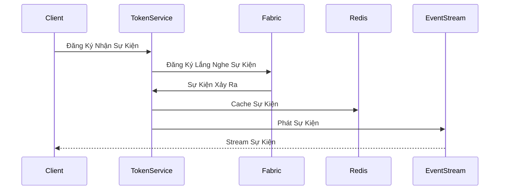
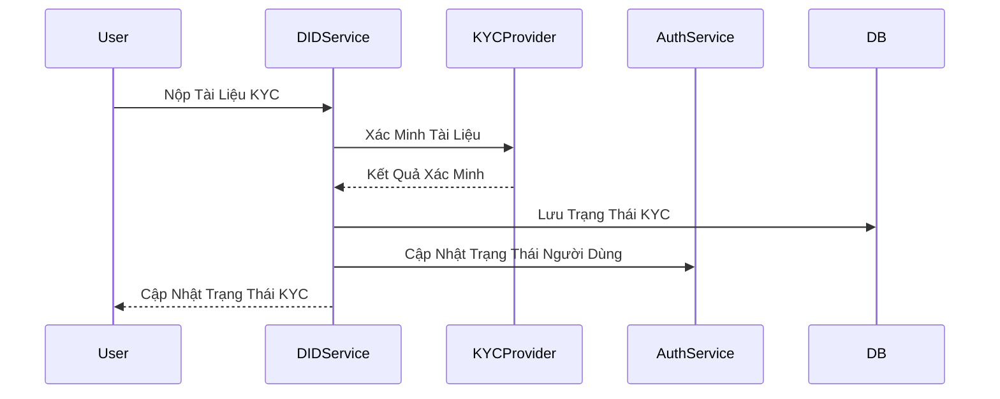
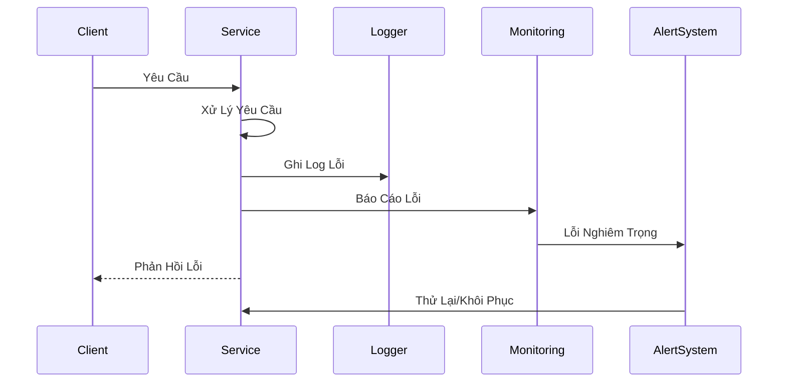
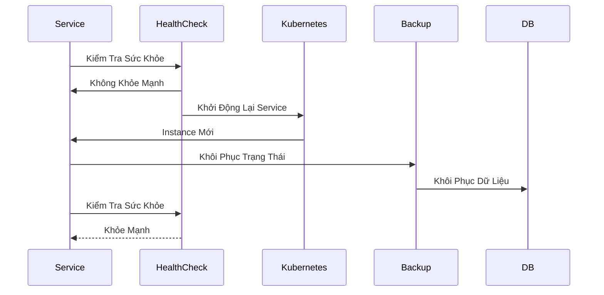

# Sơ Đồ Luồng - Hệ Thống Quản Lý Tài Sản Số

## 1. Luồng Tạo Token

## 2. Luồng Chuyển Token

## 3. Luồng Xác Thực

## 4. Luồng Sự Kiện Thời Gian Thực

## 5. Luồng KYC/AML

## 6. Luồng Xử Lý Lỗi

## 7. Luồng Khôi Phục Hệ Thống

*Cập nhật: 31/05/2025* 