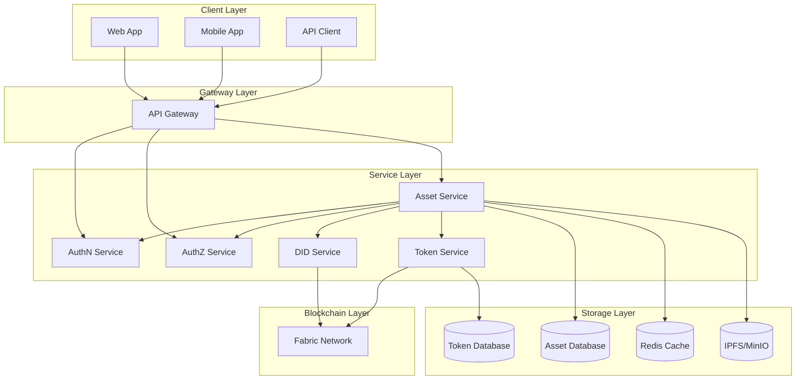

# Functional Requirements Document - Digital Asset Management System

## Table of Contents
1. [Overview](#1-overview)
2. [System Architecture](#2-system-architecture)
3. [Functional Requirements](#3-functional-requirements)
4. [Non-Functional Requirements](#4-non-functional-requirements)
5. [Service Interfaces](#5-service-interfaces)
6. [User Roles and Permissions](#6-user-roles-and-permissions)
7. [Business Processes](#7-business-processes)
8. [Deployment and Operations](#8-deployment-and-operations)
9. [Future Scope](#9-future-scope)

## 1. Overview

### 1.1 Objectives
Build a digital asset management system (Digital Asset Service) integrated with authentication and authorization services, supporting the tokenization and management of traditional assets such as real estate, certificates of deposit, and investment funds.

### 1.2 Scope
- Tokenization of physical and financial assets
- Ownership and transaction management
- Integration with AuthN Service for user authentication
- Integration with AuthZ Service for access control
- Integration with DID Service for identity management

### 1.3 Target Users
- Asset owners
- Investors
- System administrators
- Partners and third parties

## 2. System Architecture

### 2.1 High-Level Architecture



### 2.2 Detailed Architecture


## 3. Functional Requirements

### 3.1 Asset Management
- Create and update asset information
- Tokenize assets
- Manage ownership
- Track asset status
- Handle rejection and modification requests:
  - Permissioned rejection/modification
  - Manage reasons for rejection/modification
  - Track number of rejections and modifications
  - Automatic notifications to stakeholders
  - Store change and feedback history
- Fractional asset management:
  - Split assets into smaller fractions
  - Map each fraction to owner DID
  - Track ownership ratio for each DID
  - Support individual fraction transfers

### 3.2 Token Management
- Mint tokens
- Burn tokens
- Transfer tokens
- Manage balances
- Transaction history

### 3.3 User Management
- Registration and authentication
- Access control
- Identity management
- KYC/AML

### 3.4 Transactions
- Execute asset transfer transactions
- Transaction confirmation

## 4. Non-Functional Requirements

### 4.1 Performance
- Average API response time < 500ms
- System handles > 1000 concurrent requests/sec for asset metadata and business flows
- Asset status update latency after Token Service call < 2s

### 4.2 Security
- End-to-end encryption (TLS/mTLS between services)
- Multi-factor authentication (MFA) for admin users
- RBAC/ABAC access control (role and DID based)
- Audit logging for critical actions:
  - Asset creation/update/deletion
  - Tokenization activation
  - Asset approval
  - Metadata updates
  - Asset state changes
  - Rejection and modification requests
- Permission checks via AuthZ before asset operations

### 4.3 Scalability
- Independent horizontal scaling for Asset Service via Kubernetes
- API Gateway load balancing
- Event-driven optimization for Token Service calls to reduce coupling
- Optional message broker (Kafka/NATS) for async processing: audit, asset status update after tokenization

### 4.4 Reliability
- High Availability (HA)
- Automatic recovery (pod restart, liveness probe)
- Regular backup of asset metadata (DB + IPFS/MinIO)
- Disaster Recovery (DR) support

## 5. Service Interfaces

### 5.1 Asset ↔ AuthN Interface

### 5.2 Asset ↔ AuthZ Interface

```protobuf
service AuthZService {
    // Check access permission
    rpc CheckPermission(CheckPermissionRequest) returns (CheckPermissionResponse);
    // Get user permissions
    rpc GetUserPermissions(GetUserPermissionsRequest) returns (GetUserPermissionsResponse);
    // Check asset ownership
    rpc CheckAssetOwnership(CheckAssetOwnershipRequest) returns (CheckAssetOwnershipResponse);
}

message CheckPermissionRequest {
    string user_id = 1;
    string resource = 2;
    string action = 3;
}

message CheckPermissionResponse {
    bool allowed = 1;
    string reason = 2;
}

message GetUserPermissionsRequest {
    string user_id = 1;
}

message GetUserPermissionsResponse {
    repeated string permissions = 1;
    map<string, string> constraints = 2;
}

message CheckAssetOwnershipRequest {
    string user_id = 1;
    string asset_id = 2;
}

message CheckAssetOwnershipResponse {
    bool is_owner = 1;
    string ownership_type = 2; // FULL, PARTIAL, NONE
    double ownership_percentage = 3;
}
```

### 5.3 Asset ↔ Token Service Interface

// ... (gRPC interface as in Vietnamese version) ...

## 6. User Roles and Permissions

// ... (role definitions and permissions as in Vietnamese version) ...

## 7. Business Processes

### 7.1 Asset Tokenization Process

// ... (sequence diagram and description as in Vietnamese version) ...

### 7.2 Transaction Process

// ... (sequence diagram and description as in Vietnamese version) ...

## 8. Deployment and Operations

### 8.1 Deployment Requirements
- Kubernetes cluster
- Hyperledger Fabric network
- Database cluster
- Monitoring system

### 8.2 Operational Procedures
- Monitoring and alerting
- Backup and restore
- Scaling and load balancing
- Security patching

#### 8.2.1 Monitoring with Prometheus + Grafana

##### 8.2.1.1 Metrics to Monitor
- Service Metrics: request rate, response time, error rate, uptime, resource usage, audit log volume/retention
- Token Metrics: mint rate, transfer volume, burn rate, active holders, transaction latency
- Blockchain Metrics: throughput, block confirmation, network latency, peer status, chaincode performance
- Business Metrics: daily active users, transaction volume, asset tokenization rate, user growth, error distribution

##### 8.2.1.2 Prometheus Configuration
// ... (Prometheus YAML as in Vietnamese version) ...

##### 8.2.1.3 Grafana Dashboards
// ... (dashboard descriptions as in Vietnamese version) ...

##### 8.2.1.4 Alerting Rules
// ... (alerting YAML as in Vietnamese version) ...

##### 8.2.1.5 Monitoring Architecture
// ... (Mermaid diagram as in Vietnamese version) ...

##### 8.2.1.6 Implementation Notes
- Use Prometheus client libraries
- Implement custom business metrics
- Optimize sampling rate
- Configure retention policy
- Ensure audit logs are securely stored and immutable

- Audit Log Management:
  - Store audit logs in a separate system (Elasticsearch/OpenSearch)
  - Configure retention policy (min 7 years)
  - Implement log rotation and archival
  - Encrypt audit log data
  - Regular audit log backups
  - Alert on unusual metadata/state changes
  - Dashboard for audit log volume and patterns

### 8.3 Deployment Plan
- Phase 1: Core services
- Phase 2: Token management
- Phase 3: Trading features
- Phase 4: Advanced features

## 9. Future Scope

The following features/modules will be considered for future development phases:

- **Profit Distribution/Dividend**
- **Voting / Ownership-based Governance**
- **Compliance Service**
- **Order Service** (order book, matching, on-exchange trading)
- **Marketplace** (asset trading, fraction trading, order placement)

These topics will be detailed in future document updates as the system expands.

*Last Updated: 31/05/2025* 