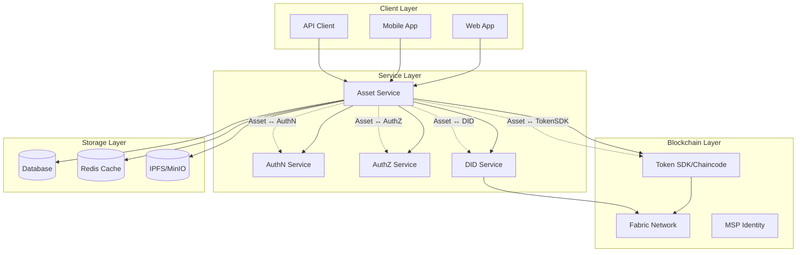
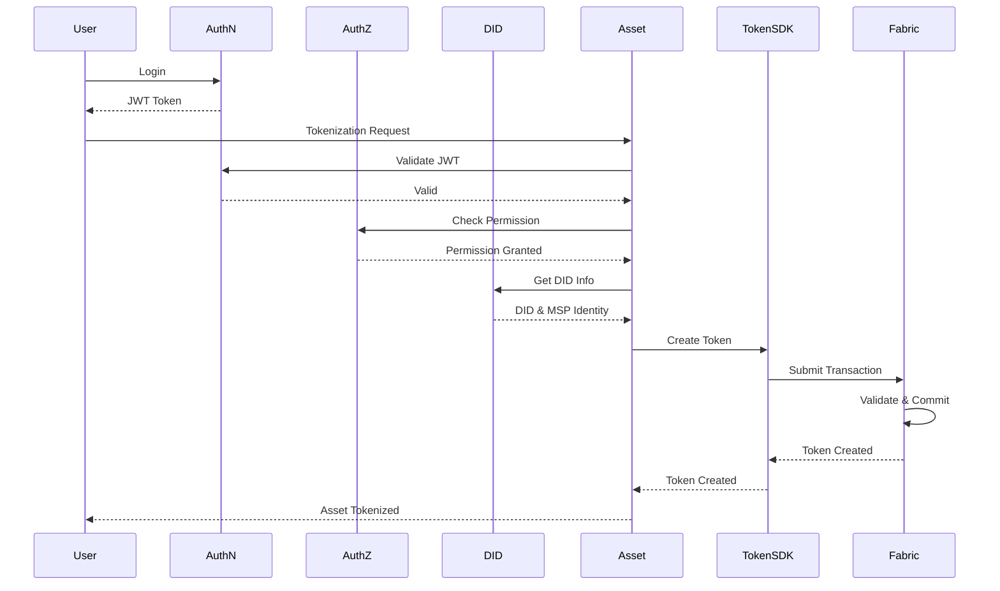
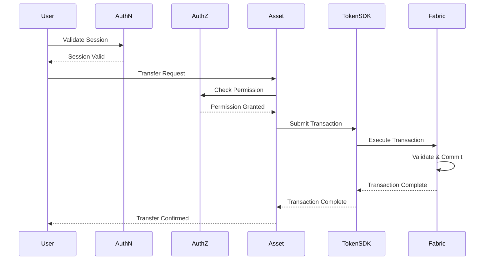
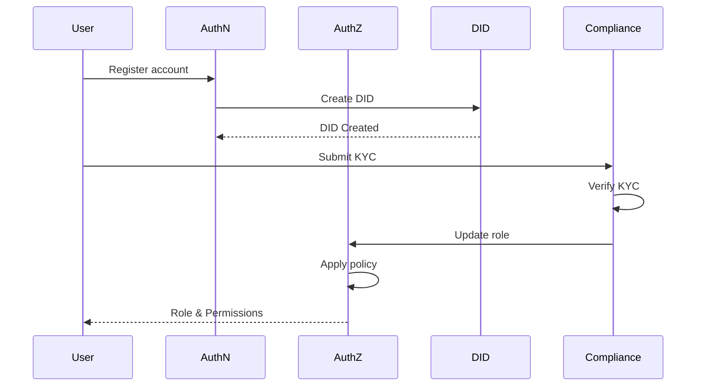
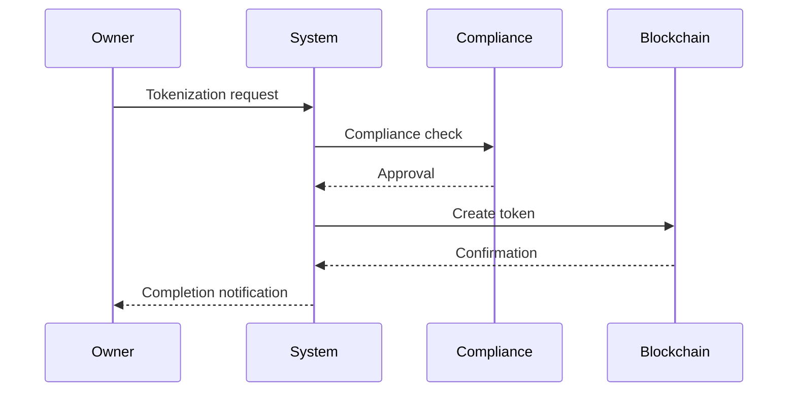
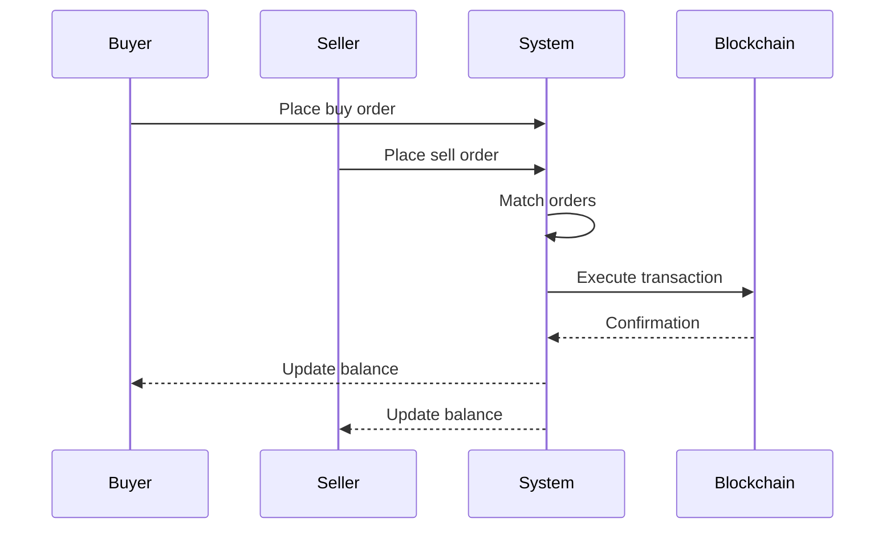
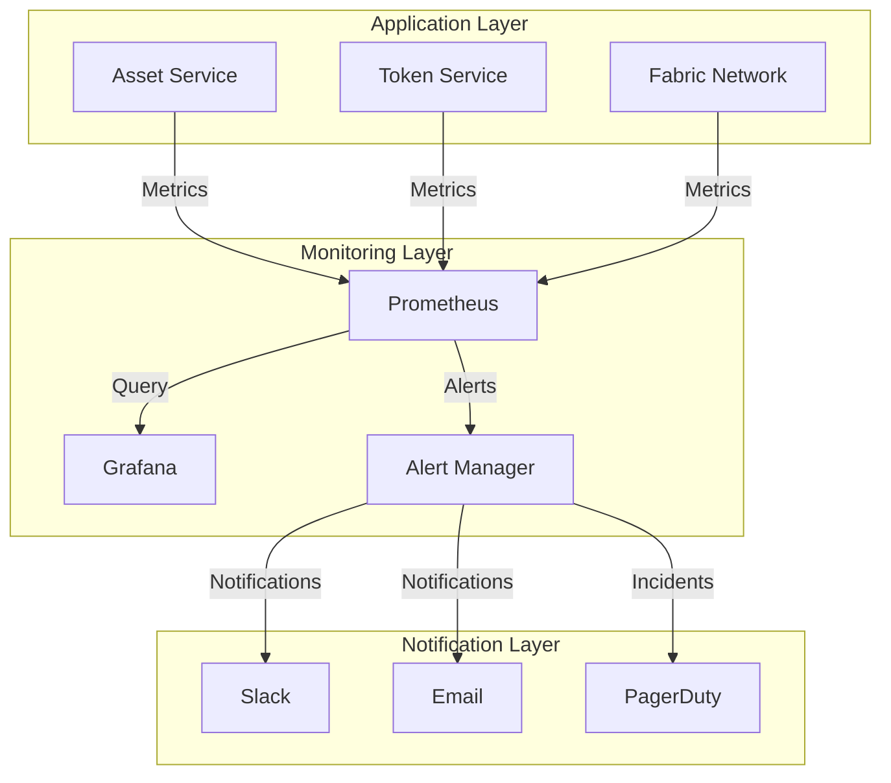

# Functional Requirements Document - Digital Asset Management System

## Table of Contents
1. [Overview](#1-overview)
2. [System Architecture](#2-system-architecture)
3. [Functional Requirements](#3-functional-requirements)
4. [Non-Functional Requirements](#4-non-functional-requirements)
5. [Service Interfaces](#5-service-interfaces)
6. [User Roles and Permissions](#6-user-roles-and-permissions)
7. [Business Processes](#7-business-processes)
8. [Deployment and Operations](#8-deployment-and-operations)

## 1. Overview

### 1.1 Objectives
Build a Digital Asset Service integrated with authentication and authorization services, supporting the tokenization and management of traditional assets such as real estate, certificates of deposit, and investment funds.

### 1.2 Scope
* Tokenization of physical and financial assets
* Ownership and transaction management
* Integration with AuthN Service for user authentication
* Integration with AuthZ Service for access control
* Integration with DID Service for identity management

### 1.3 Target Users
* Asset owners
* Investors
* System administrators
* Partners and third parties

## 2. System Architecture

### 2.1 System Overview



### 2.2 Core Components
* **Asset Service**: 
  * Asset information and metadata management
  * DID verification for asset owners during creation and updates
  * Initiates tokenization process by calling Token Service when assets are approved
  * Records asset information (metadata hash, approval events) on Fabric if immutability is required
  * Manages asset lifecycle states (Draft → Submitted → Approved/Rejected/AwaitingFix → Tokenized → Archived)
  * Tracks and synchronizes token status through events from Token Service
  * Logs audit for all metadata and state changes with information:
    - Change timestamp
    - Actor (DID)
    - Change type (metadata/state)
    - Old and new values
    - Change reason
    - Transaction hash (if applicable)
    - IP address and user agent
    - Session ID
  * Handles Rejected and AwaitingFix states:
    - Allows state transition from Submitted → Rejected/AwaitingFix
    - Requires rejection reason or modification request
    - Notifies asset owner
    - Allows owner to update and resubmit from AwaitingFix state
    - Maintains history of rejections and modification requests

* **Token Service**:
  * Responsible for entire token lifecycle (mint, burn, transfer, query balance, transaction history)
  * Direct interaction with Hyperledger Fabric through standard ERC-20 chaincode or Token SDK module
  * Receives tokenization requests from Asset Service and verifies DID before minting
  * Records token transactions and balances in dedicated storage (PostgreSQL or MongoDB for fast queries)
  * Supports extensions: Marketplace (order placement), Staking, Dividend/Profit distribution management
  * Provides gRPC/REST interface for other services (Asset, Wallet, Marketplace) to access token data

* **Token SDK/Chaincode**:
  * Provides basic token functions (mint, transfer, burn)
  * Manages token state on blockchain
  * Validates token transactions
  * Integrates with Fabric Network

* **AuthN Service**:
  * User authentication
  * Session management
  * JWT issuance

* **AuthZ Service**:
  * Access control
  * Role management
  * Permission checking

* **DID Service**:
  * Identity management
  * KYC verification
  * MSP Identity issuance

### 2.3 Asset Processing Flow



### 2.4 Transaction Flow



## 5. Service Interfaces

### 5.1 Asset ↔ AuthN Interface

```protobuf
service AuthNService {
    // Validate JWT token
    rpc ValidateToken(ValidateTokenRequest) returns (ValidateTokenResponse);
    
    // Get user information from token
    rpc GetUserInfo(GetUserInfoRequest) returns (GetUserInfoResponse);
    
    // Validate session
    rpc ValidateSession(ValidateSessionRequest) returns (ValidateSessionResponse);
}

message ValidateTokenRequest {
    string jwt_token = 1;
}

message ValidateTokenResponse {
    bool is_valid = 1;
    string user_id = 2;
    repeated string roles = 3;
    int64 expires_at = 4;
}

message GetUserInfoRequest {
    string user_id = 1;
}

message GetUserInfoResponse {
    string user_id = 1;
    string email = 2;
    string full_name = 3;
    repeated string roles = 4;
    bool is_active = 5;
}

message ValidateSessionRequest {
    string session_id = 1;
}

message ValidateSessionResponse {
    bool is_valid = 1;
    string user_id = 2;
    int64 expires_at = 3;
}
```

### 5.2 Asset ↔ AuthZ Interface

```protobuf
service AuthZService {
    // Check access permission
    rpc CheckPermission(CheckPermissionRequest) returns (CheckPermissionResponse);
    
    // Get user's permissions
    rpc GetUserPermissions(GetUserPermissionsRequest) returns (GetUserPermissionsResponse);
    
    // Check asset ownership
    rpc CheckAssetOwnership(CheckAssetOwnershipRequest) returns (CheckAssetOwnershipResponse);
}

message CheckPermissionRequest {
    string user_id = 1;
    string resource = 2;
    string action = 3;
}

message CheckPermissionResponse {
    bool allowed = 1;
    string reason = 2;
}

message GetUserPermissionsRequest {
    string user_id = 1;
}

message GetUserPermissionsResponse {
    repeated string permissions = 1;
    map<string, string> constraints = 2;
}

message CheckAssetOwnershipRequest {
    string user_id = 1;
    string asset_id = 2;
}

message CheckAssetOwnershipResponse {
    bool is_owner = 1;
    string ownership_type = 2; // FULL, PARTIAL, NONE
    double ownership_percentage = 3;
}
```

### 5.3 Asset ↔ DID Interface

```protobuf
service AssetService {
    // Create new asset
    rpc CreateAsset(CreateAssetRequest) returns (CreateAssetResponse);
    
    // Update asset information
    rpc UpdateAsset(UpdateAssetRequest) returns (UpdateAssetResponse);
    
    // Get asset information
    rpc GetAsset(GetAssetRequest) returns (GetAssetResponse);
    
    // Verify ownership
    rpc VerifyOwnership(VerifyOwnershipRequest) returns (VerifyOwnershipResponse);
}

message CreateAssetRequest {
    string owner_did = 1;
    AssetType asset_type = 2;
    string metadata_uri = 3;
    map<string, string> properties = 4;
}

message CreateAssetResponse {
    string asset_id = 1;
    string token_id = 2;
    string status = 3;
}

enum AssetType {
    REAL_ESTATE = 0;
    CERTIFICATE_OF_DEPOSIT = 1;
    INVESTMENT_FUND = 2;
    STABLECOIN = 3;
}
```

### 5.4 Asset ↔ Token Service Interface

#### 5.4.1 Objectives
- **Asset Service**: manages metadata and asset lifecycle states
- **Token Service**: responsible for tokenization, token transactions, and compliance

#### 5.4.2 gRPC Interface: Token Service

```protobuf
service TokenService {
    rpc RequestTokenization(RequestTokenizationRequest) returns (RequestTokenizationResponse);
    rpc GetTokenizationStatus(GetTokenizationStatusRequest) returns (GetTokenizationStatusResponse);
    rpc GetTokenInfo(GetTokenInfoRequest) returns (GetTokenInfoResponse);
    rpc UpdateTokenState(UpdateTokenStateRequest) returns (UpdateTokenStateResponse);
    rpc ValidateCompliance(ValidateComplianceRequest) returns (ValidateComplianceResponse);
    rpc UpdateComplianceStatus(UpdateComplianceStatusRequest) returns (UpdateComplianceStatusResponse);
}

message RequestTokenizationRequest {
    string asset_id = 1;
    string owner_did = 2;
    TokenType token_type = 3;
    double initial_supply = 4;
    map<string, string> metadata = 5;
}

message RequestTokenizationResponse {
    string tokenization_id = 1;
    TokenizationStatus status = 2;
    string message = 3;
    int64 expires_at = 4;
}

enum TokenizationStatus {
    INITIATED = 0;
    VALIDATING = 1;
    MINTING = 2;
    SUCCESS = 3;
    FAILED = 4;
    REJECTED = 5;
}

message GetTokenizationStatusRequest {
    string tokenization_id = 1;
    string asset_id = 2;
}

message GetTokenizationStatusResponse {
    TokenizationStatus status = 1;
    string token_id = 2;
    string message = 3;
    map<string, string> details = 4;
}

message GetTokenInfoRequest {
    string asset_id = 1;
    string token_id = 2;
}

message GetTokenInfoResponse {
    string token_id = 1;
    string token_address = 2;
    TokenType token_type = 3;
    double total_supply = 4;
    string owner_did = 5;
    AssetState state = 6;
    map<string, string> metadata = 7;
}

message UpdateTokenStateRequest {
    string asset_id = 1;
    string token_id = 2;
    AssetState new_state = 3;
    string reason = 4;
    map<string, string> metadata = 5;
}

message UpdateTokenStateResponse {
    string status = 1;
    string message = 2;
    string transaction_hash = 3;
}

enum AssetState {
    ACTIVE = 0;
    FROZEN = 1;
    SUSPENDED = 2;
    REVOKED = 3;
    COMPLIANCE_HOLD = 4;
}

message ValidateComplianceRequest {
    string asset_id = 1;
    string token_id = 2;
    ComplianceType compliance_type = 3;
    map<string, string> parameters = 4;
}

message ValidateComplianceResponse {
    bool valid = 1;
    repeated string violations = 2;
    string message = 3;
    map<string, string> details = 4;
}

message UpdateComplianceStatusRequest {
    string asset_id = 1;
    string token_id = 2;
    ComplianceStatus status = 3;
    string report_id = 4;
    map<string, string> details = 5;
}

message UpdateComplianceStatusResponse {
    string status = 1;
    string message = 2;
    int64 updated_at = 3;
}

enum ComplianceType {
    KYC = 0;
    AML = 1;
    SANCTIONS = 2;
    REGULATORY = 3;
}

enum ComplianceStatus {
    COMPLIANT = 0;
    NON_COMPLIANT = 1;
    PENDING_REVIEW = 2;
    EXEMPTED = 3;
}
```

#### 5.4.3 Implementation Notes

- **gRPC Communication**:
  - Use gRPC for all internal service communication
  - Implement retry mechanism for service calls
  - Use circuit breaker pattern
  - Implement request timeouts

- **Error Handling**:
  - Define clear error codes for each service
  - Implement proper error propagation
  - Log detailed error information
  - Implement retry mechanism for temporary errors

- **Security**:
  - Encrypt all internal communication
  - Implement service-to-service authentication
  - Validate input data
  - Rate limit all endpoints

- **Monitoring**:
  - Track latency for all service calls
  - Monitor error rates
  - Set up alerts for issues
  - Log detailed debugging information

## 6. User Roles and Permissions

### 6.1 Role Definitions

```protobuf
enum UserRole {
    // System administration roles
    SYSTEM_ADMIN = 0;      // System administrator
    COMPLIANCE_OFFICER = 1; // Compliance officer
    AUDITOR = 2;           // Auditor
    
    // Asset management roles
    ASSET_OWNER = 10;      // Asset owner
    ASSET_MANAGER = 11;    // Asset manager
    ASSET_OPERATOR = 12;   // Asset operator
    
    // Investment roles
    INVESTOR = 20;         // Investor
    INSTITUTIONAL_INVESTOR = 21; // Institutional investor
    RETAIL_INVESTOR = 22;  // Retail investor
    
    // Partner roles
    BROKER = 30;           // Broker
    CUSTODIAN = 31;        // Custodian
    LEGAL_ADVISOR = 32;    // Legal advisor
}
```

### 6.2 Role Permissions

#### 6.2.1 System Administration
* **SYSTEM_ADMIN**:
  * Full system management
  * System configuration
  * User and role management
  * Access to all logs and metrics
  * Highest system privileges

* **COMPLIANCE_OFFICER**:
  * KYC review and approval
  * Transaction monitoring
  * Compliance reporting
  * Risk assessment
  * No system configuration access

* **AUDITOR**:
  * Full transaction history access
  * System log access
  * Audit report generation
  * No modification rights

#### 6.2.2 Asset Management
* **ASSET_OWNER**:
  * Asset creation and management
  * Token issuance
  * Distribution policy decisions
  * Asset reporting
  * No system configuration access

* **ASSET_MANAGER**:
  * Asset operation management
  * Transaction execution
  * Management reporting
  * No token issuance rights

* **ASSET_OPERATOR**:
  * Operational activities
  * Asset status updates
  * No financial management rights

#### 6.2.3 Investors
* **INVESTOR** (Base role):
  * Asset information access
  * Transaction execution
  * Investment reporting
  * No asset creation rights

* **INSTITUTIONAL_INVESTOR**:
  * All INVESTOR rights
  * Large volume trading
  * Dedicated API access
  * Enhanced KYC requirements

* **RETAIL_INVESTOR**:
  * Limited trading
  * Basic information access
  * Basic KYC requirements

#### 6.2.4 Partners
* **BROKER**:
  * Order creation and management
  * Market information access
  * No direct trading rights

* **CUSTODIAN**:
  * Physical asset management
  * Ownership verification
  * No trading rights

* **LEGAL_ADVISOR**:
  * Legal document access
  * Legal report generation
  * No modification rights

### 6.3 Role Assignment Process



### 6.4 Policy Management

```protobuf
message RolePolicy {
    string role = 1;
    repeated string permissions = 2;
    map<string, string> constraints = 3;
    int64 max_transaction_amount = 4;
    repeated string allowed_asset_types = 5;
}

message UserPolicy {
    string user_id = 1;
    string role = 2;
    KYCStatus kyc_status = 3;
    repeated string additional_permissions = 4;
    map<string, string> custom_constraints = 5;
}
```

### 6.5 Implementation Notes

* **Role Hierarchy**:
  * Implement role inheritance
  * Support custom roles
  * Allow permission overrides
  * Audit log all changes

* **KYC Integration**:
  * KYC level affects permissions
  * Automatic role updates after KYC
  * Support enhanced KYC
  * Store KYC history

* **Compliance**:
  * Role-based compliance checks
  * Role-based transaction limits
  * Violation reporting
  * Anomaly alerts

* **Monitoring**:
  * Track role changes
  * Monitor permission usage
  * Alert on policy violations
  * Regular compliance reports

## 7. Business Processes

### 7.1 Asset Tokenization Process


### 7.2 Trading Process


## 8. Deployment and Operations

### 8.1 Deployment Requirements
* Kubernetes cluster
* Hyperledger Fabric network
* Database cluster
* Monitoring system

### 8.2 Operational Procedures

#### 8.2.1 Monitoring with Prometheus + Grafana

##### 8.2.1.1 Metrics to Monitor

- **Service Metrics**:
  - Request rate (RPS)
  - Response time (p50, p90, p99)
  - Error rate
  - Service uptime
  - Resource usage (CPU, Memory, Disk)
  - Audit log volume and retention

- **Token Metrics**:
  - Token mint rate
  - Token transfer volume
  - Token burn rate
  - Active token holders
  - Token transaction latency

- **Blockchain Metrics**:
  - Transaction throughput
  - Block confirmation time
  - Network latency
  - Peer status
  - Chaincode performance

- **Business Metrics**:
  - Daily active users
  - Transaction volume
  - Asset tokenization rate
  - User growth rate
  - Error distribution

##### 8.2.1.2 Prometheus Configuration

```yaml
global:
  scrape_interval: 15s
  evaluation_interval: 15s

scrape_configs:
  - job_name: 'asset-service'
    static_configs:
      - targets: ['asset-service:8080']
    metrics_path: '/metrics'
    
  - job_name: 'token-service'
    static_configs:
      - targets: ['token-service:8080']
    metrics_path: '/metrics'
    
  - job_name: 'fabric-network'
    static_configs:
      - targets: ['fabric-peer:8080']
    metrics_path: '/metrics'
```

##### 8.2.1.3 Grafana Dashboards

- **Service Overview**:
  - System health
  - Resource utilization
  - Error rates
  - Response times

- **Token Operations**:
  - Mint/Transfer/Burn rates
  - Transaction volume
  - Token holder statistics
  - Transaction latency

- **Blockchain Health**:
  - Network status
  - Peer health
  - Transaction throughput
  - Block metrics

- **Business Analytics**:
  - User activity
  - Transaction trends
  - Asset tokenization
  - Error analysis

##### 8.2.1.4 Alerting Rules

```yaml
groups:
  - name: service_alerts
    rules:
      - alert: HighErrorRate
        expr: rate(http_requests_total{status=~"5.."}[5m]) > 0.1
        for: 5m
        labels:
          severity: critical
        annotations:
          summary: High error rate detected
          
      - alert: HighLatency
        expr: http_request_duration_seconds{quantile="0.9"} > 1
        for: 5m
        labels:
          severity: warning
        annotations:
          summary: High latency detected
          
      - alert: ServiceDown
        expr: up == 0
        for: 1m
        labels:
          severity: critical
        annotations:
          summary: Service is down
```

##### 8.2.1.5 Monitoring Architecture



##### 8.2.1.6 Implementation Notes

- **Metrics Collection**:
  - Use client libraries for Prometheus
  - Implement custom metrics for business logic
  - Optimize sampling rate
  - Configure retention policy
  - Ensure audit logs are stored securely and immutably

- **Audit Log Management**:
  - Store audit logs in separate system (Elasticsearch/OpenSearch)
  - Configure retention policy for audit logs (minimum 7 years)
  - Implement log rotation and archival
  - Encrypt audit log data
  - Regular backup of audit logs
  - Alert on unusual metadata or state changes
  - Dashboard for monitoring audit log volume and patterns

### 8.3 Deployment Plan
* Phase 1: Core services
* Phase 2: Token management
* Phase 3: Trading features
* Phase 4: Advanced features

*Last Updated: 31/05/2025* 