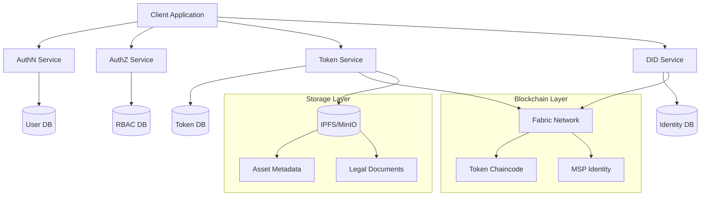
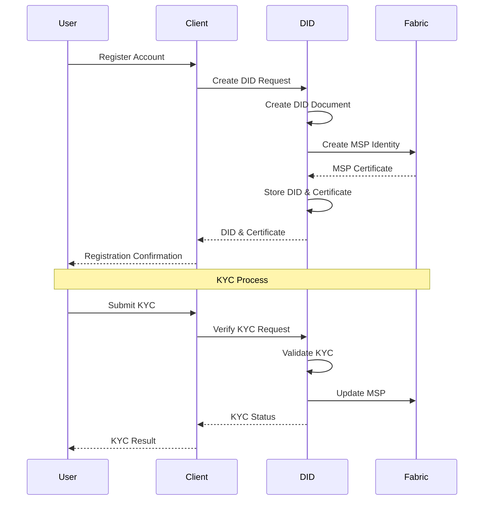
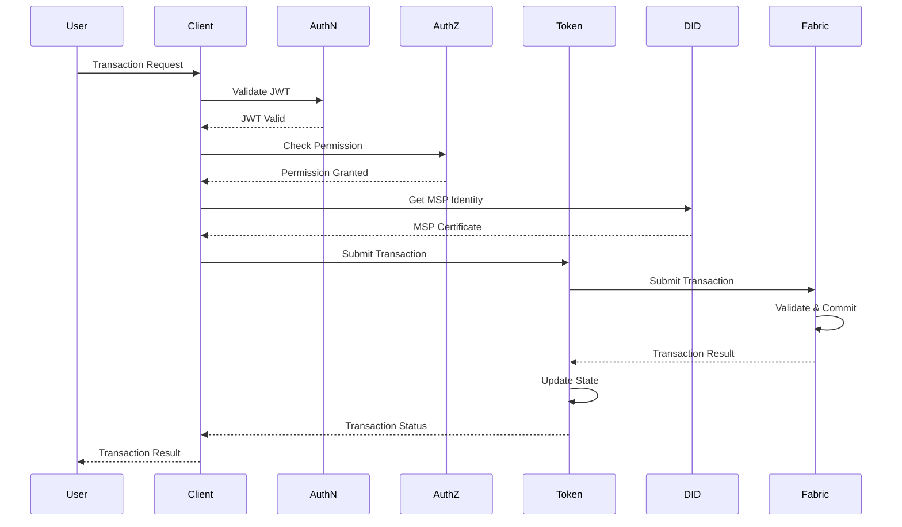
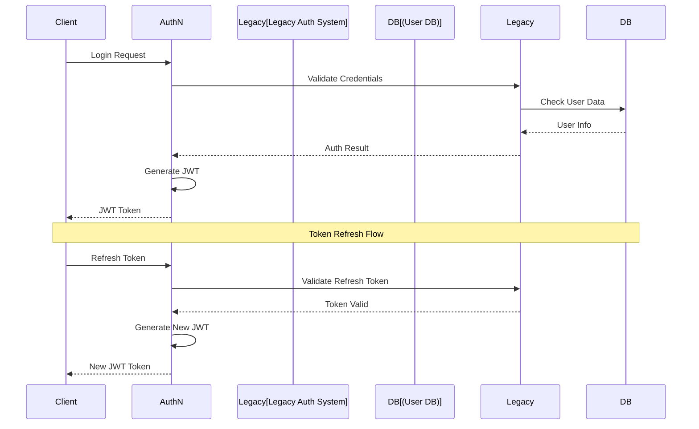
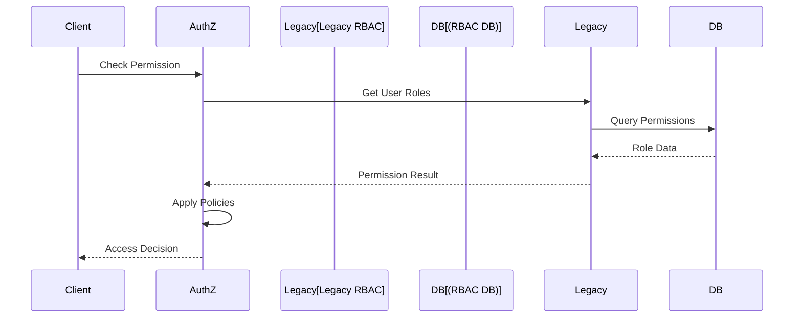

# Functional Requirements - Digital Asset Management System

## 1. Functional Requirements

### 1.1 Digital Assets Tokenization

* Support tokenization of physical and financial assets:

  * Real Estate
  * Certificates of Deposit (CDs)
  * Investment Fund Certificates (IFCs)
  * Stablecoins (backed by fiat, commodities, or crypto)
* Each token represents full or partial ownership of the asset.
* Tokenization process includes:

  * Asset identification and valuation
  * Asset custody (if required)
  * Token structure design (fungible / NFT / fractional NFT)
  * Token issuance (mint) through smart contracts
  * Ownership recording on blockchain
  * Token trading and transfer through on-chain mechanisms
* Integration of metadata (IPFS or external storage) attached to tokens
* Support for whitelist/blacklist to ensure only KYC-verified users can interact with specific legal tokens like IFCs and Real Estate

### 1.2 Authentication & Authorization

* **AuthN Service**:
  * User authentication and session management
  * JWT token issuance and validation
  * Multi-factor authentication support
  * Session tracking and management
  * Secure token storage and refresh mechanism

* **AuthZ Service**:
  * Role-based access control (RBAC)
  * Permission management for token operations
  * Resource-level access control
  * Policy enforcement for token transfers
  * Integration with business rules

### 1.3 Ownership Management

* Track token ownership on blockchain.
* Support fractional ownership model.
* Verify ownership before transfer.
* Validate user identity through AuthN Service
* Check transfer permissions through AuthZ Service

### 1.4 Trading & Asset Transfer

* Support buying, selling, and transferring tokens through smart contracts.
* Implement atomic delivery vs payment (DvP) mechanism.
* Allow P2P token trading or marketplace trading.
* Validate user sessions through AuthN Service
* Enforce trading permissions through AuthZ Service

### 1.5 Dividend Distribution

* Smart contract automatic distribution of:

  * Deposit interest
  * Fund dividends
  * Real estate rental income
* Periodic execution (monthly or quarterly).
* Validate distribution rights through AuthZ Service

### 1.6 Regulatory Compliance

* KYC/AML integration for all users.
* Only allow KYC-verified wallets to interact with the system.
* Apply whitelist/blacklist at smart contract level.
* Enforce compliance through AuthZ Service policies

### 1.7 Smart Contract Automation

* Automate business operations:

  * Token creation / destruction / transfer
  * Governance voting
  * Periodic reinvestment (SIP)
* Validate operations through AuthN and AuthZ Services

### 1.8 Reporting & Auditing

* Provide APIs for:

  * Retrieving ownership and transaction history
  * Querying NAV and investment performance
* Track transactions on-chain or hash off-chain data for verification.
* Enforce reporting access through AuthZ Service

## 2. System Architecture

### 2.1 Architecture Diagram

### 2.2 DID Processing Flow

### 2.3 Token Transaction Flow

### 2.4 Service Components

* **AuthN Service**: Provides user authentication and issues JWT tokens for sessions
* **AuthZ Service**: Manages access control based on user roles (RBAC)
* **DID Service**: Provides DID (Decentralized Identifiers) and maps users to system identities (MSP, cert)
* **Token Service**: Implements token logic (mint, transfer, burn, view) through Fabric Token SDK
* **Client App**: Frontend interface for user interaction
* **Fabric Network**: Records tokenized asset transactions on private blockchain network

## 2. Non-Functional Requirements

### 2.1 Security

* Authentication through AuthN Service with JWT tokens
* Authorization through AuthZ Service with RBAC
* Sign all transactions with Hyperledger Fabric MSP identity.
* Prevent attacks such as:

  * Reentrancy
  * Oracle Manipulation
  * Replay attack
  * JWT token theft
  * Session hijacking

### 2.2 Scalability

* Support multiple asset types simultaneously.
* Microservice-oriented design for easy scaling.
* Prepare for multi-chain deployment capability.
* Scale AuthN and AuthZ services independently

### 2.3 Integration Capability

* Integration with:

  * AuthN Service for user authentication and session management
  * AuthZ Service for access control and permission management
  * DID Service for user identification
  * Hyperledger Fabric Token SDK (via Gateway)
  * Chainlink oracle for NAV and price updates
  * IPFS or MinIO for metadata storage

### 2.4 Compliance & Monitoring

* Log sensitive behaviors and alert anomalies.
* Support periodic reporting in regulatory format.
* Allow audit trail retrieval on demand.
* Monitor AuthN and AuthZ service performance

### 2.5 Availability & Reliability

* 24/7 system operation with failover mechanism.
* Support horizontal scaling.
* Regular backups and token state snapshots.
* High availability for AuthN and AuthZ services

## 3. Implementation Scope by Phase (MVP)

| Feature                    | Priority   |
| -------------------------- | ---------- |
| Token Create/Transfer/Burn | High       |
| Digital Asset Tokenization | High       |
| Token Ownership Management | High       |
| AuthN & AuthZ Integration  | High       |
| DID Integration            | High       |
| Dividend Distribution      | Medium     |
| Periodic Trading (SIP)     | Low        |
| NAV Updates via Oracle     | Low        |
| Cross-chain Support        | Low        |

*Last Updated: 31/05/2025*

## 4. Integration with Existing AuthN/AuthZ Systems

### 4.1 AuthN Service Integration

* **Authentication Integration**:
  * Use existing API Gateway for authentication
  * Convert session tokens to JWT
  * Support SSO with existing system
  * Maintain backward compatibility

* **Session Management**:
  * Synchronize sessions between old and new systems
  * Support token refresh
  * Handle synchronized logout
  * Track session state

### 4.2 AuthZ Service Integration

* **Authorization Integration**:
  * Map roles from legacy to new RBAC
  * Convert permissions format
  * Support policy inheritance
  * Maintain audit trail

* **Permission Management**:
  * Synchronize role changes
  * Validate permissions
  * Cache permission data
  * Log access decisions

### 4.3 Technical Requirements

* **API Integration**:
  * REST API endpoints for AuthN/AuthZ
  * gRPC services for internal calls
  * WebSocket for real-time updates
  * Rate limiting and circuit breaking

* **Data Migration**:
  * Migrate user data
  * Convert role mappings
  * Preserve audit logs
  * Validate data integrity

* **Security**:
  * Encrypt sensitive data
  * Secure API communication
  * Monitor integration points
  * Regular security audits

* **Monitoring**:
  * Track integration metrics
  * Alert on failures
  * Monitor performance
  * Log integration events

*Last Updated: 31/05/2025* 