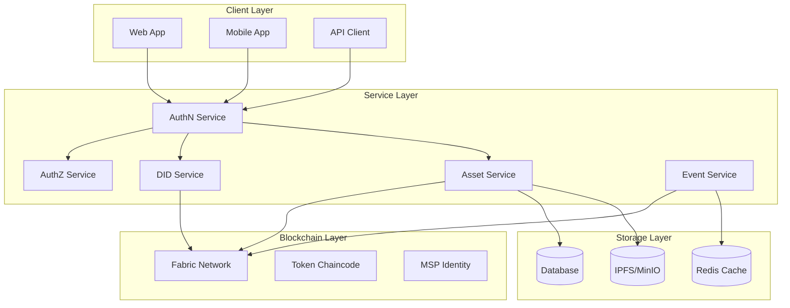
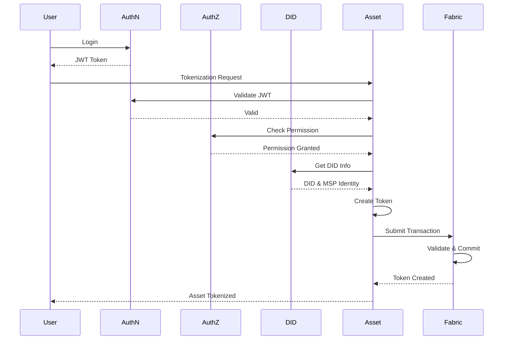
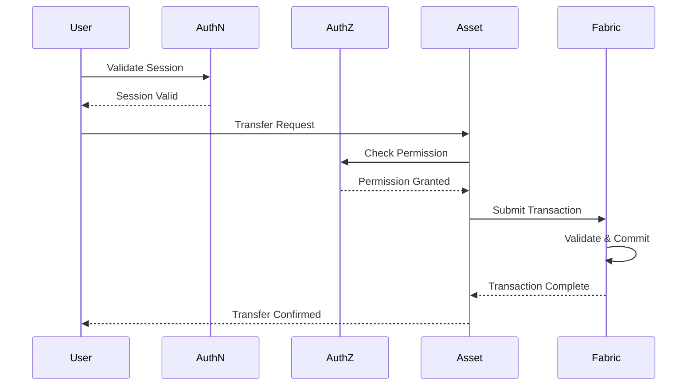

# Functional Requirements Document - Digital Asset Management System

## Table of Contents
1. [Overview](#1-overview)
2. [System Architecture](#2-system-architecture)
3. [Functional Requirements](#3-functional-requirements)
4. [Non-Functional Requirements](#4-non-functional-requirements)
5. [Service Interfaces](#5-service-interfaces)
6. [User Roles and Permissions](#6-user-roles-and-permissions)
7. [Business Processes](#7-business-processes)
8. [Deployment and Operations](#8-deployment-and-operations)

## 1. Overview

### 1.1 Objectives
Build a Digital Asset Service integrated with authentication and authorization services, supporting the tokenization and management of traditional assets such as real estate, certificates of deposit, and investment funds.

### 1.2 Scope
* Tokenization of physical and financial assets
* Ownership and transaction management
* Integration with AuthN Service for user authentication
* Integration with AuthZ Service for access control
* Integration with DID Service for identity management

### 1.3 Target Users
* Asset owners
* Investors
* System administrators
* Partners and third parties

## 2. System Architecture

### 2.1 System Overview



### 2.2 Core Components
* **Asset Service**: 
  * Asset information and metadata management
  * Tokenization and token lifecycle management
  * Token transaction processing
  * Fabric and DID Service integration
  * Balance and state management

* **AuthN Service**:
  * User authentication
  * Session management
  * JWT issuance

* **AuthZ Service**:
  * Access control
  * Role management
  * Permission checking

* **DID Service**:
  * Identity management
  * KYC verification
  * MSP Identity issuance

### 2.3 Asset Processing Flow



### 2.4 Transaction Flow



### 2.5 Component Details

* **Asset Service**:
  * Asset information and metadata management
  * Tokenization and token lifecycle management
  * Token transaction processing
  * Fabric and DID Service integration
  * Balance and state management

* **Event Service**:
  * Real-time event processing
  * Update notifications
  * Status monitoring
  * Data analytics

## 3. Functional Requirements

### 3.1 Asset Management
* Create and manage digital assets
* Asset tokenization
* Metadata management
* Status tracking

### 3.2 Transaction Management
* Token creation and transfer
* Token burning
* Transaction history tracking
* Transaction confirmation

### 3.3 User Management
* Registration and authentication
* Role management
* KYC/AML
* Session management

### 3.4 Reporting and Monitoring
* Transaction reporting
* Asset reporting
* System monitoring
* Audit logging

## 4. Non-Functional Requirements

### 4.1 Performance
* Response time < 2s
* Support 1000+ transactions/second
* Horizontal scalability
* Resource optimization

### 4.2 Security
* Data encryption
* Multi-factor authentication
* Granular permissions
* Audit trail

### 4.3 Availability
* 99.9% uptime
* Automatic recovery
* Regular backups
* Real-time monitoring

### 4.4 Compliance
* KYC/AML
* Transaction reporting
* Data retention
* Audit logging

## 5. Service Interfaces

### 5.1 Asset ↔ DID Interface

```protobuf
service AssetService {
    // Create new asset
    rpc CreateAsset(CreateAssetRequest) returns (CreateAssetResponse);
    
    // Update asset information
    rpc UpdateAsset(UpdateAssetRequest) returns (UpdateAssetResponse);
    
    // Get asset information
    rpc GetAsset(GetAssetRequest) returns (GetAssetResponse);
    
    // Verify ownership
    rpc VerifyOwnership(VerifyOwnershipRequest) returns (VerifyOwnershipResponse);
}

message CreateAssetRequest {
    string owner_did = 1;
    AssetType asset_type = 2;
    string metadata_uri = 3;
    map<string, string> properties = 4;
}

message CreateAssetResponse {
    string asset_id = 1;
    string token_id = 2;
    string status = 3;
}

enum AssetType {
    REAL_ESTATE = 0;
    CERTIFICATE_OF_DEPOSIT = 1;
    INVESTMENT_FUND = 2;
    STABLECOIN = 3;
}
```

### 5.2 Asset ↔ Token Interface

```protobuf
service TokenService {
    // Create token for asset
    rpc MintToken(MintTokenRequest) returns (MintTokenResponse);
    
    // Transfer token
    rpc TransferToken(TransferTokenRequest) returns (TransferTokenResponse);
    
    // Burn token
    rpc BurnToken(BurnTokenRequest) returns (BurnTokenResponse);
    
    // Get token information
    rpc GetToken(GetTokenRequest) returns (GetTokenResponse);
}

message MintTokenRequest {
    string asset_id = 1;
    string owner_did = 2;
    uint64 amount = 3;
    string metadata_uri = 4;
}

message MintTokenResponse {
    string token_id = 1;
    string transaction_id = 2;
    string status = 3;
}

message TransferTokenRequest {
    string token_id = 1;
    string from_did = 2;
    string to_did = 3;
    uint64 amount = 4;
}

message TransferTokenResponse {
    string transaction_id = 1;
    string status = 2;
}
```

### 5.3 Asset ↔ Event Interface

```protobuf
service EventService {
    // Subscribe to events
    rpc Subscribe(SubscribeRequest) returns (stream Event);
    
    // Publish event
    rpc Publish(PublishRequest) returns (PublishResponse);
}

message Event {
    string event_type = 1;
    string token_id = 2;
    string transaction_id = 3;
    string status = 4;
    int64 timestamp = 5;
    map<string, string> metadata = 6;
}
```

### 5.4 Implementation Notes

* **gRPC Communication**:
  * Use gRPC for all internal service communication
  * Implement retry mechanism for service calls
  * Use circuit breaker pattern
  * Implement request timeouts

* **Error Handling**:
  * Define clear error codes for each service
  * Implement proper error propagation
  * Log detailed error information
  * Implement retry mechanism for temporary errors

* **Security**:
  * Encrypt all internal communication
  * Implement service-to-service authentication
  * Validate input data
  * Rate limit all endpoints

* **Monitoring**:
  * Track latency for all service calls
  * Monitor error rates
  * Set up alerts for issues
  * Log detailed debugging information

## 6. User Roles and Permissions

### 6.1 Role Definitions

```protobuf
enum UserRole {
    // System administration roles
    SYSTEM_ADMIN = 0;      // System administrator
    COMPLIANCE_OFFICER = 1; // Compliance officer
    AUDITOR = 2;           // Auditor
    
    // Asset management roles
    ASSET_OWNER = 10;      // Asset owner
    ASSET_MANAGER = 11;    // Asset manager
    ASSET_OPERATOR = 12;   // Asset operator
    
    // Investment roles
    INVESTOR = 20;         // Investor
    INSTITUTIONAL_INVESTOR = 21; // Institutional investor
    RETAIL_INVESTOR = 22;  // Retail investor
    
    // Partner roles
    BROKER = 30;           // Broker
    CUSTODIAN = 31;        // Custodian
    LEGAL_ADVISOR = 32;    // Legal advisor
}
```

### 6.2 Role Permissions

#### 6.2.1 System Administration
* **SYSTEM_ADMIN**:
  * Full system management
  * System configuration
  * User and role management
  * Access to all logs and metrics
  * Highest system privileges

* **COMPLIANCE_OFFICER**:
  * KYC review and approval
  * Transaction monitoring
  * Compliance reporting
  * Risk assessment
  * No system configuration access

* **AUDITOR**:
  * Full transaction history access
  * System log access
  * Audit report generation
  * No modification rights

#### 6.2.2 Asset Management
* **ASSET_OWNER**:
  * Asset creation and management
  * Token issuance
  * Distribution policy decisions
  * Asset reporting
  * No system configuration access

* **ASSET_MANAGER**:
  * Asset operation management
  * Transaction execution
  * Management reporting
  * No token issuance rights

* **ASSET_OPERATOR**:
  * Operational activities
  * Asset status updates
  * No financial management rights

#### 6.2.3 Investors
* **INVESTOR** (Base role):
  * Asset information access
  * Transaction execution
  * Investment reporting
  * No asset creation rights

* **INSTITUTIONAL_INVESTOR**:
  * All INVESTOR rights
  * Large volume trading
  * Dedicated API access
  * Enhanced KYC requirements

* **RETAIL_INVESTOR**:
  * Limited trading
  * Basic information access
  * Basic KYC requirements

#### 6.2.4 Partners
* **BROKER**:
  * Order creation and management
  * Market information access
  * No direct trading rights

* **CUSTODIAN**:
  * Physical asset management
  * Ownership verification
  * No trading rights

* **LEGAL_ADVISOR**:
  * Legal document access
  * Legal report generation
  * No modification rights

### 6.3 Role Assignment Process


### 6.4 Policy Management

```protobuf
message RolePolicy {
    string role = 1;
    repeated string permissions = 2;
    map<string, string> constraints = 3;
    int64 max_transaction_amount = 4;
    repeated string allowed_asset_types = 5;
}

message UserPolicy {
    string user_id = 1;
    string role = 2;
    KYCStatus kyc_status = 3;
    repeated string additional_permissions = 4;
    map<string, string> custom_constraints = 5;
}
```

### 6.5 Implementation Notes

* **Role Hierarchy**:
  * Implement role inheritance
  * Support custom roles
  * Allow permission overrides
  * Audit log all changes

* **KYC Integration**:
  * KYC level affects permissions
  * Automatic role updates after KYC
  * Support enhanced KYC
  * Store KYC history

* **Compliance**:
  * Role-based compliance checks
  * Role-based transaction limits
  * Violation reporting
  * Anomaly alerts

* **Monitoring**:
  * Track role changes
  * Monitor permission usage
  * Alert on policy violations
  * Regular compliance reports

## 7. Business Processes

### 7.1 Asset Tokenization Process


### 7.2 Trading Process


## 8. Deployment and Operations

### 8.1 Deployment Requirements
* Kubernetes cluster
* Hyperledger Fabric network
* Database cluster
* Monitoring system

### 8.2 Operational Procedures
* Monitoring and alerting
* Backup and restore
* Scaling and load balancing
* Security patching

### 8.3 Deployment Plan
* Phase 1: Core services
* Phase 2: Token management
* Phase 3: Trading features
* Phase 4: Advanced features

*Last Updated: 31/05/2025* 