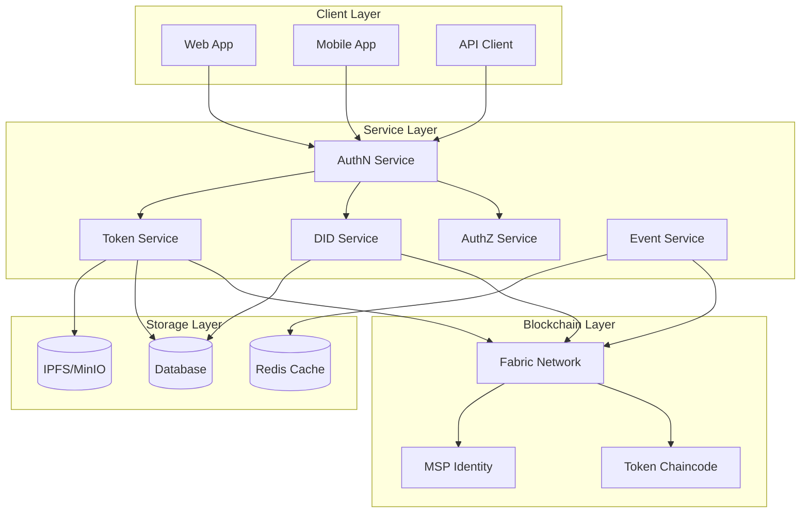
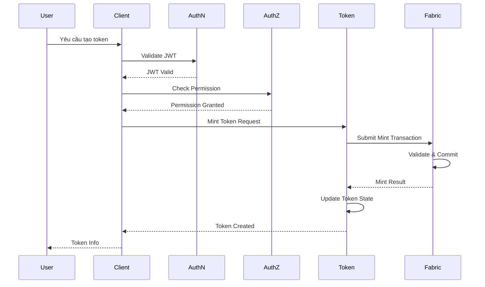
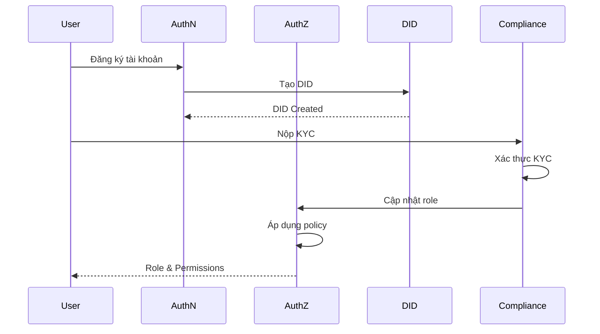
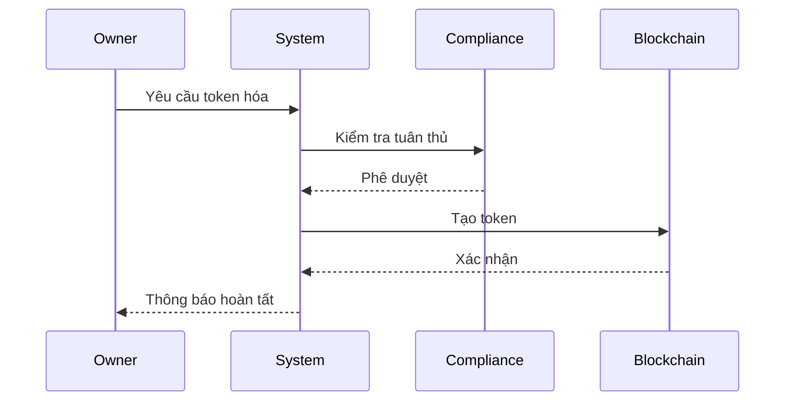
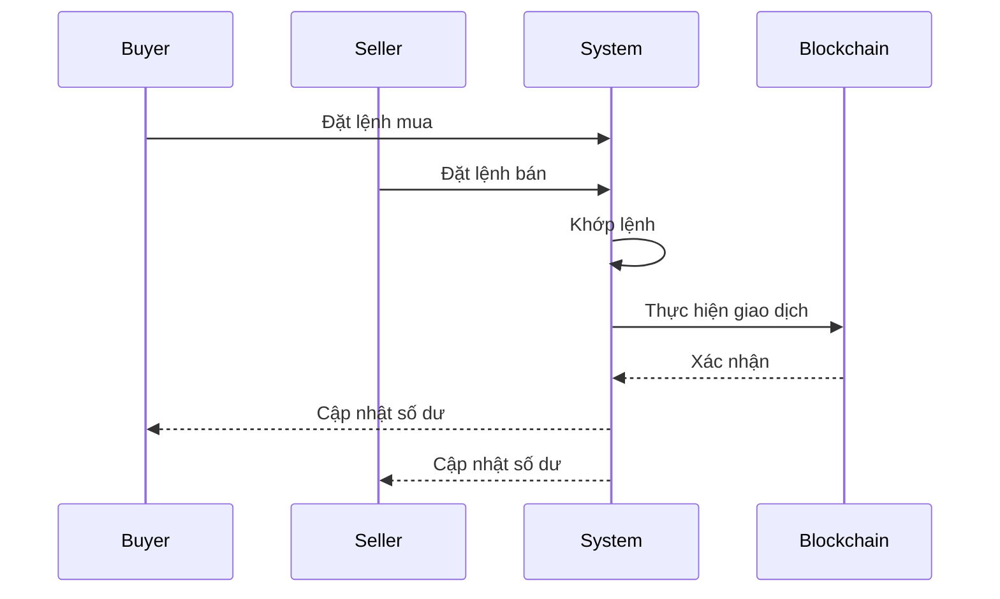

# Tài Liệu Yêu Cầu Chức Năng - Hệ Thống Quản Lý Tài Sản Số

## Mục lục
1. [Tổng quan](#1-tổng-quan)
2. [Kiến trúc hệ thống](#2-kiến-trúc-hệ-thống)
3. [Yêu cầu chức năng](#3-yêu-cầu-chức-năng)
4. [Yêu cầu phi chức năng](#4-yêu-cầu-phi-chức-năng)
5. [Interface giữa các Service](#5-interface-giữa-các-service)
6. [Vai trò người dùng và Phân quyền](#6-vai-trò-người-dùng-và-phân-quyền)
7. [Quy trình nghiệp vụ](#7-quy-trình-nghiệp-vụ)
8. [Triển khai và Vận hành](#8-triển-khai-và-vận-hành)

## 1. Tổng quan

### 1.1 Mục tiêu
Xây dựng một hệ thống quản lý tài sản số tích hợp với blockchain Hyperledger Fabric, hỗ trợ việc token hóa tài sản truyền thống như bất động sản, chứng chỉ tiền gửi, và quỹ đầu tư.

### 1.2 Phạm vi
* Token hóa tài sản vật lý và tài chính
* Quản lý quyền sở hữu và giao dịch
* Tích hợp với hệ thống xác thực và phân quyền
* Hỗ trợ tuân thủ quy định

### 1.3 Đối tượng người dùng
* Chủ sở hữu tài sản
* Nhà đầu tư
* Quản trị viên hệ thống
* Đối tác và bên thứ ba

## 2. Kiến trúc hệ thống

### 2.1 Sơ đồ hệ thống tổng quan



### 2.2 Các thành phần chính
* **AuthN Service**: Xác thực người dùng và quản lý phiên
* **AuthZ Service**: Phân quyền truy cập
* **DID Service**: Quản lý danh tính phi tập trung
* **Token Service**: Quản lý token và giao dịch
* **Event Service**: Xử lý sự kiện realtime

### 2.2 Luồng xử lý Token



### 2.3 Tích hợp Token Service

* **Token Service**:
  * Quản lý vòng đời token
  * Xử lý giao dịch token
  * Tích hợp với Fabric Token SDK
  * Quản lý metadata token

* **Fabric Integration**:
  * Sử dụng Fabric Token SDK
  * Quản lý UTXO
  * Xử lý giao dịch
  * Đồng bộ trạng thái

* **Quy trình giao dịch**:
  * Xác thực người dùng
  * Kiểm tra quyền
  * Thực hiện giao dịch
  * Cập nhật trạng thái

* **Tính năng bảo mật**:
  * Kiểm tra quyền chi tiết
  * Xác thực giao dịch
  * Audit trail
  * Rate limiting

## 3. Yêu cầu chức năng

### 3.1 Quản lý tài sản
* Tạo và quản lý tài sản số
* Token hóa tài sản
* Quản lý metadata
* Theo dõi trạng thái

### 3.2 Quản lý giao dịch
* Tạo và chuyển token
* Hủy token
* Theo dõi lịch sử giao dịch
* Xác nhận giao dịch

### 3.3 Quản lý người dùng
* Đăng ký và xác thực
* Quản lý vai trò
* KYC/AML
* Quản lý phiên

### 3.4 Báo cáo và giám sát
* Báo cáo giao dịch
* Báo cáo tài sản
* Giám sát hệ thống
* Audit log

## 4. Yêu cầu phi chức năng

### 4.1 Hiệu năng
* Thời gian phản hồi < 2s
* Hỗ trợ 1000+ giao dịch/giây
* Khả năng mở rộng theo chiều ngang
* Tối ưu hóa tài nguyên

### 4.2 Bảo mật
* Mã hóa dữ liệu
* Xác thực đa yếu tố
* Phân quyền chi tiết
* Audit trail

### 4.3 Khả dụng
* Uptime 99.9%
* Khôi phục tự động
* Backup định kỳ
* Monitoring realtime

### 4.4 Tuân thủ
* KYC/AML
* Báo cáo giao dịch
* Lưu trữ dữ liệu
* Audit log

## 5. Interface giữa các Service

### 5.1 DID ↔ AuthN Interface

```protobuf
service DIDService {
    // Tạo DID cho user mới
    rpc CreateDID(CreateDIDRequest) returns (CreateDIDResponse);
    
    // Lấy thông tin DID của user
    rpc GetDID(GetDIDRequest) returns (GetDIDResponse);
    
    // Cập nhật trạng thái KYC
    rpc UpdateKYCStatus(UpdateKYCRequest) returns (UpdateKYCResponse);
    
    // Lấy MSP Identity cho giao dịch
    rpc GetMSPIdentity(GetMSPRequest) returns (GetMSPResponse);
}

message CreateDIDRequest {
    string user_id = 1;
    string email = 2;
    string phone = 3;
}

message CreateDIDResponse {
    string did = 1;
    string msp_id = 2;
    bytes certificate = 3;
}

message GetDIDRequest {
    string user_id = 1;
}

message GetDIDResponse {
    string did = 1;
    string msp_id = 2;
    KYCStatus kyc_status = 3;
    bytes certificate = 4;
}

enum KYCStatus {
    UNVERIFIED = 0;
    PENDING = 1;
    VERIFIED = 2;
    REJECTED = 3;
}
```

### 5.2 DID ↔ Asset Interface

```protobuf
service AssetService {
    // Tạo tài sản mới
    rpc CreateAsset(CreateAssetRequest) returns (CreateAssetResponse);
    
    // Cập nhật thông tin tài sản
    rpc UpdateAsset(UpdateAssetRequest) returns (UpdateAssetResponse);
    
    // Lấy thông tin tài sản
    rpc GetAsset(GetAssetRequest) returns (GetAssetResponse);
    
    // Xác thực quyền sở hữu
    rpc VerifyOwnership(VerifyOwnershipRequest) returns (VerifyOwnershipResponse);
}

message CreateAssetRequest {
    string owner_did = 1;
    AssetType asset_type = 2;
    string metadata_uri = 3;
    map<string, string> properties = 4;
}

message CreateAssetResponse {
    string asset_id = 1;
    string token_id = 2;
    string status = 3;
}

enum AssetType {
    REAL_ESTATE = 0;
    CERTIFICATE_OF_DEPOSIT = 1;
    INVESTMENT_FUND = 2;
    STABLECOIN = 3;
}
```

### 5.3 Asset ↔ Token Interface

```protobuf
service TokenService {
    // Tạo token cho tài sản
    rpc MintToken(MintTokenRequest) returns (MintTokenResponse);
    
    // Chuyển token
    rpc TransferToken(TransferTokenRequest) returns (TransferTokenResponse);
    
    // Hủy token
    rpc BurnToken(BurnTokenRequest) returns (BurnTokenResponse);
    
    // Lấy thông tin token
    rpc GetToken(GetTokenRequest) returns (GetTokenResponse);
}

message MintTokenRequest {
    string asset_id = 1;
    string owner_did = 2;
    uint64 amount = 3;
    string metadata_uri = 4;
}

message MintTokenResponse {
    string token_id = 1;
    string transaction_id = 2;
    string status = 3;
}

message TransferTokenRequest {
    string token_id = 1;
    string from_did = 2;
    string to_did = 3;
    uint64 amount = 4;
}

message TransferTokenResponse {
    string transaction_id = 1;
    string status = 2;
}
```

### 5.4 Các Interface khác

#### 5.4.1 AuthN ↔ AuthZ Interface

```protobuf
service AuthZService {
    // Kiểm tra quyền truy cập
    rpc CheckPermission(CheckPermissionRequest) returns (CheckPermissionResponse);
    
    // Lấy danh sách quyền của user
    rpc GetUserPermissions(GetUserPermissionsRequest) returns (GetUserPermissionsResponse);
}

message CheckPermissionRequest {
    string user_id = 1;
    string resource = 2;
    string action = 3;
}

message CheckPermissionResponse {
    bool allowed = 1;
    string reason = 2;
}
```

#### 5.4.2 Token ↔ Event Interface

```protobuf
service EventService {
    // Đăng ký lắng nghe sự kiện
    rpc Subscribe(SubscribeRequest) returns (stream Event);
    
    // Publish sự kiện
    rpc Publish(PublishRequest) returns (PublishResponse);
}

message Event {
    string event_type = 1;
    string token_id = 2;
    string transaction_id = 3;
    string status = 4;
    int64 timestamp = 5;
    map<string, string> metadata = 6;
}
```

### 5.5 Lưu ý triển khai

* **gRPC Communication**:
  * Sử dụng gRPC cho tất cả internal service communication
  * Implement retry mechanism cho các gọi service
  * Sử dụng circuit breaker pattern
  * Implement timeout cho mọi request

* **Error Handling**:
  * Định nghĩa rõ error codes cho từng service
  * Implement proper error propagation
  * Log đầy đủ thông tin lỗi
  * Có cơ chế retry cho các lỗi tạm thời

* **Security**:
  * Mã hóa tất cả internal communication
  * Implement service-to-service authentication
  * Validate input data
  * Rate limiting cho mọi endpoint

* **Monitoring**:
  * Track latency cho mọi service call
  * Monitor error rates
  * Alert khi có vấn đề
  * Log đầy đủ thông tin cho debugging

*Cập nhật: 31/05/2025* 

## 6. Vai trò người dùng và Phân quyền

### 6.1 Định nghĩa vai trò

```protobuf
enum UserRole {
    // Vai trò quản trị hệ thống
    SYSTEM_ADMIN = 0;      // Quản trị viên hệ thống
    COMPLIANCE_OFFICER = 1; // Nhân viên tuân thủ
    AUDITOR = 2;           // Kiểm toán viên
    
    // Vai trò quản lý tài sản
    ASSET_OWNER = 10;      // Chủ sở hữu tài sản
    ASSET_MANAGER = 11;    // Người quản lý tài sản
    ASSET_OPERATOR = 12;   // Người vận hành tài sản
    
    // Vai trò đầu tư
    INVESTOR = 20;         // Nhà đầu tư
    INSTITUTIONAL_INVESTOR = 21; // Nhà đầu tư tổ chức
    RETAIL_INVESTOR = 22;  // Nhà đầu tư cá nhân
    
    // Vai trò đối tác
    BROKER = 30;           // Môi giới
    CUSTODIAN = 31;        // Người giữ tài sản
    LEGAL_ADVISOR = 32;    // Cố vấn pháp lý
}
```

### 6.2 Quyền hạn theo vai trò

#### 6.2.1 Quản trị hệ thống
* **SYSTEM_ADMIN**:
  * Quản lý toàn bộ hệ thống
  * Cấu hình các tham số hệ thống
  * Quản lý người dùng và vai trò
  * Xem toàn bộ logs và metrics
  * Có quyền cao nhất trong hệ thống

* **COMPLIANCE_OFFICER**:
  * Xem xét và phê duyệt KYC
  * Giám sát các giao dịch
  * Báo cáo tuân thủ
  * Đánh giá rủi ro
  * Không có quyền thay đổi cấu hình hệ thống

* **AUDITOR**:
  * Xem toàn bộ lịch sử giao dịch
  * Truy xuất logs hệ thống
  * Tạo báo cáo kiểm toán
  * Không có quyền thực hiện thay đổi

#### 6.2.2 Quản lý tài sản
* **ASSET_OWNER**:
  * Tạo và quản lý tài sản
  * Phát hành token
  * Quyết định chính sách phân phối
  * Xem báo cáo tài sản
  * Không thể thay đổi cấu hình hệ thống

* **ASSET_MANAGER**:
  * Quản lý hoạt động tài sản
  * Thực hiện giao dịch
  * Tạo báo cáo quản lý
  * Không thể phát hành token mới

* **ASSET_OPERATOR**:
  * Thực hiện các hoạt động vận hành
  * Cập nhật trạng thái tài sản
  * Không có quyền quản lý tài chính

#### 6.2.3 Nhà đầu tư
* **INVESTOR** (Base role):
  * Xem thông tin tài sản
  * Thực hiện giao dịch
  * Xem báo cáo đầu tư
  * Không thể tạo tài sản mới

* **INSTITUTIONAL_INVESTOR**:
  * Tất cả quyền của INVESTOR
  * Giao dịch số lượng lớn
  * Truy cập API riêng
  * Yêu cầu KYC nâng cao

* **RETAIL_INVESTOR**:
  * Giao dịch giới hạn
  * Truy cập thông tin cơ bản
  * Yêu cầu KYC cơ bản

#### 6.2.4 Đối tác
* **BROKER**:
  * Tạo và quản lý đơn hàng
  * Xem thông tin thị trường
  * Không thể thực hiện giao dịch trực tiếp

* **CUSTODIAN**:
  * Quản lý tài sản vật lý
  * Xác nhận quyền sở hữu
  * Không có quyền giao dịch

* **LEGAL_ADVISOR**:
  * Xem tài liệu pháp lý
  * Tạo báo cáo pháp lý
  * Không có quyền thực hiện thay đổi

### 6.3 Quy trình phân quyền



### 6.4 Policy Management

```protobuf
message RolePolicy {
    string role = 1;
    repeated string permissions = 2;
    map<string, string> constraints = 3;
    int64 max_transaction_amount = 4;
    repeated string allowed_asset_types = 5;
}

message UserPolicy {
    string user_id = 1;
    string role = 2;
    KYCStatus kyc_status = 3;
    repeated string additional_permissions = 4;
    map<string, string> custom_constraints = 5;
}
```

### 6.5 Lưu ý triển khai

* **Role Hierarchy**:
  * Implement role inheritance
  * Hỗ trợ custom roles
  * Có thể override permissions
  * Audit log cho mọi thay đổi

* **KYC Integration**:
  * KYC level ảnh hưởng đến quyền
  * Tự động cập nhật role sau KYC
  * Hỗ trợ KYC nâng cao
  * Lưu trữ KYC history

* **Compliance**:
  * Kiểm tra tuân thủ theo role
  * Giới hạn giao dịch theo role
  * Báo cáo vi phạm
  * Alert khi có bất thường

* **Monitoring**:
  * Track role changes
  * Monitor permission usage
  * Alert on policy violations
  * Regular compliance reports

*Cập nhật: 31/05/2025*

## 7. Quy trình nghiệp vụ

### 7.1 Quy trình token hóa tài sản


### 7.2 Quy trình giao dịch


## 8. Triển khai và Vận hành

### 8.1 Yêu cầu triển khai
* Kubernetes cluster
* Hyperledger Fabric network
* Database cluster
* Monitoring system

### 8.2 Quy trình vận hành
* Monitoring và alerting
* Backup và restore
* Scaling và load balancing
* Security patching

### 8.3 Kế hoạch triển khai
* Phase 1: Core services
* Phase 2: Token management
* Phase 3: Trading features
* Phase 4: Advanced features

*Cập nhật: 31/05/2025*