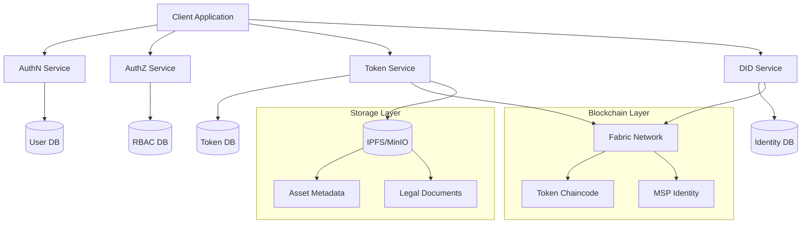
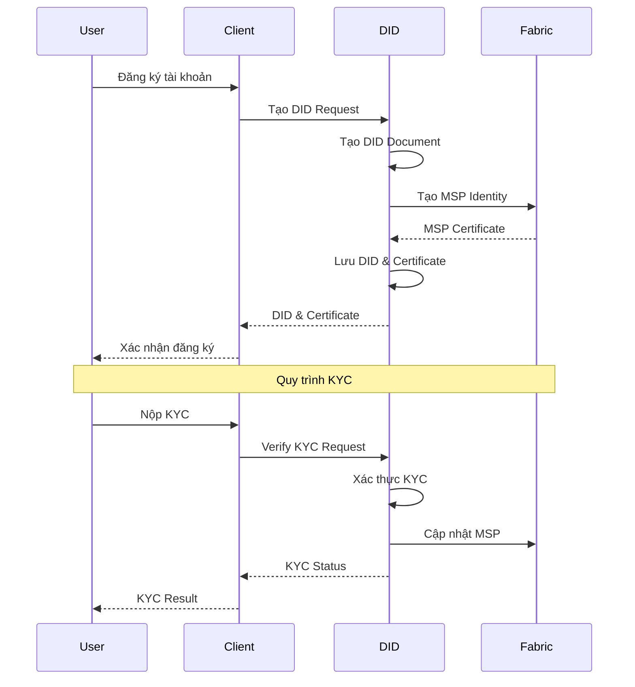
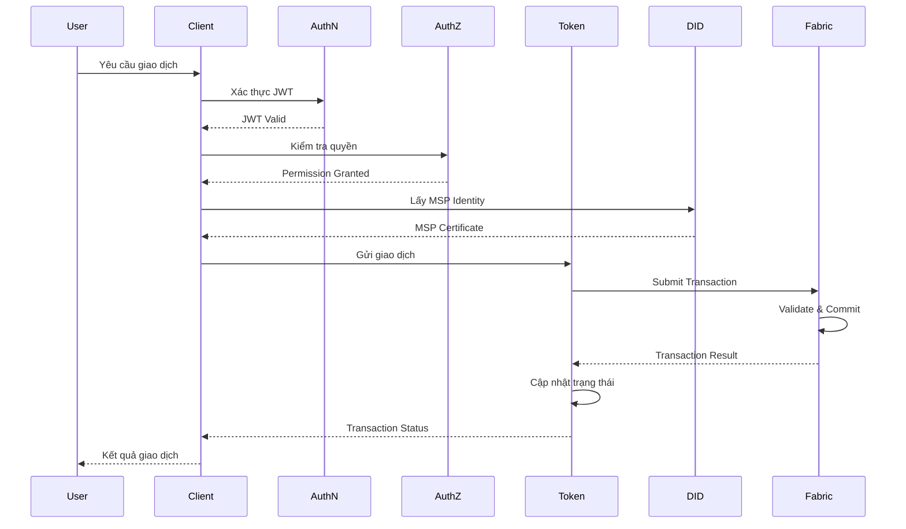
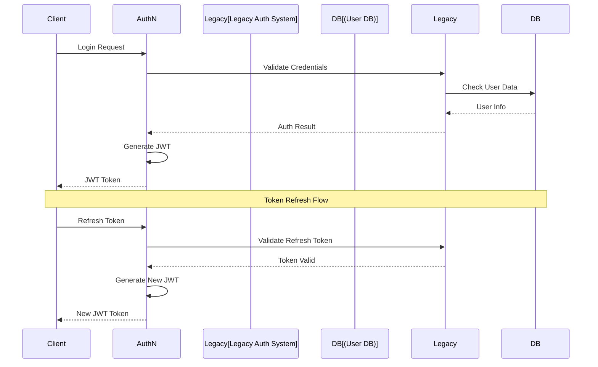
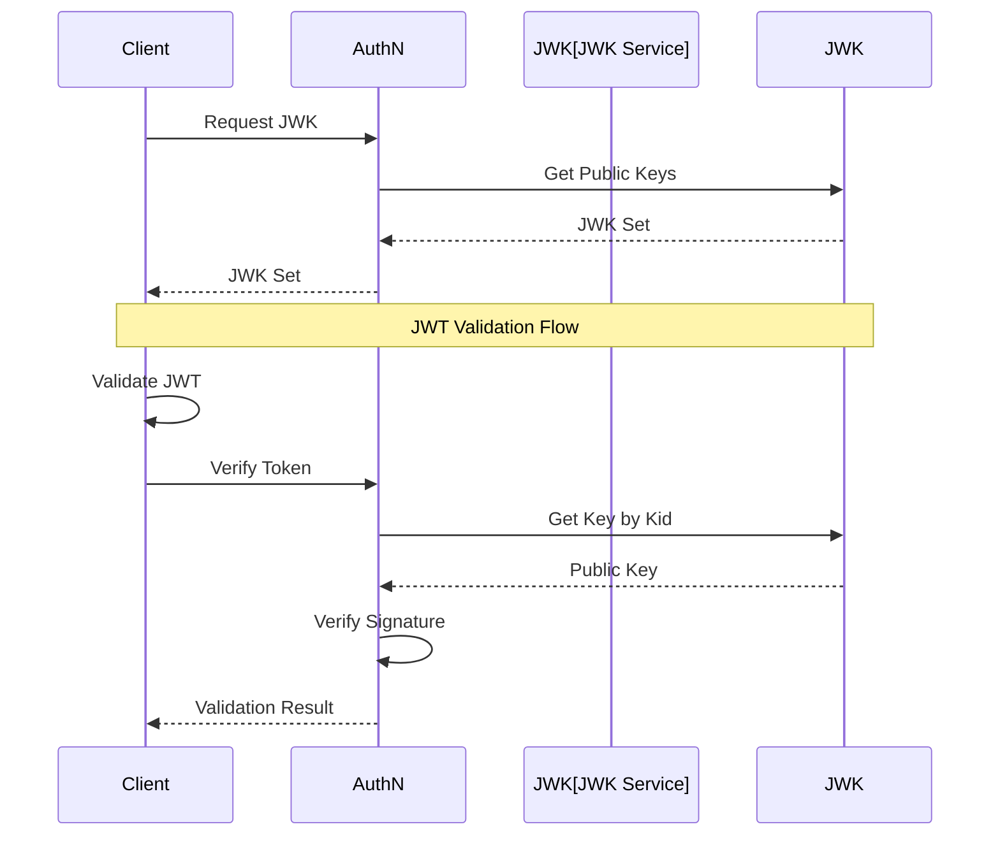
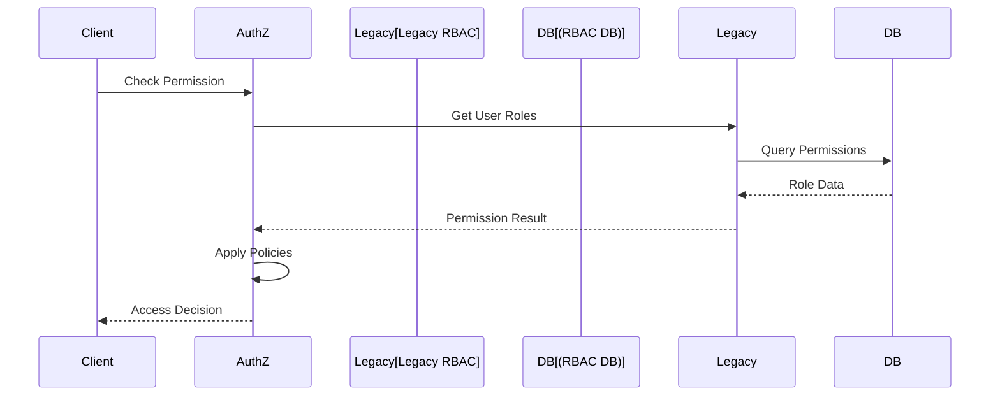

# Yêu Cầu Chức Năng - Hệ Thống Quản Lý Tài Sản Số

## 1. Mục tiêu hệ thống

Xây dựng một hệ thống quản lý tài sản số tích hợp với blockchain Hyperledger Fabric, hỗ trợ việc token hóa tài sản truyền thống như bất động sản, chứng chỉ tiền gửi, và quỹ đầu tư. Hệ thống cần đảm bảo xác thực người dùng qua AuthN Service, phân quyền truy cập qua AuthZ Service, và hỗ trợ giao dịch token thông qua Fabric Token SDK.

---

## 2. Kiến trúc hệ thống tổng thể

### 2.1 Sơ đồ kiến trúc

### 2.2 Luồng xử lý DID

### 2.3 Luồng giao dịch token

* **AuthN Service**: Cung cấp xác thực người dùng và cấp JWT token cho các phiên làm việc.
* **AuthZ Service**: Quản lý phân quyền truy cập dựa trên vai trò người dùng (RBAC).
* **DID Service**: Cung cấp DID (Decentralized Identifiers) và ánh xạ người dùng đến danh tính trong hệ thống (MSP, cert).
* **Token Service**: Thực hiện logic token (mint, transfer, burn, view) thông qua Fabric Token SDK.
* **Client App**: Giao diện frontend tương tác với người dùng.
* **Fabric Network**: Ghi nhận các giao dịch token hóa tài sản trên mạng blockchain riêng.

---

## 3. Yêu cầu chức năng

### 3.1 Token hóa tài sản số

* Hỗ trợ token hóa các tài sản vật lý và tài chính:
  * Bất động sản
  * Chứng chỉ tiền gửi (CDs)
  * Chứng chỉ quỹ đầu tư (IFCs)
  * Stablecoin (bảo chứng bởi tiền pháp định, hàng hóa, hoặc crypto)
* Mỗi token đại diện cho toàn bộ hoặc một phần quyền sở hữu tài sản
* Quy trình token hóa bao gồm:
  * Định danh và định giá tài sản
  * Lưu ký tài sản (nếu cần)
  * Thiết kế cấu trúc token (fungible / NFT / fractional NFT)
  * Phát hành token (mint) thông qua smart contract
  * Ghi nhận quyền sở hữu trên blockchain
  * Giao dịch và chuyển nhượng token qua các cơ chế on-chain
* Tích hợp metadata (IPFS hoặc lưu trữ ngoài) gắn kèm token
* Hỗ trợ whitelist/blacklist để đảm bảo chỉ người dùng đã KYC mới tương tác được với loại token pháp lý đặc thù

### 3.2 Tạo và phát hành Token

* Nhận thông tin tài sản từ người dùng/quản trị viên
* Xác thực người dùng qua AuthN Service và lấy JWT token
* Kiểm tra quyền mint token qua AuthZ Service
* Gọi DID để ánh xạ MSP/certificate của chủ sở hữu
* Gọi Fabric Token SDK để tạo token (UTXO based)
* Lưu metadata mô tả tài sản và token tương ứng

### 3.3 Chuyển nhượng & Giao dịch Token

* Cho phép người dùng chuyển token sang người khác
* Xác thực JWT token qua AuthN Service
* Kiểm tra quyền qua AuthZ Service
* Gọi DID → lấy cert người gửi/người nhận
* Giao dịch sử dụng hàm `Transfer` của Token SDK
* Hỗ trợ giao dịch P2P và tích hợp marketplace
* Triển khai cơ chế thanh toán giao nhận nguyên tử (DvP)

### 3.4 Hủy Token

* Cho phép người sở hữu chủ động hủy bỏ token
* Xác thực JWT token qua AuthN Service
* Kiểm tra quyền qua AuthZ Service
* Gọi DID → xác thực danh tính và cert
* Gọi `Burn` SDK để xóa token khỏi mạng

### 3.5 Truy vấn số dư và lịch sử giao dịch

* Cho phép người dùng xem số dư token của mình
* Cho phép truy vấn lịch sử giao dịch (txID, timestamp, status...)
* Tích hợp Fabric Event hoặc chaincode để nhận sự kiện realtime

### 3.6 Tự động phân phối lợi tức

* Token có liên quan đến chứng chỉ tiền gửi, bất động sản cho thuê...
* Định kỳ phân phối lợi tức qua logic hợp đồng thông minh hoặc job định kỳ
* Lưu thông tin giao dịch lợi tức và gửi thông báo đến người sở hữu
* Hỗ trợ tái đầu tư tự động (SIP)

### 3.7 Báo cáo và tích hợp dữ liệu

* Tổng hợp báo cáo sở hữu token theo thời gian, loại tài sản
* Hỗ trợ export dữ liệu cho cơ quan quản lý (CSV, API)
* Tích hợp DID để xác định người dùng và AuthZ để giới hạn quyền xem báo cáo
* Theo dõi giao dịch on-chain hoặc hash dữ liệu off-chain để kiểm chứng

---

## 4. Yêu cầu phi chức năng

### 4.1 Bảo mật

* Xác thực qua AuthN Service và JWT token
* Giao dịch được ký bằng cert từ DID Service (MSP Identity)
* Kiểm tra quyền chi tiết theo từng hành động qua AuthZ Service
* Ngăn chặn các tấn công như:
  * Reentrancy
  * Oracle Manipulation
  * Replay attack
  * JWT token theft
  * Session hijacking

### 4.2 Khả năng mở rộng

* Hỗ trợ nhiều loại tài sản và nhiều tổ chức sở hữu
* Thiết kế dạng microservice để dễ tách module theo nghiệp vụ (mint, transfer...)
* Chuẩn bị cho khả năng triển khai đa chuỗi (multi-chain)

### 4.3 Tính sẵn sàng và khôi phục

* Hỗ trợ HA (High Availability) và backup định kỳ
* Có khả năng khôi phục token theo snapshot trạng thái cuối cùng
* Hệ thống hoạt động 24/7 với cơ chế failover
* Hỗ trợ nhân bản ngang (horizontal scaling)

### 4.4 Khả năng tích hợp

* Tích hợp với:
  * AuthN Service để xác thực người dùng và quản lý phiên
  * AuthZ Service để kiểm tra quyền truy cập
  * DID Service để định danh người dùng
  * Hyperledger Fabric Token SDK (qua Gateway)
  * Chainlink oracle để cập nhật NAV, giá
  * IPFS hoặc MinIO để lưu metadata

---

## 5. Ưu tiên triển khai giai đoạn đầu (MVP)

| Chức năng                         | Ưu tiên    |
| --------------------------------- | ---------- |
| Tạo Token tài sản (mint)          | Cao        |
| Chuyển Token (transfer)           | Cao        |
| Hủy Token (burn)                  | Cao        |
| Truy vấn số dư, lịch sử giao dịch | Trung bình |
| Tích hợp AuthN và AuthZ           | Cao        |
| Tích hợp DID                      | Cao        |
| SIP & tự động hóa lợi tức         | Trung bình |
| Hệ thống báo cáo                  | Trung bình |
| Hỗ trợ cross-chain                | Thấp       |

---

## 6. Ghi chú triển khai kỹ thuật

* Chaincode sử dụng Fabric Token SDK dạng external
* AuthN Service và AuthZ Service được viết bằng Go
* DID Service có thể được viết bằng Go hoặc NestJS tùy môi trường
* Giao dịch nên thực hiện qua gRPC hoặc HTTP API Gateway
* Cơ sở dữ liệu lưu thông tin metadata về tài sản token hóa (PostgreSQL hoặc MongoDB tùy quy mô)
* IPFS hoặc MinIO có thể dùng để lưu trữ file chứng nhận/metadata nếu cần
* Hỗ trợ triển khai đa chuỗi trong tương lai
* Tích hợp Chainlink để cập nhật giá và NAV

*Cập nhật: 31/05/2025*

## 7. Tích hợp với hệ thống AuthN/AuthZ hiện tại

### 7.1 Tích hợp AuthN Service

* **Tích hợp xác thực**:
  * Sử dụng API Gateway hiện tại để xác thực
  * Chuyển đổi session token sang JWT
  * Hỗ trợ SSO với hệ thống hiện tại
  * Duy trì backward compatibility

* **Quản lý phiên**:
  * Đồng bộ session giữa hệ thống cũ và mới
  * Hỗ trợ token refresh
  * Xử lý logout đồng bộ
  * Theo dõi trạng thái phiên

* **Quản lý JWT**:
  * Expose JWK endpoint qua gRPC
  * Cung cấp public keys cho việc validate JWT
  * Hỗ trợ key rotation
  * Cache JWK responses
  * Implement token validation service

* **Tính năng bảo mật**:
  * Sử dụng RSA/ECDSA key pairs cho JWT signing
  * Chính sách key rotation
  * Hỗ trợ token revocation
  * Rate limiting cho JWK requests
  * Secure key storage

### 7.2 Tích hợp AuthZ Service

* **Tích hợp phân quyền**:
  * Map roles từ hệ thống cũ sang RBAC mới
  * Chuyển đổi permissions format
  * Hỗ trợ policy inheritance
  * Duy trì audit trail

* **Quản lý quyền**:
  * Đồng bộ role changes
  * Validate permissions
  * Cache permission data
  * Log access decisions

### 7.3 Yêu cầu kỹ thuật

* **API Integration**:
  * REST API endpoints cho AuthN/AuthZ
  * gRPC services cho internal calls
  * WebSocket cho real-time updates
  * Rate limiting và circuit breaking

* **Data Migration**:
  * Migrate user data
  * Convert role mappings
  * Preserve audit logs
  * Validate data integrity

* **Security**:
  * Encrypt sensitive data
  * Secure API communication
  * Monitor integration points
  * Regular security audits

* **Monitoring**:
  * Track integration metrics
  * Alert on failures
  * Monitor performance
  * Log integration events

*Cập nhật: 31/05/2025* 