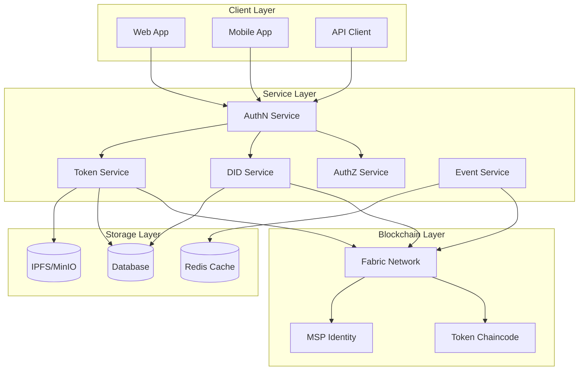
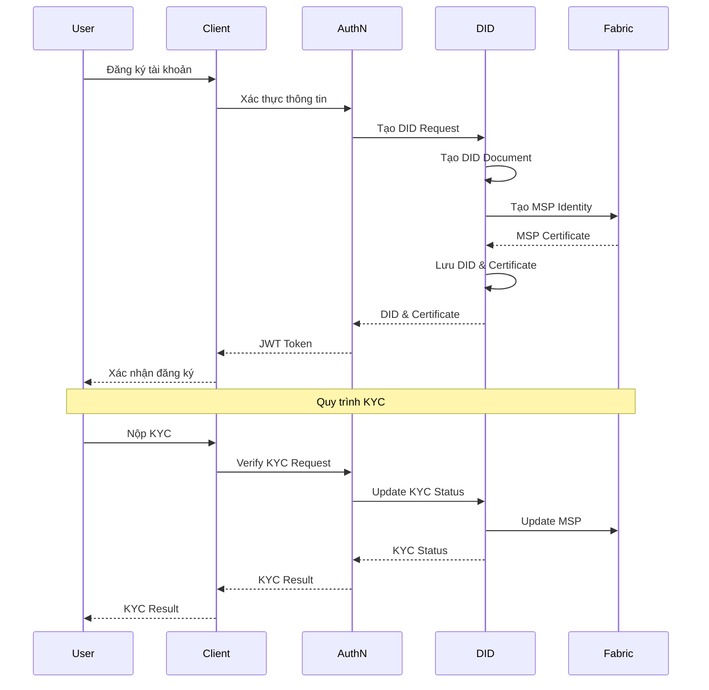
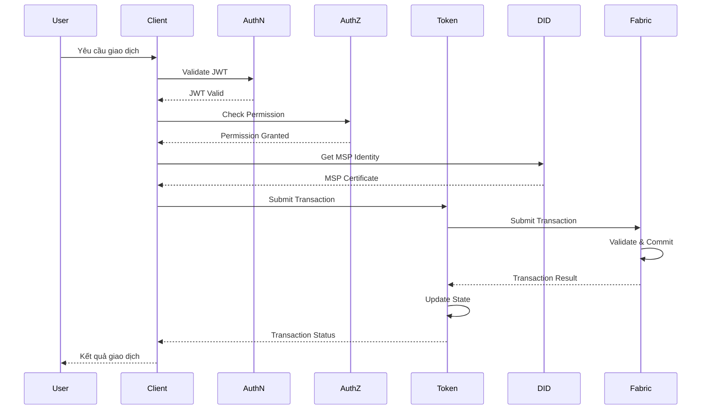
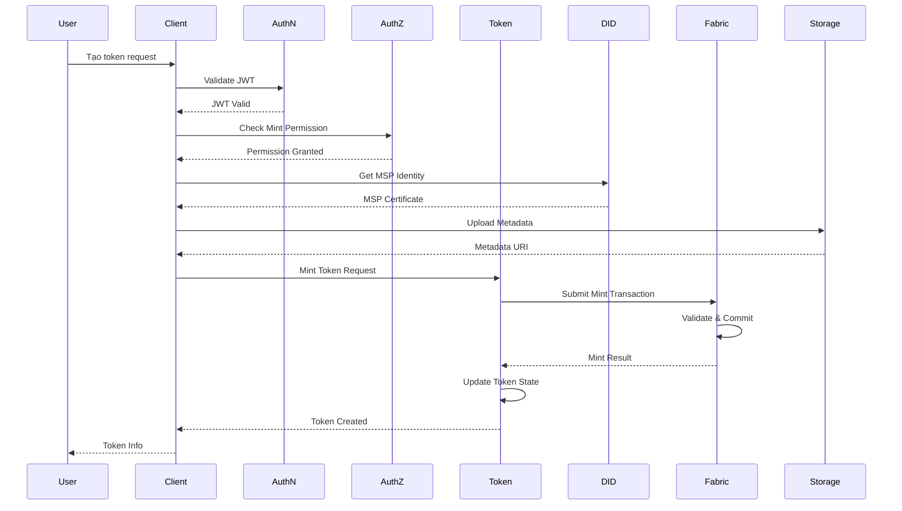
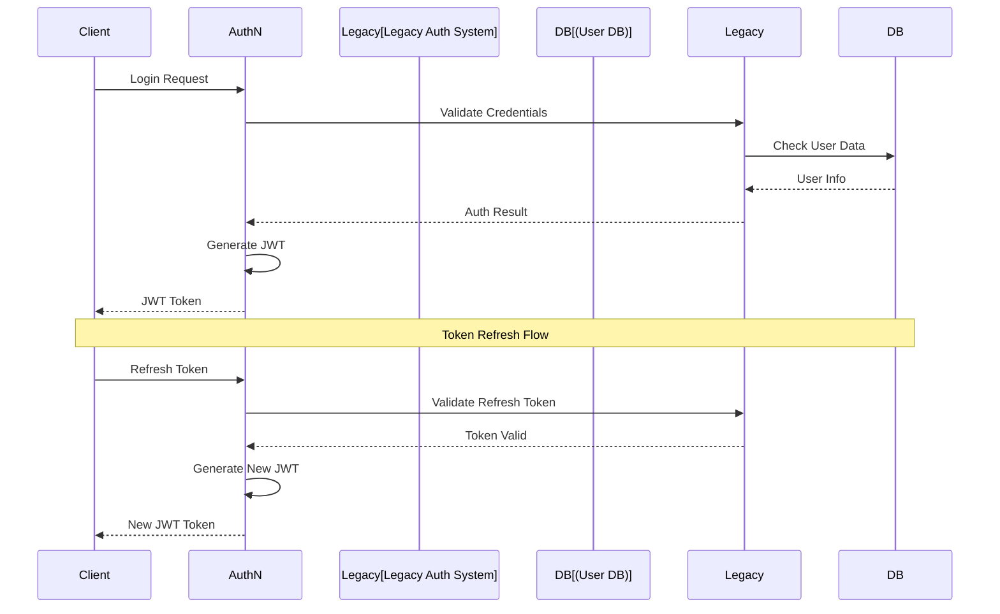
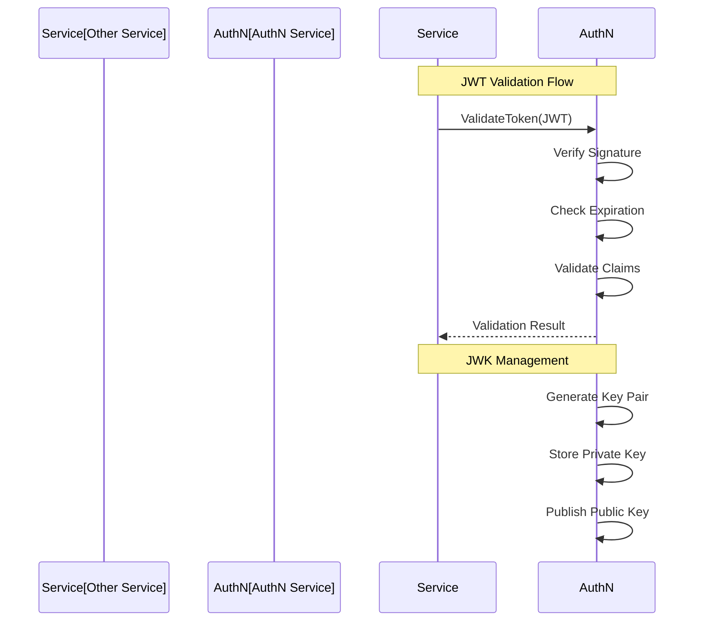
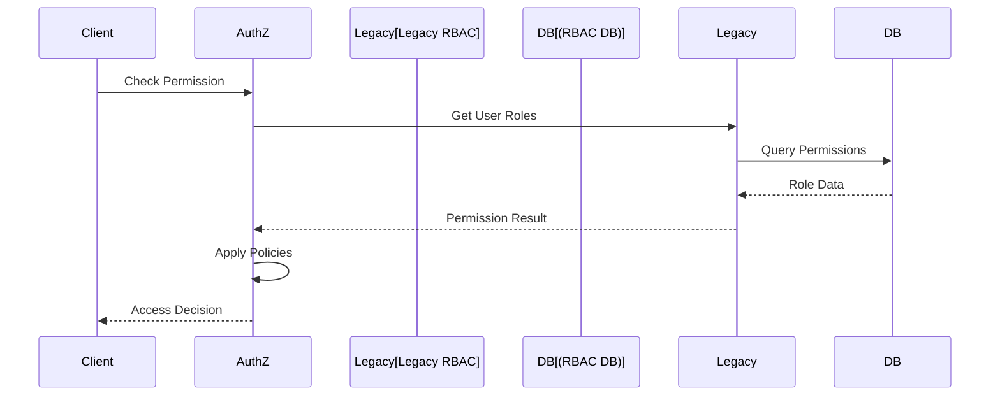
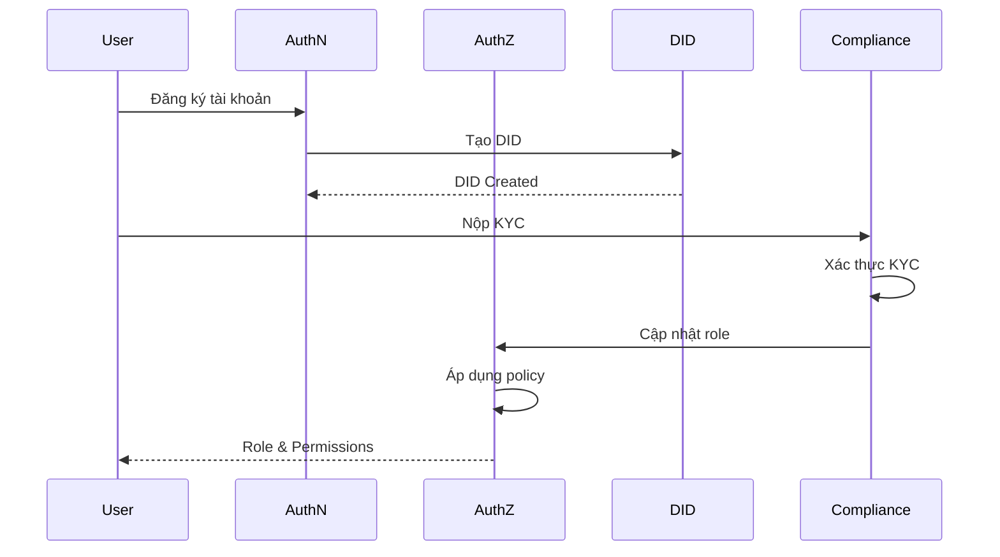

# Yêu Cầu Chức Năng - Hệ Thống Quản Lý Tài Sản Số

## 1. Mục tiêu hệ thống

Xây dựng một hệ thống quản lý tài sản số tích hợp với blockchain Hyperledger Fabric, hỗ trợ việc token hóa tài sản truyền thống như bất động sản, chứng chỉ tiền gửi, và quỹ đầu tư. Hệ thống cần đảm bảo xác thực người dùng qua AuthN Service, phân quyền truy cập qua AuthZ Service, và hỗ trợ giao dịch token thông qua Fabric Token SDK.

---

## 2. Kiến trúc hệ thống tổng thể

### 2.1 Sơ đồ hệ thống tổng quan



### 2.2 Luồng xử lý DID



### 2.3 Luồng giao dịch token



### 2.4 Luồng tạo token



* **AuthN Service**: Cung cấp xác thực người dùng và cấp JWT token cho các phiên làm việc.
* **AuthZ Service**: Quản lý phân quyền truy cập dựa trên vai trò người dùng (RBAC).
* **DID Service**: Cung cấp DID (Decentralized Identifiers) và ánh xạ người dùng đến danh tính trong hệ thống (MSP, cert).
* **Token Service**: Thực hiện logic token (mint, transfer, burn, view) thông qua Fabric Token SDK.
* **Event Service**: Xử lý và phát tán các sự kiện trong hệ thống.
* **Client App**: Giao diện frontend tương tác với người dùng.
* **Fabric Network**: Ghi nhận các giao dịch token hóa tài sản trên mạng blockchain riêng.

---

## 3. Yêu cầu chức năng

### 3.1 Token hóa tài sản số

* Hỗ trợ token hóa các tài sản vật lý và tài chính:
  * Bất động sản
  * Chứng chỉ tiền gửi (CDs)
  * Chứng chỉ quỹ đầu tư (IFCs)
  * Stablecoin (bảo chứng bởi tiền pháp định, hàng hóa, hoặc crypto)
* Mỗi token đại diện cho toàn bộ hoặc một phần quyền sở hữu tài sản
* Quy trình token hóa bao gồm:
  * Định danh và định giá tài sản
  * Lưu ký tài sản (nếu cần)
  * Thiết kế cấu trúc token (fungible / NFT / fractional NFT)
  * Phát hành token (mint) thông qua smart contract
  * Ghi nhận quyền sở hữu trên blockchain
  * Giao dịch và chuyển nhượng token qua các cơ chế on-chain
* Tích hợp metadata (IPFS hoặc lưu trữ ngoài) gắn kèm token
* Hỗ trợ whitelist/blacklist để đảm bảo chỉ người dùng đã KYC mới tương tác được với loại token pháp lý đặc thù

### 3.2 Tạo và phát hành Token

* Nhận thông tin tài sản từ người dùng/quản trị viên
* Xác thực người dùng qua AuthN Service và lấy JWT token
* Kiểm tra quyền mint token qua AuthZ Service
* Gọi DID để ánh xạ MSP/certificate của chủ sở hữu
* Gọi Fabric Token SDK để tạo token (UTXO based)
* Lưu metadata mô tả tài sản và token tương ứng

### 3.3 Chuyển nhượng & Giao dịch Token

* Cho phép người dùng chuyển token sang người khác
* Xác thực JWT token qua AuthN Service
* Kiểm tra quyền qua AuthZ Service
* Gọi DID → lấy cert người gửi/người nhận
* Giao dịch sử dụng hàm `Transfer` của Token SDK
* Hỗ trợ giao dịch P2P và tích hợp marketplace
* Triển khai cơ chế thanh toán giao nhận nguyên tử (DvP)

### 3.4 Hủy Token

* Cho phép người sở hữu chủ động hủy bỏ token
* Xác thực JWT token qua AuthN Service
* Kiểm tra quyền qua AuthZ Service
* Gọi DID → xác thực danh tính và cert
* Gọi `Burn` SDK để xóa token khỏi mạng

### 3.5 Truy vấn số dư và lịch sử giao dịch

* Cho phép người dùng xem số dư token của mình
* Cho phép truy vấn lịch sử giao dịch (txID, timestamp, status...)
* Tích hợp Fabric Event hoặc chaincode để nhận sự kiện realtime

### 3.6 Tự động phân phối lợi tức

* Token có liên quan đến chứng chỉ tiền gửi, bất động sản cho thuê...
* Định kỳ phân phối lợi tức qua logic hợp đồng thông minh hoặc job định kỳ
* Lưu thông tin giao dịch lợi tức và gửi thông báo đến người sở hữu
* Hỗ trợ tái đầu tư tự động (SIP)

### 3.7 Báo cáo và tích hợp dữ liệu

* Tổng hợp báo cáo sở hữu token theo thời gian, loại tài sản
* Hỗ trợ export dữ liệu cho cơ quan quản lý (CSV, API)
* Tích hợp DID để xác định người dùng và AuthZ để giới hạn quyền xem báo cáo
* Theo dõi giao dịch on-chain hoặc hash dữ liệu off-chain để kiểm chứng

---

## 4. Yêu cầu phi chức năng

### 4.1 Bảo mật

* Xác thực qua AuthN Service và JWT token
* Giao dịch được ký bằng cert từ DID Service (MSP Identity)
* Kiểm tra quyền chi tiết theo từng hành động qua AuthZ Service
* Ngăn chặn các tấn công như:
  * Reentrancy
  * Oracle Manipulation
  * Replay attack
  * JWT token theft
  * Session hijacking

### 4.2 Khả năng mở rộng

* Hỗ trợ nhiều loại tài sản và nhiều tổ chức sở hữu
* Thiết kế dạng microservice để dễ tách module theo nghiệp vụ (mint, transfer...)
* Chuẩn bị cho khả năng triển khai đa chuỗi (multi-chain)

### 4.3 Tính sẵn sàng và khôi phục

* Hỗ trợ HA (High Availability) và backup định kỳ
* Có khả năng khôi phục token theo snapshot trạng thái cuối cùng
* Hệ thống hoạt động 24/7 với cơ chế failover
* Hỗ trợ nhân bản ngang (horizontal scaling)

### 4.4 Khả năng tích hợp

* Tích hợp với:
  * AuthN Service để xác thực người dùng và quản lý phiên
  * AuthZ Service để kiểm tra quyền truy cập
  * DID Service để định danh người dùng
  * Hyperledger Fabric Token SDK (qua Gateway)
  * Chainlink oracle để cập nhật NAV, giá
  * IPFS hoặc MinIO để lưu metadata

---

## 5. Ưu tiên triển khai giai đoạn đầu (MVP)

| Chức năng                         | Ưu tiên    |
| --------------------------------- | ---------- |
| Tạo Token tài sản (mint)          | Cao        |
| Chuyển Token (transfer)           | Cao        |
| Hủy Token (burn)                  | Cao        |
| Truy vấn số dư, lịch sử giao dịch | Trung bình |
| Tích hợp AuthN và AuthZ           | Cao        |
| Tích hợp DID                      | Cao        |
| SIP & tự động hóa lợi tức         | Trung bình |
| Hệ thống báo cáo                  | Trung bình |
| Hỗ trợ cross-chain                | Thấp       |

---

## 6. Ghi chú triển khai kỹ thuật

* Chaincode sử dụng Fabric Token SDK dạng external
* AuthN Service và AuthZ Service được viết bằng Go
* DID Service có thể được viết bằng Go hoặc NestJS tùy môi trường
* Giao dịch nên thực hiện qua gRPC hoặc HTTP API Gateway
* Cơ sở dữ liệu lưu thông tin metadata về tài sản token hóa (PostgreSQL hoặc MongoDB tùy quy mô)
* IPFS hoặc MinIO có thể dùng để lưu trữ file chứng nhận/metadata nếu cần
* Hỗ trợ triển khai đa chuỗi trong tương lai
* Tích hợp Chainlink để cập nhật giá và NAV

*Cập nhật: 31/05/2025*

## 7. Tích hợp với hệ thống AuthN/AuthZ hiện tại

### 7.1 Tích hợp AuthN Service





* **Tích hợp xác thực**:
  * Sử dụng API Gateway hiện tại để xác thực
  * Chuyển đổi session token sang JWT
  * Hỗ trợ SSO với hệ thống hiện tại
  * Duy trì backward compatibility

* **Quản lý phiên**:
  * Đồng bộ session giữa hệ thống cũ và mới
  * Hỗ trợ token refresh
  * Xử lý logout đồng bộ
  * Theo dõi trạng thái phiên

* **JWT Management & Validation**:
  * AuthN Service quản lý toàn bộ lifecycle của JWT
  * Expose gRPC endpoint cho các service khác validate token
  * Tự động rotate key pairs
  * Cache validation results
  * Hỗ trợ token revocation

* **Tính năng bảo mật**:
  * Sử dụng RSA/ECDSA key pairs cho JWT signing
  * Private key được lưu trữ an toàn trong AuthN Service
  * Public key được publish cho các service khác
  * Rate limiting cho validation requests
  * Audit log cho mọi validation request

### 7.2 Tích hợp AuthZ Service



* **Tích hợp phân quyền**:
  * Map roles từ hệ thống cũ sang RBAC mới
  * Chuyển đổi permissions format
  * Hỗ trợ policy inheritance
  * Duy trì audit trail

* **Quản lý quyền**:
  * Đồng bộ role changes
  * Validate permissions
  * Cache permission data
  * Log access decisions

### 7.3 Yêu cầu kỹ thuật

* **API Integration**:
  * REST API endpoints cho AuthN/AuthZ
  * gRPC services cho internal calls
  * WebSocket cho real-time updates
  * Rate limiting và circuit breaking

* **Data Migration**:
  * Migrate user data
  * Convert role mappings
  * Preserve audit logs
  * Validate data integrity

* **Security**:
  * Encrypt sensitive data
  * Secure API communication
  * Monitor integration points
  * Regular security audits

* **Monitoring**:
  * Track integration metrics
  * Alert on failures
  * Monitor performance
  * Log integration events

*Cập nhật: 31/05/2025* 

## 8. Interface giữa các Service

### 8.1 DID ↔ AuthN Interface

```protobuf
service DIDService {
    // Tạo DID cho user mới
    rpc CreateDID(CreateDIDRequest) returns (CreateDIDResponse);
    
    // Lấy thông tin DID của user
    rpc GetDID(GetDIDRequest) returns (GetDIDResponse);
    
    // Cập nhật trạng thái KYC
    rpc UpdateKYCStatus(UpdateKYCRequest) returns (UpdateKYCResponse);
    
    // Lấy MSP Identity cho giao dịch
    rpc GetMSPIdentity(GetMSPRequest) returns (GetMSPResponse);
}

message CreateDIDRequest {
    string user_id = 1;
    string email = 2;
    string phone = 3;
}

message CreateDIDResponse {
    string did = 1;
    string msp_id = 2;
    bytes certificate = 3;
}

message GetDIDRequest {
    string user_id = 1;
}

message GetDIDResponse {
    string did = 1;
    string msp_id = 2;
    KYCStatus kyc_status = 3;
    bytes certificate = 4;
}

enum KYCStatus {
    UNVERIFIED = 0;
    PENDING = 1;
    VERIFIED = 2;
    REJECTED = 3;
}
```

### 8.2 DID ↔ Asset Interface

```protobuf
service AssetService {
    // Tạo tài sản mới
    rpc CreateAsset(CreateAssetRequest) returns (CreateAssetResponse);
    
    // Cập nhật thông tin tài sản
    rpc UpdateAsset(UpdateAssetRequest) returns (UpdateAssetResponse);
    
    // Lấy thông tin tài sản
    rpc GetAsset(GetAssetRequest) returns (GetAssetResponse);
    
    // Xác thực quyền sở hữu
    rpc VerifyOwnership(VerifyOwnershipRequest) returns (VerifyOwnershipResponse);
}

message CreateAssetRequest {
    string owner_did = 1;
    AssetType asset_type = 2;
    string metadata_uri = 3;
    map<string, string> properties = 4;
}

message CreateAssetResponse {
    string asset_id = 1;
    string token_id = 2;
    string status = 3;
}

enum AssetType {
    REAL_ESTATE = 0;
    CERTIFICATE_OF_DEPOSIT = 1;
    INVESTMENT_FUND = 2;
    STABLECOIN = 3;
}
```

### 8.3 Asset ↔ Token Interface

```protobuf
service TokenService {
    // Tạo token cho tài sản
    rpc MintToken(MintTokenRequest) returns (MintTokenResponse);
    
    // Chuyển token
    rpc TransferToken(TransferTokenRequest) returns (TransferTokenResponse);
    
    // Hủy token
    rpc BurnToken(BurnTokenRequest) returns (BurnTokenResponse);
    
    // Lấy thông tin token
    rpc GetToken(GetTokenRequest) returns (GetTokenResponse);
}

message MintTokenRequest {
    string asset_id = 1;
    string owner_did = 2;
    uint64 amount = 3;
    string metadata_uri = 4;
}

message MintTokenResponse {
    string token_id = 1;
    string transaction_id = 2;
    string status = 3;
}

message TransferTokenRequest {
    string token_id = 1;
    string from_did = 2;
    string to_did = 3;
    uint64 amount = 4;
}

message TransferTokenResponse {
    string transaction_id = 1;
    string status = 2;
}
```

### 8.4 Các Interface khác

#### 8.4.1 AuthN ↔ AuthZ Interface

```protobuf
service AuthZService {
    // Kiểm tra quyền truy cập
    rpc CheckPermission(CheckPermissionRequest) returns (CheckPermissionResponse);
    
    // Lấy danh sách quyền của user
    rpc GetUserPermissions(GetUserPermissionsRequest) returns (GetUserPermissionsResponse);
}

message CheckPermissionRequest {
    string user_id = 1;
    string resource = 2;
    string action = 3;
}

message CheckPermissionResponse {
    bool allowed = 1;
    string reason = 2;
}
```

#### 8.4.2 Token ↔ Event Interface

```protobuf
service EventService {
    // Đăng ký lắng nghe sự kiện
    rpc Subscribe(SubscribeRequest) returns (stream Event);
    
    // Publish sự kiện
    rpc Publish(PublishRequest) returns (PublishResponse);
}

message Event {
    string event_type = 1;
    string token_id = 2;
    string transaction_id = 3;
    string status = 4;
    int64 timestamp = 5;
    map<string, string> metadata = 6;
}
```

### 8.5 Lưu ý triển khai

* **gRPC Communication**:
  * Sử dụng gRPC cho tất cả internal service communication
  * Implement retry mechanism cho các gọi service
  * Sử dụng circuit breaker pattern
  * Implement timeout cho mọi request

* **Error Handling**:
  * Định nghĩa rõ error codes cho từng service
  * Implement proper error propagation
  * Log đầy đủ thông tin lỗi
  * Có cơ chế retry cho các lỗi tạm thời

* **Security**:
  * Mã hóa tất cả internal communication
  * Implement service-to-service authentication
  * Validate input data
  * Rate limiting cho mọi endpoint

* **Monitoring**:
  * Track latency cho mọi service call
  * Monitor error rates
  * Alert khi có vấn đề
  * Log đầy đủ thông tin cho debugging

*Cập nhật: 31/05/2025* 

## 9. Vai trò người dùng và Phân quyền

### 9.1 Định nghĩa vai trò

```protobuf
enum UserRole {
    // Vai trò quản trị hệ thống
    SYSTEM_ADMIN = 0;      // Quản trị viên hệ thống
    COMPLIANCE_OFFICER = 1; // Nhân viên tuân thủ
    AUDITOR = 2;           // Kiểm toán viên
    
    // Vai trò quản lý tài sản
    ASSET_OWNER = 10;      // Chủ sở hữu tài sản
    ASSET_MANAGER = 11;    // Người quản lý tài sản
    ASSET_OPERATOR = 12;   // Người vận hành tài sản
    
    // Vai trò đầu tư
    INVESTOR = 20;         // Nhà đầu tư
    INSTITUTIONAL_INVESTOR = 21; // Nhà đầu tư tổ chức
    RETAIL_INVESTOR = 22;  // Nhà đầu tư cá nhân
    
    // Vai trò đối tác
    BROKER = 30;           // Môi giới
    CUSTODIAN = 31;        // Người giữ tài sản
    LEGAL_ADVISOR = 32;    // Cố vấn pháp lý
}
```

### 9.2 Quyền hạn theo vai trò

#### 9.2.1 Quản trị hệ thống
* **SYSTEM_ADMIN**:
  * Quản lý toàn bộ hệ thống
  * Cấu hình các tham số hệ thống
  * Quản lý người dùng và vai trò
  * Xem toàn bộ logs và metrics
  * Có quyền cao nhất trong hệ thống

* **COMPLIANCE_OFFICER**:
  * Xem xét và phê duyệt KYC
  * Giám sát các giao dịch
  * Báo cáo tuân thủ
  * Đánh giá rủi ro
  * Không có quyền thay đổi cấu hình hệ thống

* **AUDITOR**:
  * Xem toàn bộ lịch sử giao dịch
  * Truy xuất logs hệ thống
  * Tạo báo cáo kiểm toán
  * Không có quyền thực hiện thay đổi

#### 9.2.2 Quản lý tài sản
* **ASSET_OWNER**:
  * Tạo và quản lý tài sản
  * Phát hành token
  * Quyết định chính sách phân phối
  * Xem báo cáo tài sản
  * Không thể thay đổi cấu hình hệ thống

* **ASSET_MANAGER**:
  * Quản lý hoạt động tài sản
  * Thực hiện giao dịch
  * Tạo báo cáo quản lý
  * Không thể phát hành token mới

* **ASSET_OPERATOR**:
  * Thực hiện các hoạt động vận hành
  * Cập nhật trạng thái tài sản
  * Không có quyền quản lý tài chính

#### 9.2.3 Nhà đầu tư
* **INVESTOR** (Base role):
  * Xem thông tin tài sản
  * Thực hiện giao dịch
  * Xem báo cáo đầu tư
  * Không thể tạo tài sản mới

* **INSTITUTIONAL_INVESTOR**:
  * Tất cả quyền của INVESTOR
  * Giao dịch số lượng lớn
  * Truy cập API riêng
  * Yêu cầu KYC nâng cao

* **RETAIL_INVESTOR**:
  * Giao dịch giới hạn
  * Truy cập thông tin cơ bản
  * Yêu cầu KYC cơ bản

#### 9.2.4 Đối tác
* **BROKER**:
  * Tạo và quản lý đơn hàng
  * Xem thông tin thị trường
  * Không thể thực hiện giao dịch trực tiếp

* **CUSTODIAN**:
  * Quản lý tài sản vật lý
  * Xác nhận quyền sở hữu
  * Không có quyền giao dịch

* **LEGAL_ADVISOR**:
  * Xem tài liệu pháp lý
  * Tạo báo cáo pháp lý
  * Không có quyền thực hiện thay đổi

### 9.3 Quy trình phân quyền



### 9.4 Policy Management

```protobuf
message RolePolicy {
    string role = 1;
    repeated string permissions = 2;
    map<string, string> constraints = 3;
    int64 max_transaction_amount = 4;
    repeated string allowed_asset_types = 5;
}

message UserPolicy {
    string user_id = 1;
    string role = 2;
    KYCStatus kyc_status = 3;
    repeated string additional_permissions = 4;
    map<string, string> custom_constraints = 5;
}
```

### 9.5 Lưu ý triển khai

* **Role Hierarchy**:
  * Implement role inheritance
  * Hỗ trợ custom roles
  * Có thể override permissions
  * Audit log cho mọi thay đổi

* **KYC Integration**:
  * KYC level ảnh hưởng đến quyền
  * Tự động cập nhật role sau KYC
  * Hỗ trợ KYC nâng cao
  * Lưu trữ KYC history

* **Compliance**:
  * Kiểm tra tuân thủ theo role
  * Giới hạn giao dịch theo role
  * Báo cáo vi phạm
  * Alert khi có bất thường

* **Monitoring**:
  * Track role changes
  * Monitor permission usage
  * Alert on policy violations
  * Regular compliance reports

*Cập nhật: 31/05/2025*