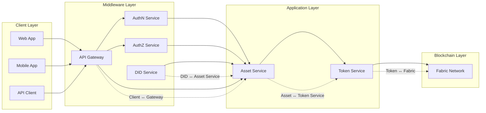
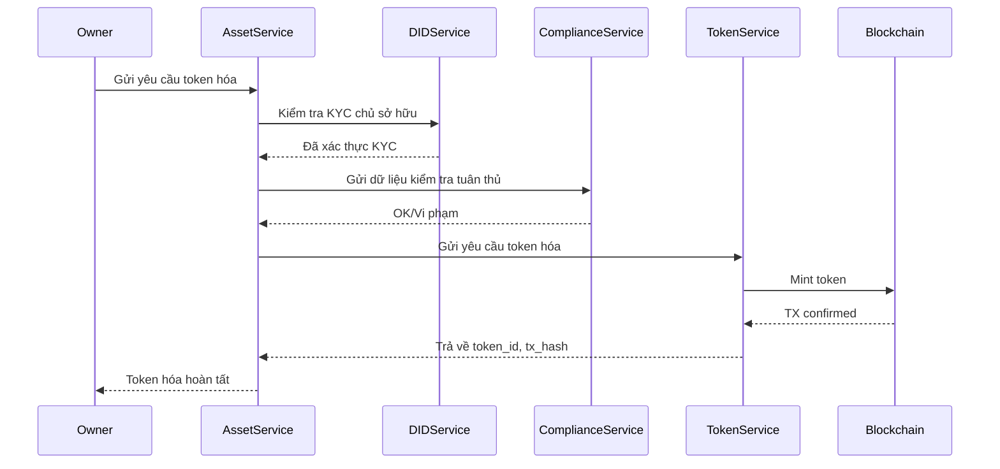
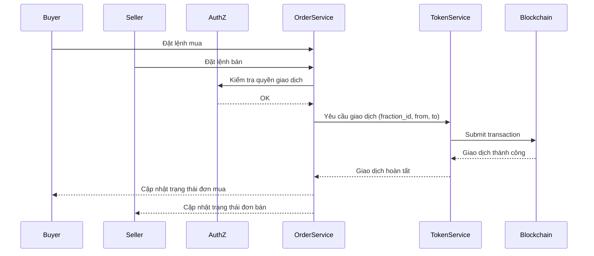

# Tài Liệu Yêu Cầu Chức Năng - Hệ Thống Quản Lý Tài Sản Số

## Mục lục
1. [Tổng quan](#1-tổng-quan)
2. [Kiến trúc hệ thống](#2-kiến-trúc-hệ-thống)
3. [Yêu cầu chức năng](#3-yêu-cầu-chức-năng)
4. [Yêu cầu phi chức năng](#4-yêu-cầu-phi-chức-năng)
5. [Interface giữa các Service](#5-interface-giữa-các-service)
6. [Vai trò người dùng và Phân quyền](#6-vai-trò-người-dùng-và-phân-quyền)
7. [Quy trình nghiệp vụ](#7-quy-trình-nghiệp-vụ)
8. [Triển khai và Vận hành](#8-triển-khai-và-vận-hành)
9. [Phần mở rộng (Future Scope)](#9-phần-mở-rộng-future-scope)

## 1. Tổng quan

### 1.1 Mục tiêu
Xây dựng hệ thống quản lý tài sản số (Digital Asset Service) tích hợp với các dịch vụ xác thực và phân quyền, hỗ trợ việc token hóa và quản lý tài sản truyền thống như bất động sản, chứng chỉ tiền gửi, và quỹ đầu tư.

### 1.2 Phạm vi
- Token hóa tài sản vật lý và tài chính
- Quản lý quyền sở hữu và giao dịch
- Tích hợp với AuthN Service cho xác thực người dùng
- Tích hợp với AuthZ Service cho phân quyền truy cập
- Tích hợp với DID Service cho quản lý danh tính

### 1.3 Đối tượng người dùng
- Chủ sở hữu tài sản
- Nhà đầu tư
- Quản trị viên hệ thống
- Đối tác và bên thứ ba

## 2. Kiến trúc hệ thống

### 2.1 Sơ đồ hệ thống tổng quan

#### 2.1.1 Sơ đồ high-level



#### 2.1.2 Sơ đồ chi tiết


### 2.2 Các thành phần chính

#### 2.2.1 Asset Service
- Quản lý thông tin và metadata của tài sản (real estate, CD, fund...)
- Xác thực DID chủ sở hữu tài sản khi tạo và cập nhật
- Kích hoạt quá trình token hóa bằng cách gọi Token Service khi tài sản được phê duyệt
- Ghi thông tin tài sản (metadata hash, approval event...) lên Fabric nếu cần đảm bảo tính bất biến
- Quản lý trạng thái vòng đời tài sản (Draft → Submitted → Approved/Rejected/AwaitingFix → Tokenized → Archived)
- Theo dõi và đồng bộ trạng thái token thông qua event từ Token Service
- Ghi log audit cho mọi thay đổi metadata và trạng thái tài sản với thông tin:
  - Thời gian thay đổi
  - Người thực hiện (DID)
  - Loại thay đổi (metadata/state)
  - Giá trị cũ và mới
  - Lý do thay đổi
  - Transaction hash (nếu có)
  - IP address và user agent
  - Session ID
- Xử lý trạng thái Rejected và AwaitingFix:
  - Cho phép chuyển trạng thái từ Submitted → Rejected/AwaitingFix
  - Yêu cầu lý do từ chối hoặc yêu cầu sửa đổi
  - Thông báo cho chủ sở hữu tài sản
  - Cho phép chủ sở hữu cập nhật và gửi lại từ trạng thái AwaitingFix
  - Lưu lịch sử các lần từ chối và yêu cầu sửa đổi

#### 2.2.2 Token Service
- Chịu trách nhiệm toàn bộ về vòng đời token (mint, burn, transfer, query balance, transaction history)
- Tương tác trực tiếp với Hyperledger Fabric thông qua chaincode chuẩn ERC-20 hoặc mô-đun Token SDK
- Nhận yêu cầu token hóa từ Asset Service và xác nhận lại DID trước khi mint token
- Ghi log giao dịch và số dư token vào hệ thống lưu trữ riêng (có thể dùng PostgreSQL hoặc MongoDB cho truy vấn nhanh)
- Hỗ trợ mở rộng: Marketplace (đặt lệnh giao dịch), Staking, Quản lý cổ tức/phân phối lợi nhuận
- Cung cấp gRPC/REST interface cho các dịch vụ khác (Asset, Wallet, Marketplace) để truy cập dữ liệu token

#### 2.2.3 AuthN Service
- Xác thực người dùng
- Quản lý phiên
- Cấp phát JWT

#### 2.2.4 AuthZ Service
- Phân quyền truy cập
- Quản lý vai trò
- Kiểm tra quyền

#### 2.2.5 DID Service
- Quản lý danh tính
- Xác thực KYC
- Cấp phát MSP Identity

### 2.3 Luồng xử lý tài sản


### 2.4 Luồng giao dịch


## 3. Yêu cầu chức năng

### 3.1 Quản lý tài sản
- Tạo và cập nhật thông tin tài sản
- Token hóa tài sản
- Quản lý quyền sở hữu
- Theo dõi trạng thái tài sản
- Xử lý từ chối và yêu cầu sửa đổi:
  - Phân quyền cho phép từ chối/yêu cầu sửa đổi
  - Quản lý lý do từ chối và yêu cầu sửa đổi
  - Theo dõi số lần từ chối và sửa đổi
  - Thông báo tự động cho các bên liên quan
  - Lưu trữ lịch sử thay đổi và phản hồi
- Quản lý tài sản phân đoạn (Fractional Asset):
  - Chia nhỏ tài sản thành các phần nhỏ hơn (fractions)
  - Mapping mỗi fraction với DID của chủ sở hữu
  - Theo dõi tỷ lệ sở hữu của mỗi DID
  - Hỗ trợ chuyển nhượng từng fraction riêng lẻ

### 3.2 Quản lý token
- Phát hành token (mint)
- Hủy token (burn)
- Chuyển token (transfer)
- Quản lý số dư
- Lịch sử giao dịch

### 3.3 Quản lý người dùng
- Đăng ký và xác thực
- Phân quyền truy cập
- Quản lý danh tính
- KYC/AML

### 3.4 Giao dịch
- Thực hiện giao dịch chuyển nhượng tài sản
- Xác nhận giao dịch

## 5. Interface giữa các Service

### 5.1 Asset ↔ AuthN Interface

### 5.2 Asset ↔ AuthZ Interface

```protobuf
service AuthZService {
    // Kiểm tra quyền truy cập
    rpc CheckPermission(CheckPermissionRequest) returns (CheckPermissionResponse);
    
    // Lấy danh sách quyền của user
    rpc GetUserPermissions(GetUserPermissionsRequest) returns (GetUserPermissionsResponse);
    
    // Kiểm tra quyền sở hữu tài sản
    rpc CheckAssetOwnership(CheckAssetOwnershipRequest) returns (CheckAssetOwnershipResponse);
}

message CheckPermissionRequest {
    string user_id = 1;
    string resource = 2;
    string action = 3;
}

message CheckPermissionResponse {
    bool allowed = 1;
    string reason = 2;
}

message GetUserPermissionsRequest {
    string user_id = 1;
}

message GetUserPermissionsResponse {
    repeated string permissions = 1;
    map<string, string> constraints = 2;
}

message CheckAssetOwnershipRequest {
    string user_id = 1;
    string asset_id = 2;
}

message CheckAssetOwnershipResponse {
    bool is_owner = 1;
    string ownership_type = 2; // FULL, PARTIAL, NONE
    double ownership_percentage = 3;
}
```

### 5.3 Giao tiếp giữa Asset Service ↔ Token Service

#### 5.3.1 Mục tiêu
- **Asset Service**: quản lý metadata và trạng thái vòng đời tài sản.
- **Token Service**: chịu trách nhiệm token hóa, giao dịch token, kiểm tra tuân thủ (compliance).

#### 5.3.2 Giao diện gRPC: Token Service

```protobuf
service TokenService {
    rpc RequestTokenization(RequestTokenizationRequest) returns (RequestTokenizationResponse);
    rpc GetTokenizationStatus(GetTokenizationStatusRequest) returns (GetTokenizationStatusResponse);
    rpc GetTokenInfo(GetTokenInfoRequest) returns (GetTokenInfoResponse);
    rpc UpdateTokenState(UpdateTokenStateRequest) returns (UpdateTokenStateResponse);
    rpc ValidateCompliance(ValidateComplianceRequest) returns (ValidateComplianceResponse);
    rpc UpdateComplianceStatus(UpdateComplianceStatusRequest) returns (UpdateComplianceStatusResponse);
}

message RequestTokenizationRequest {
    string asset_id = 1;
    string owner_did = 2;
    TokenType token_type = 3;
    double initial_supply = 4;
    map<string, string> metadata = 5;
}

message RequestTokenizationResponse {
    string tokenization_id = 1;
    TokenizationStatus status = 2;
    string message = 3;
    int64 expires_at = 4;
}

enum TokenizationStatus {
    INITIATED = 0;
    VALIDATING = 1;
    MINTING = 2;
    SUCCESS = 3;
    FAILED = 4;
    REJECTED = 5;
}

message GetTokenizationStatusRequest {
    string tokenization_id = 1;
    string asset_id = 2;
}

message GetTokenizationStatusResponse {
    TokenizationStatus status = 1;
    string token_id = 2;
    string message = 3;
    map<string, string> details = 4;
}

message GetTokenInfoRequest {
    string asset_id = 1;
    string token_id = 2;
}

message GetTokenInfoResponse {
    string token_id = 1;
    string token_address = 2;
    TokenType token_type = 3;
    double total_supply = 4;
    string owner_did = 5;
    AssetState state = 6;
    map<string, string> metadata = 7;
}

message UpdateTokenStateRequest {
    string asset_id = 1;
    string token_id = 2;
    AssetState new_state = 3;
    string reason = 4;
    map<string, string> metadata = 5;
}

message UpdateTokenStateResponse {
    string status = 1;
    string message = 2;
    string transaction_hash = 3;
}

enum AssetState {
    ACTIVE = 0;
    FROZEN = 1;
    SUSPENDED = 2;
    REVOKED = 3;
    COMPLIANCE_HOLD = 4;
}

message ValidateComplianceRequest {
    string asset_id = 1;
    string token_id = 2;
    ComplianceType compliance_type = 3;
    map<string, string> parameters = 4;
}

message ValidateComplianceResponse {
    bool valid = 1;
    repeated string violations = 2;
    string message = 3;
    map<string, string> details = 4;
}

message UpdateComplianceStatusRequest {
    string asset_id = 1;
    string token_id = 2;
    ComplianceStatus status = 3;
    string report_id = 4;
    map<string, string> details = 5;
}

message UpdateComplianceStatusResponse {
    string status = 1;
    string message = 2;
    int64 updated_at = 3;
}

enum ComplianceType {
    KYC = 0;
    AML = 1;
    SANCTIONS = 2;
    REGULATORY = 3;
}

enum ComplianceStatus {
    COMPLIANT = 0;
    NON_COMPLIANT = 1;
    PENDING_REVIEW = 2;
    EXEMPTED = 3;
}
```

#### 5.3.3 Lưu ý triển khai

- **gRPC Communication**:
  - Sử dụng gRPC cho tất cả internal service communication
  - Implement retry mechanism cho các gọi service
  - Sử dụng circuit breaker pattern
  - Implement timeout cho mọi request

- **Error Handling**:
  - Định nghĩa rõ error codes cho từng service
  - Implement proper error propagation
  - Log đầy đủ thông tin lỗi
  - Có cơ chế retry cho các lỗi tạm thời

- **Security**:
  - Mã hóa tất cả internal communication
  - Implement service-to-service authentication
  - Validate input data
  - Rate limiting cho mọi endpoint

- **Monitoring**:
  - Track latency cho mọi service call
  - Monitor error rates
  - Alert khi có vấn đề
  - Log đầy đủ thông tin cho debugging

## 7. Quy trình nghiệp vụ

### 7.1 Quy trình token hóa tài sản



### 7.2 Quy trình giao dịch



## 8. Triển khai và Vận hành

### 8.1 Yêu cầu triển khai
- Kubernetes cluster
- Hyperledger Fabric network
- Database cluster
- Monitoring system

### 8.2 Quy trình vận hành
- Monitoring và alerting
- Backup và restore
- Scaling và load balancing
- Security patching

#### 8.2.1 Monitoring với Prometheus + Grafana

##### 8.2.1.1 Metrics cần theo dõi

- **Service Metrics**:
  - Request rate (RPS)
  - Response time (p50, p90, p99)
  - Error rate
  - Service uptime
  - Resource usage (CPU, Memory, Disk)
  - Audit log volume và retention

- **Token Metrics**:
  - Token mint rate
  - Token transfer volume
  - Token burn rate
  - Active token holders
  - Token transaction latency

- **Blockchain Metrics**:
  - Transaction throughput
  - Block confirmation time
  - Network latency
  - Peer status
  - Chaincode performance

- **Business Metrics**:
  - Daily active users
  - Transaction volume
  - Asset tokenization rate
  - User growth rate
  - Error distribution

##### 8.2.1.2 Prometheus Configuration

```yaml
global:
  scrape_interval: 15s
  evaluation_interval: 15s

scrape_configs:
  - job_name: 'asset-service'
    static_configs:
      - targets: ['asset-service:8080']
    metrics_path: '/metrics'
    
  - job_name: 'token-service'
    static_configs:
      - targets: ['token-service:8080']
    metrics_path: '/metrics'
    
  - job_name: 'fabric-network'
    static_configs:
      - targets: ['fabric-peer:8080']
    metrics_path: '/metrics'
```

##### 8.2.1.3 Grafana Dashboards

- **Service Overview**:
  - System health
  - Resource utilization
  - Error rates
  - Response times

- **Token Operations**:
  - Mint/Transfer/Burn rates
  - Transaction volume
  - Token holder statistics
  - Transaction latency

- **Blockchain Health**:
  - Network status
  - Peer health
  - Transaction throughput
  - Block metrics

- **Business Analytics**:
  - User activity
  - Transaction trends
  - Asset tokenization
  - Error analysis

##### 8.2.1.4 Alerting Rules

```yaml
groups:
  - name: service_alerts
    rules:
      - alert: HighErrorRate
        expr: rate(http_requests_total{status=~"5.."}[5m]) > 0.1
        for: 5m
        labels:
          severity: critical
        annotations:
          summary: High error rate detected
          
      - alert: HighLatency
        expr: http_request_duration_seconds{quantile="0.9"} > 1
        for: 5m
        labels:
          severity: warning
        annotations:
          summary: High latency detected
          
      - alert: ServiceDown
        expr: up == 0
        for: 1m
        labels:
          severity: critical
        annotations:
          summary: Service is down
```

##### 8.2.1.5 Monitoring Architecture


##### 8.2.1.6 Lưu ý triển khai

- **Metrics Collection**:
  - Sử dụng client libraries cho Prometheus
  - Implement custom metrics cho business logic
  - Tối ưu sampling rate
  - Cấu hình retention policy
  - Đảm bảo audit log được lưu trữ an toàn và không thể sửa đổi

- **Audit Log Management**:
  - Lưu trữ audit log trong hệ thống riêng biệt (Elasticsearch/OpenSearch)
  - Cấu hình retention policy cho audit log (tối thiểu 7 năm)
  - Implement log rotation và archival
  - Mã hóa dữ liệu audit log
  - Backup định kỳ audit log
  - Alert khi có thay đổi bất thường về metadata hoặc state
  - Dashboard theo dõi audit log volume và patterns

### 8.3 Kế hoạch triển khai
- Phase 1: Core services
- Phase 2: Token management
- Phase 3: Trading features
- Phase 4: Advanced features

## 9. Phần mở rộng (Future Scope)

Các chức năng/phân hệ sau đây sẽ được xem xét phát triển ở các giai đoạn tiếp theo:

- **Phân phối lợi nhuận** (Profit Distribution/Dividend)
- **Voting / Quyền biểu quyết theo sở hữu**
- **Compliance Service** (Dịch vụ tuân thủ)
- **Order Service** (Sổ lệnh, khớp lệnh, giao dịch trên sàn)
- **Marketplace** (Sàn giao dịch tài sản, giao dịch fraction, đặt lệnh mua/bán)

Các nội dung này sẽ được bổ sung chi tiết trong các bản cập nhật tài liệu tiếp theo khi hệ thống mở rộng phạm vi.

*Cập nhật: 31/05/2025*
