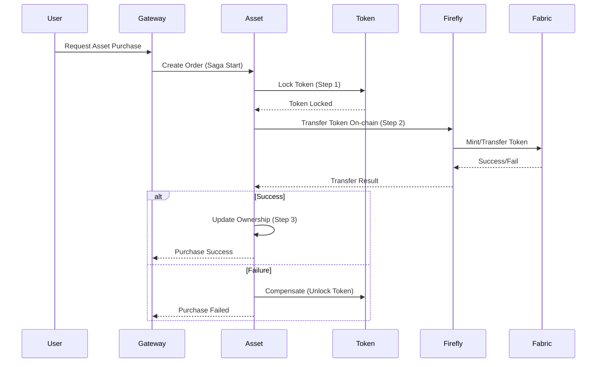

# ⚡ Saga Pattern cho Giao dịch Tài chính Phức tạp

## 1. Tổng quan về Saga Pattern

Saga Pattern là giải pháp quản lý giao dịch phân tán trong hệ thống microservices, đảm bảo tính nhất quán eventual consistency khi một giao dịch lớn được chia nhỏ thành nhiều bước (sub-transactions) thực thi trên nhiều service khác nhau. Nếu một bước thất bại, các bước đã thực hiện trước đó sẽ được rollback thông qua các "compensating actions".

## 2. Ứng dụng trong các flow tài chính

Các flow như mua bán tài sản, chuyển nhượng, chuyển token, mirror cross-chain đều liên quan đến nhiều service (Asset, Token, Firefly, Cacti, Blockchain, v.v.) và cần đảm bảo:
- Không double-spending
- Không mất mát tài sản/token khi một bước thất bại
- Có thể rollback trạng thái về an toàn

## 3. Cách triển khai Saga Pattern

- **Orchestrator-based Saga:** Một service trung tâm (có thể là Asset Service hoặc một Saga Orchestrator riêng) điều phối các bước, theo dõi trạng thái, gọi các service liên quan và xử lý rollback khi cần.
- **Choreography-based Saga:** Các service tự động lắng nghe event (qua Kafka), thực hiện bước của mình và phát event tiếp theo, rollback khi nhận event thất bại.

## 4. Ví dụ: Flow Mua Bán Tài Sản (Asset Purchase)

1. User gửi yêu cầu mua tài sản → Asset Service tạo order (PENDING)
2. Token Service lock token của người mua
3. Firefly Service thực hiện chuyển token on-chain (mint/burn/transfer)
4. Asset Service cập nhật quyền sở hữu tài sản
5. Giao dịch thành công → cập nhật trạng thái order (COMPLETED)
6. Nếu thất bại ở bất kỳ bước nào: Orchestrator gọi các service thực hiện rollback (unlock token, revert ownership, v.v.)

## 5. Sequence Diagram (Saga Orchestrator)

## 6. Ưu điểm khi áp dụng Saga Pattern

- Đảm bảo tính nhất quán eventual consistency cho các giao dịch phức tạp, đa service
- Dễ mở rộng, dễ tracking trạng thái giao dịch
- Có thể tận dụng Kafka để phát event, lưu trữ trạng thái Saga, hỗ trợ retry/compensate

## 7. Đề xuất triển khai

- Bổ sung một Saga Orchestrator (có thể là một service riêng hoặc tích hợp vào Asset Service)
- Định nghĩa rõ các "compensating actions" cho từng bước nghiệp vụ
- Sử dụng Kafka để phát event, lưu trạng thái Saga, hỗ trợ retry/compensate
- Logging/Audit chi tiết trạng thái từng Saga 