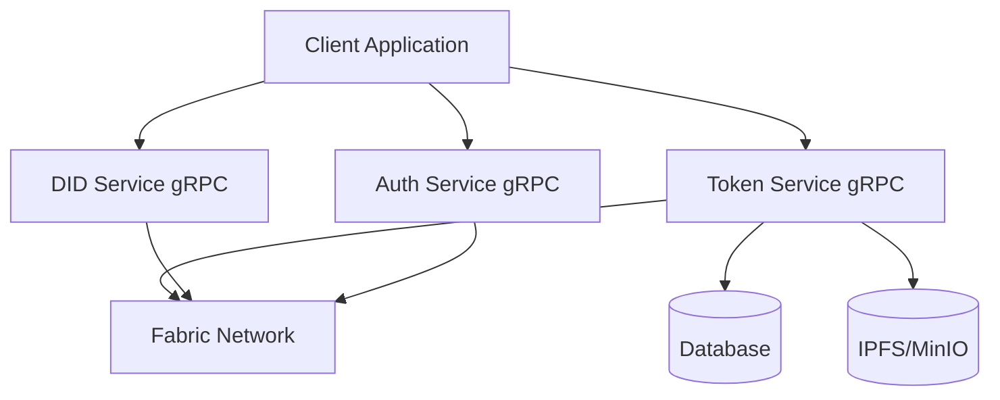
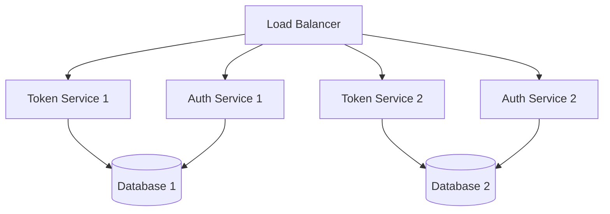

# Technical Design Document - Digital Asset Management System

## 1. System Architecture

### 1.1 High-Level Architecture



### 1.2 Component Overview

* **Client Application**
  * Web-based frontend (React/Next.js)
  * Mobile application (React Native)
  * Admin dashboard
  * gRPC client integration

* **Token Service**
  * gRPC server
  * Token lifecycle management
  * Transaction processing
  * Asset metadata handling
  * Event management
  * Real-time streaming

* **Auth Service**
  * gRPC server
  * JWT token management
  * Role-based access control (RBAC)
  * Permission management
  * Session handling

* **DID Service**
  * gRPC server
  * Identity management
  * Certificate handling
  * MSP integration
  * KYC/AML integration

* **Fabric Network**
  * Private blockchain network
  * Smart contracts
  * Token SDK integration
  * Event system

---

## 2. Technical Stack

### 2.1 Backend Services

* **Token Service**
  * Golang
  * gRPC
  * Fabric SDK
  * PostgreSQL
  * Redis (caching)

* **Auth Service**
  * Golang
  * gRPC
  * JWT
  * Redis (session storage)
  * PostgreSQL (user data)

* **DID Service**
  * Golang
  * gRPC
  * Fabric SDK
  * PostgreSQL
  * IPFS/MinIO

### 2.2 Frontend

* **Web Application**
  * React/Next.js
  * TypeScript
  * Material-UI/Tailwind CSS
  * gRPC-web client
  * Redux/Context API

* **Mobile Application**
  * React Native
  * TypeScript
  * Native Base
  * gRPC client
  * Redux

### 2.3 Infrastructure

* **Database**
  * PostgreSQL (main database)
  * Redis (caching)
  * MongoDB (optional for analytics)

* **Storage**
  * IPFS/MinIO (metadata storage)
  * S3-compatible storage

* **Blockchain**
  * Hyperledger Fabric
  * Fabric Token SDK
  * Chaincode (Go)

---

## 3. Detailed Component Design

### 3.1 Token Service

#### 3.1.1 Core Components

```go
// Token Service Interface
type TokenService interface {
    // Token Management
    CreateToken(ctx context.Context, asset *Asset) (*Token, error)
    TransferToken(ctx context.Context, transfer *TransferRequest) (*Transaction, error)
    BurnToken(ctx context.Context, burn *BurnRequest) (*Transaction, error)
    
    // Query Operations
    GetTokenBalance(ctx context.Context, wallet string) (*Balance, error)
    GetTransactionHistory(ctx context.Context, filters *QueryFilters) ([]*Transaction, error)
    
    // Event Handling
    SubscribeToEvents(callback EventCallback) error
    ProcessEvents(event *TokenEvent) error
}

// Token Service Implementation
type tokenServiceImpl struct {
    fabricClient *fabric.Client
    db          *sql.DB
    cache       *redis.Client
    logger      *zap.Logger
    grpcServer  *grpc.Server
}

// Asset represents a digital asset
type Asset struct {
    ID          string          `json:"id"`
    OwnerID     string          `json:"owner_id"`
    TokenType   string          `json:"token_type"`
    Amount      decimal.Decimal `json:"amount"`
    Metadata    json.RawMessage `json:"metadata"`
    CreatedAt   time.Time       `json:"created_at"`
    UpdatedAt   time.Time       `json:"updated_at"`
}

// Transaction represents a token transaction
type Transaction struct {
    ID              string          `json:"id"`
    TokenID         string          `json:"token_id"`
    FromWallet      string          `json:"from_wallet"`
    ToWallet        string          `json:"to_wallet"`
    Amount          decimal.Decimal `json:"amount"`
    TransactionType string          `json:"transaction_type"`
    Status          string          `json:"status"`
    CreatedAt       time.Time       `json:"created_at"`
}

// EventCallback is a function type for handling token events
type EventCallback func(event *TokenEvent) error
```

#### 3.1.2 Database Schema

```sql
-- Tokens Table
CREATE TABLE tokens (
    id UUID PRIMARY KEY,
    asset_id UUID NOT NULL,
    owner_id UUID NOT NULL,
    token_type VARCHAR(50) NOT NULL,
    amount DECIMAL NOT NULL,
    metadata JSONB,
    created_at TIMESTAMP NOT NULL,
    updated_at TIMESTAMP NOT NULL
);

-- Transactions Table
CREATE TABLE transactions (
    id UUID PRIMARY KEY,
    token_id UUID NOT NULL,
    from_wallet VARCHAR(255) NOT NULL,
    to_wallet VARCHAR(255) NOT NULL,
    amount DECIMAL NOT NULL,
    transaction_type VARCHAR(50) NOT NULL,
    status VARCHAR(50) NOT NULL,
    created_at TIMESTAMP NOT NULL
);
```

#### 3.1.3 gRPC Service Implementation

```go
// TokenServiceServer implements the gRPC service
type TokenServiceServer struct {
    pb.UnimplementedTokenServiceServer
    service TokenService
    logger  *zap.Logger
}

// CreateToken implements the CreateToken RPC method
func (s *TokenServiceServer) CreateToken(ctx context.Context, req *pb.CreateTokenRequest) (*pb.Token, error) {
    asset := &Asset{
        ID:        req.AssetId,
        OwnerID:   req.OwnerId,
        TokenType: req.TokenType,
        Amount:    decimal.RequireFromString(req.Amount),
        Metadata:  req.Metadata,
    }

    token, err := s.service.CreateToken(ctx, asset)
    if err != nil {
        s.logger.Error("failed to create token", zap.Error(err))
        return nil, status.Error(codes.Internal, "failed to create token")
    }

    return convertToProtoToken(token), nil
}

// TransferToken implements the TransferToken RPC method
func (s *TokenServiceServer) TransferToken(ctx context.Context, req *pb.TransferRequest) (*pb.Transaction, error) {
    transfer := &TransferRequest{
        TokenID:    req.TokenId,
        FromWallet: req.FromWallet,
        ToWallet:   req.ToWallet,
        Amount:     decimal.RequireFromString(req.Amount),
    }

    transaction, err := s.service.TransferToken(ctx, transfer)
    if err != nil {
        s.logger.Error("failed to transfer token", zap.Error(err))
        return nil, status.Error(codes.Internal, "failed to transfer token")
    }

    return convertToProtoTransaction(transaction), nil
}
```

#### 3.1.4 gRPC Service Definition

```protobuf
syntax = "proto3";

package token;

option go_package = "github.com/metafi/digital-assets-service/token";

service TokenService {
    rpc CreateToken(CreateTokenRequest) returns (Token);
    rpc TransferToken(TransferRequest) returns (Transaction);
    rpc BurnToken(BurnRequest) returns (Transaction);
    rpc GetBalance(BalanceRequest) returns (Balance);
    rpc GetTransactionHistory(HistoryRequest) returns (TransactionList);
    rpc SubscribeToEvents(SubscribeRequest) returns (stream TokenEvent);
}

message CreateTokenRequest {
    string asset_id = 1;
    string owner_id = 2;
    string token_type = 3;
    string amount = 4;
    bytes metadata = 5;
}

message TransferRequest {
    string token_id = 1;
    string from_wallet = 2;
    string to_wallet = 3;
    string amount = 4;
}

message BurnRequest {
    string token_id = 1;
    string wallet = 2;
    string amount = 3;
}

message BalanceRequest {
    string wallet = 1;
}

message HistoryRequest {
    string wallet = 1;
    int32 limit = 2;
    int32 offset = 3;
}

message SubscribeRequest {
    string wallet = 1;
    repeated string event_types = 2;
}

message TokenEvent {
    string event_id = 1;
    string event_type = 2;
    string token_id = 3;
    string wallet = 4;
    string amount = 5;
    int64 timestamp = 6;
    bytes metadata = 7;
}
```

#### 3.1.5 Configuration

```go
// Config represents the configuration for the token service
type Config struct {
    // gRPC Server configuration
    Server struct {
        Port int    `yaml:"port"`
        Host string `yaml:"host"`
    } `yaml:"server"`

    // Database configuration
    Database struct {
        Host     string `yaml:"host"`
        Port     int    `yaml:"port"`
        User     string `yaml:"user"`
        Password string `yaml:"password"`
        Name     string `yaml:"name"`
    } `yaml:"database"`

    // Redis configuration
    Redis struct {
        Host     string `yaml:"host"`
        Port     int    `yaml:"port"`
        Password string `yaml:"password"`
        DB       int    `yaml:"db"`
    } `yaml:"redis"`

    // Fabric configuration
    Fabric struct {
        ChannelID     string `yaml:"channel_id"`
        ChaincodeName string `yaml:"chaincode_name"`
        MSPID         string `yaml:"msp_id"`
        CertPath      string `yaml:"cert_path"`
        KeyPath       string `yaml:"key_path"`
    } `yaml:"fabric"`
}
```

### 3.2 DID Service

#### 3.2.1 Core Components

```go
// DID Service Interface
type DIDService interface {
    // Identity Management
    CreateIdentity(ctx context.Context, user *User) (*Identity, error)
    VerifyIdentity(ctx context.Context, identity *Identity) (bool, error)
    
    // Certificate Management
    IssueCertificate(ctx context.Context, identity *Identity) (*Certificate, error)
    RevokeCertificate(ctx context.Context, certificate *Certificate) error
    
    // KYC Integration
    PerformKYC(ctx context.Context, user *User) (*KYCResult, error)
    VerifyKYCStatus(ctx context.Context, user *User) (*KYCStatus, error)
}
```

### 3.3 Auth Service

#### 3.3.1 Core Components

```go
// Auth Service Interface
type AuthService interface {
    // Authentication
    Authenticate(ctx context.Context, credentials *Credentials) (*AuthToken, error)
    ValidateToken(ctx context.Context, token string) (bool, error)
    
    // Authorization
    CheckPermission(ctx context.Context, user *User, resource *Resource) (bool, error)
    AssignRole(ctx context.Context, user *User, role *Role) error
    
    // Session Management
    CreateSession(ctx context.Context, user *User) (*Session, error)
    InvalidateSession(ctx context.Context, session *Session) error
}
```

---

## 4. Security Design

### 4.1 Authentication

* JWT-based authentication
* Multi-factor authentication (MFA)
* Session management
* Token refresh mechanism

### 4.2 Authorization

* Role-based access control (RBAC)
* Resource-level permissions
* gRPC service protection
* Rate limiting

### 4.3 Data Security

* Data encryption at rest
* TLS for data in transit
* Secure key management
* Regular security audits

### 4.4 Blockchain Security

* MSP-based identity management
* Transaction signing
* Smart contract security
* Network security

---

## 5. Deployment Architecture

### 5.1 Infrastructure



### 5.2 Deployment Strategy

* Kubernetes-based deployment
* Container orchestration
* Auto-scaling
* Load balancing
* High availability

### 5.3 Monitoring

* Prometheus metrics
* Grafana dashboards
* ELK stack for logging
* Alert management

---

## 6. Development Guidelines

### 6.1 Code Standards

* Go
* gRPC
* Protocol Buffers
* Unit testing
* Integration testing

### 6.2 Git Workflow

* Feature branch workflow
* Pull request reviews
* CI/CD pipeline
* Automated testing
* Code quality checks

### 6.3 Documentation

* API documentation
* Code documentation
* Architecture documentation
* Deployment guides
* User guides

### 6. Monitoring and Logging

#### 6.1 Metrics Collection

##### 6.1.1 Prometheus Metrics

```go
// Metrics definitions
type Metrics struct {
    // Operation metrics
    OperationDuration *prometheus.HistogramVec
    OperationErrors   *prometheus.CounterVec
    OperationLatency  *prometheus.HistogramVec
    
    // Token metrics
    TokenCreation     *prometheus.CounterVec
    TokenTransfers    *prometheus.CounterVec
    TokenBalance      *prometheus.GaugeVec
    
    // System metrics
    ActiveConnections *prometheus.GaugeVec
    RequestRate       *prometheus.CounterVec
    ErrorRate         *prometheus.CounterVec
    CacheHitRate      *prometheus.GaugeVec
}

// Initialize metrics
func NewMetrics() *Metrics {
    return &Metrics{
        OperationDuration: prometheus.NewHistogramVec(
            prometheus.HistogramOpts{
                Name: "operation_duration_seconds",
                Help: "Duration of operations in seconds",
                Buckets: prometheus.DefBuckets,
            },
            []string{"operation", "service"},
        ),
        OperationErrors: prometheus.NewCounterVec(
            prometheus.CounterOpts{
                Name: "operation_errors_total",
                Help: "Total number of operation errors",
            },
            []string{"operation", "service", "error_type"},
        ),
        TokenCreation: prometheus.NewCounterVec(
            prometheus.CounterOpts{
                Name: "token_creation_total",
                Help: "Total number of tokens created",
            },
            []string{"token_type", "status"},
        ),
        TokenTransfers: prometheus.NewCounterVec(
            prometheus.CounterOpts{
                Name: "token_transfers_total",
                Help: "Total number of token transfers",
            },
            []string{"status"},
        ),
        ActiveConnections: prometheus.NewGaugeVec(
            prometheus.GaugeOpts{
                Name: "active_connections",
                Help: "Number of active connections",
            },
            []string{"service"},
        ),
    }
}
```

##### 6.1.2 Metrics Collection Points

```go
// Record operation metrics
func (s *tokenServiceImpl) recordMetrics(operation string, duration time.Duration, err error) {
    s.metrics.OperationDuration.WithLabelValues(operation, "token_service").Observe(duration.Seconds())
    if err != nil {
        s.metrics.OperationErrors.WithLabelValues(operation, "token_service", getErrorType(err)).Inc()
    }
}

// Record token metrics
func (s *tokenServiceImpl) recordTokenMetrics(tokenType string, status string) {
    s.metrics.TokenCreation.WithLabelValues(tokenType, status).Inc()
}

// Record transfer metrics
func (s *tokenServiceImpl) recordTransferMetrics(status string) {
    s.metrics.TokenTransfers.WithLabelValues(status).Inc()
}

// Record connection metrics
func (s *tokenServiceImpl) recordConnectionMetrics(active int) {
    s.metrics.ActiveConnections.WithLabelValues("token_service").Set(float64(active))
}
```

#### 6.2 Logging

##### 6.2.1 Logging Configuration

```go
// Logging configuration
type LogConfig struct {
    Level      string   `yaml:"level"`
    Format     string   `yaml:"format"`
    OutputPaths []string `yaml:"output_paths"`
    ErrorPaths  []string `yaml:"error_paths"`
    MaxSize    int      `yaml:"max_size"`
    MaxBackups int      `yaml:"max_backups"`
    MaxAge     int      `yaml:"max_age"`
    Compress   bool     `yaml:"compress"`
}

// Initialize logger
func setupLogger(config *LogConfig) (*zap.Logger, error) {
    zapConfig := zap.NewProductionConfig()
    
    // Set log level
    level, err := zapcore.ParseLevel(config.Level)
    if err != nil {
        return nil, fmt.Errorf("invalid log level: %w", err)
    }
    zapConfig.Level = zap.NewAtomicLevelAt(level)
    
    // Set output paths
    zapConfig.OutputPaths = config.OutputPaths
    zapConfig.ErrorOutputPaths = config.ErrorPaths
    
    // Configure log rotation
    zapConfig.EncoderConfig.TimeKey = "timestamp"
    zapConfig.EncoderConfig.EncodeTime = zapcore.ISO8601TimeEncoder
    
    return zapConfig.Build()
}
```

##### 6.2.2 Structured Logging

```go
// Log event structure
type LogEvent struct {
    TraceID    string                 `json:"trace_id"`
    Service    string                 `json:"service"`
    Operation  string                 `json:"operation"`
    Level      string                 `json:"level"`
    Message    string                 `json:"message"`
    Error      string                 `json:"error,omitempty"`
    Metadata   map[string]interface{} `json:"metadata,omitempty"`
    Timestamp  time.Time             `json:"timestamp"`
}

// Log event handler
func (s *tokenServiceImpl) logEvent(level zapcore.Level, operation string, message string, err error, metadata map[string]interface{}) {
    event := &LogEvent{
        TraceID:    trace.SpanContextFromContext(s.ctx).TraceID().String(),
        Service:    "token_service",
        Operation:  operation,
        Level:      level.String(),
        Message:    message,
        Timestamp:  time.Now(),
        Metadata:   metadata,
    }
    
    if err != nil {
        event.Error = err.Error()
    }
    
    switch level {
    case zapcore.InfoLevel:
        s.logger.Info(message, zap.Any("event", event))
    case zapcore.ErrorLevel:
        s.logger.Error(message, zap.Any("event", event))
    case zapcore.WarnLevel:
        s.logger.Warn(message, zap.Any("event", event))
    case zapcore.DebugLevel:
        s.logger.Debug(message, zap.Any("event", event))
    }
}
```

#### 6.3 Monitoring Dashboard

##### 6.3.1 Grafana Dashboard Configuration

```json
{
  "dashboard": {
    "id": null,
    "title": "Token Service Dashboard",
    "tags": ["token-service", "monitoring"],
    "timezone": "browser",
    "panels": [
      {
        "title": "Operation Duration",
        "type": "graph",
        "datasource": "Prometheus",
        "targets": [
          {
            "expr": "rate(operation_duration_seconds_sum[5m]) / rate(operation_duration_seconds_count[5m])",
            "legendFormat": "{{operation}}"
          }
        ]
      },
      {
        "title": "Error Rate",
        "type": "graph",
        "datasource": "Prometheus",
        "targets": [
          {
            "expr": "rate(operation_errors_total[5m])",
            "legendFormat": "{{operation}} - {{error_type}}"
          }
        ]
      },
      {
        "title": "Token Operations",
        "type": "graph",
        "datasource": "Prometheus",
        "targets": [
          {
            "expr": "rate(token_creation_total[5m])",
            "legendFormat": "{{token_type}} - {{status}}"
          },
          {
            "expr": "rate(token_transfers_total[5m])",
            "legendFormat": "{{status}}"
          }
        ]
      }
    ]
  }
}
```

##### 6.3.2 Alert Rules

```yaml
groups:
- name: token_service_alerts
  rules:
  - alert: HighErrorRate
    expr: rate(operation_errors_total[5m]) > 0.1
    for: 5m
    labels:
      severity: warning
    annotations:
      summary: High error rate detected
      description: Error rate is above 10% for the last 5 minutes

  - alert: HighLatency
    expr: rate(operation_duration_seconds_sum[5m]) / rate(operation_duration_seconds_count[5m]) > 1
    for: 5m
    labels:
      severity: warning
    annotations:
      summary: High latency detected
      description: Operation latency is above 1 second for the last 5 minutes

  - alert: ServiceDown
    expr: up{service="token_service"} == 0
    for: 1m
    labels:
      severity: critical
    annotations:
      summary: Token service is down
      description: Token service has been down for more than 1 minute
```

#### 6.4 Log Analysis

##### 6.4.1 ELK Stack Configuration

```yaml
# Filebeat configuration
filebeat.inputs:
- type: log
  enabled: true
  paths:
    - /var/log/token-service/*.log
  fields:
    service: token-service
  json.keys_under_root: true
  json.add_error_key: true

# Logstash configuration
input {
  beats {
    port => 5044
  }
}

filter {
  json {
    source => "message"
  }
  date {
    match => [ "timestamp", "ISO8601" ]
    target => "@timestamp"
  }
}

output {
  elasticsearch {
    hosts => ["elasticsearch:9200"]
    index => "token-service-%{+YYYY.MM.dd}"
  }
}

# Kibana index pattern
{
  "index_patterns": ["token-service-*"],
  "settings": {
    "number_of_shards": 3,
    "number_of_replicas": 1
  },
  "mappings": {
    "properties": {
      "trace_id": { "type": "keyword" },
      "service": { "type": "keyword" },
      "operation": { "type": "keyword" },
      "level": { "type": "keyword" },
      "message": { "type": "text" },
      "error": { "type": "text" },
      "metadata": { "type": "object" },
      "timestamp": { "type": "date" }
    }
  }
}
```

*Last Updated: 31/05/2025* 