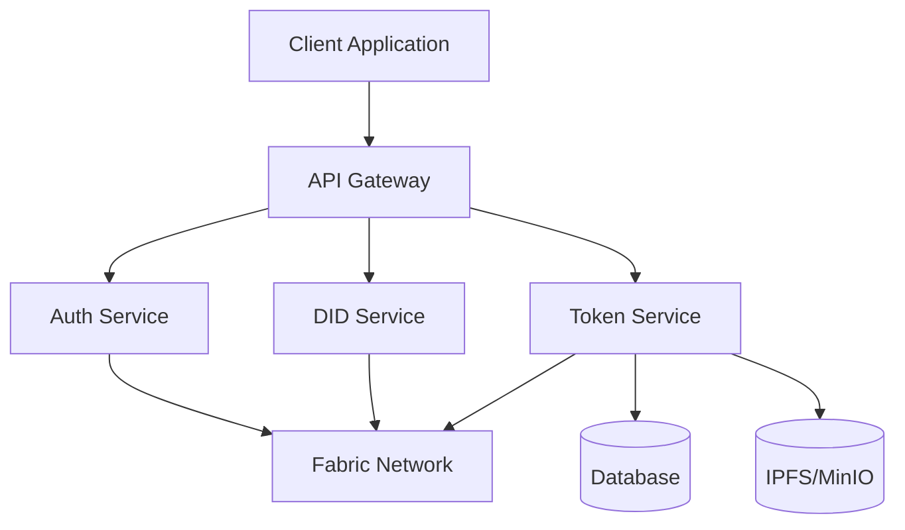
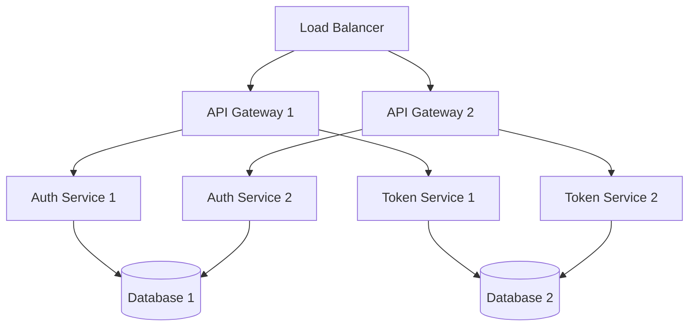

# Technical Design Document - Digital Asset Management System

## 1. System Architecture

### 1.1 High-Level Architecture



### 1.2 Component Overview

* **Client Application**
  * Web-based frontend (React/Next.js)
  * Mobile application (React Native)
  * Admin dashboard

* **API Gateway**
  * RESTful API endpoints
  * gRPC services
  * Rate limiting
  * Request validation
  * API documentation (Swagger)

* **Auth Service**
  * JWT token management
  * Role-based access control (RBAC)
  * Permission management
  * Session handling

* **Token Service**
  * Token lifecycle management
  * Transaction processing
  * Asset metadata handling
  * Event management

* **DID Service**
  * Identity management
  * Certificate handling
  * MSP integration
  * KYC/AML integration

* **Fabric Network**
  * Private blockchain network
  * Smart contracts
  * Token SDK integration
  * Event system

---

## 2. Technical Stack

### 2.1 Backend Services

* **API Gateway**
  * NestJS
  * Express.js
  * gRPC
  * OpenAPI/Swagger

* **Auth Service**
  * NestJS
  * JWT
  * Redis (session storage)
  * PostgreSQL (user data)

* **Token Service**
  * NestJS
  * Fabric SDK
  * PostgreSQL
  * Redis (caching)

* **DID Service**
  * Go/NestJS
  * Fabric SDK
  * PostgreSQL
  * IPFS/MinIO

### 2.2 Frontend

* **Web Application**
  * React/Next.js
  * TypeScript
  * Material-UI/Tailwind CSS
  * Redux/Context API

* **Mobile Application**
  * React Native
  * TypeScript
  * Native Base
  * Redux

### 2.3 Infrastructure

* **Database**
  * PostgreSQL (main database)
  * Redis (caching)
  * MongoDB (optional for analytics)

* **Storage**
  * IPFS/MinIO (metadata storage)
  * S3-compatible storage

* **Blockchain**
  * Hyperledger Fabric
  * Fabric Token SDK
  * Chaincode (Go)

---

## 3. Detailed Component Design

### 3.1 Token Service

#### 3.1.1 Core Components

```typescript
interface TokenService {
  // Token Management
  createToken(asset: Asset): Promise<Token>;
  transferToken(transfer: TransferRequest): Promise<Transaction>;
  burnToken(burn: BurnRequest): Promise<Transaction>;
  
  // Query Operations
  getTokenBalance(wallet: string): Promise<Balance>;
  getTransactionHistory(filters: QueryFilters): Promise<Transaction[]>;
  
  // Event Handling
  subscribeToEvents(callback: EventCallback): void;
  processEvents(event: TokenEvent): Promise<void>;
}
```

#### 3.1.2 Database Schema

```sql
-- Tokens Table
CREATE TABLE tokens (
    id UUID PRIMARY KEY,
    asset_id UUID NOT NULL,
    owner_id UUID NOT NULL,
    token_type VARCHAR(50) NOT NULL,
    amount DECIMAL NOT NULL,
    metadata JSONB,
    created_at TIMESTAMP NOT NULL,
    updated_at TIMESTAMP NOT NULL
);

-- Transactions Table
CREATE TABLE transactions (
    id UUID PRIMARY KEY,
    token_id UUID NOT NULL,
    from_wallet VARCHAR(255) NOT NULL,
    to_wallet VARCHAR(255) NOT NULL,
    amount DECIMAL NOT NULL,
    transaction_type VARCHAR(50) NOT NULL,
    status VARCHAR(50) NOT NULL,
    created_at TIMESTAMP NOT NULL
);
```

### 3.2 DID Service

#### 3.2.1 Core Components

```typescript
interface DIDService {
  // Identity Management
  createIdentity(user: User): Promise<Identity>;
  verifyIdentity(identity: Identity): Promise<boolean>;
  
  // Certificate Management
  issueCertificate(identity: Identity): Promise<Certificate>;
  revokeCertificate(certificate: Certificate): Promise<void>;
  
  // KYC Integration
  performKYC(user: User): Promise<KYCResult>;
  verifyKYCStatus(user: User): Promise<KYCStatus>;
}
```

### 3.3 Auth Service

#### 3.3.1 Core Components

```typescript
interface AuthService {
  // Authentication
  authenticate(credentials: Credentials): Promise<AuthToken>;
  validateToken(token: string): Promise<boolean>;
  
  // Authorization
  checkPermission(user: User, resource: Resource): Promise<boolean>;
  assignRole(user: User, role: Role): Promise<void>;
  
  // Session Management
  createSession(user: User): Promise<Session>;
  invalidateSession(session: Session): Promise<void>;
}
```

---

## 4. API Design

### 4.1 RESTful Endpoints

#### 4.1.1 Token Management

```typescript
// Token Creation
POST /api/v1/tokens
{
  "assetId": "uuid",
  "ownerId": "uuid",
  "tokenType": "FUNGIBLE|NFT|FRACTIONAL_NFT",
  "amount": "decimal",
  "metadata": {}
}

// Token Transfer
POST /api/v1/tokens/{tokenId}/transfer
{
  "fromWallet": "string",
  "toWallet": "string",
  "amount": "decimal"
}

// Token Burn
POST /api/v1/tokens/{tokenId}/burn
{
  "wallet": "string",
  "amount": "decimal"
}
```

#### 4.1.2 Identity Management

```typescript
// Create Identity
POST /api/v1/identities
{
  "userId": "uuid",
  "kycData": {}
}

// Verify Identity
POST /api/v1/identities/{identityId}/verify
{
  "verificationData": {}
}
```

### 4.2 gRPC Services

```protobuf
service TokenService {
  rpc CreateToken(CreateTokenRequest) returns (Token);
  rpc TransferToken(TransferRequest) returns (Transaction);
  rpc BurnToken(BurnRequest) returns (Transaction);
  rpc GetBalance(BalanceRequest) returns (Balance);
  rpc GetTransactionHistory(HistoryRequest) returns (TransactionList);
}

service DIDService {
  rpc CreateIdentity(CreateIdentityRequest) returns (Identity);
  rpc VerifyIdentity(VerifyIdentityRequest) returns (VerificationResult);
  rpc IssueCertificate(CertificateRequest) returns (Certificate);
}
```

---

## 5. Security Design

### 5.1 Authentication

* JWT-based authentication
* Multi-factor authentication (MFA)
* Session management
* Token refresh mechanism

### 5.2 Authorization

* Role-based access control (RBAC)
* Resource-level permissions
* API endpoint protection
* Rate limiting

### 5.3 Data Security

* Data encryption at rest
* TLS for data in transit
* Secure key management
* Regular security audits

### 5.4 Blockchain Security

* MSP-based identity management
* Transaction signing
* Smart contract security
* Network security

---

## 6. Deployment Architecture

### 6.1 Infrastructure



### 6.2 Deployment Strategy

* Kubernetes-based deployment
* Container orchestration
* Auto-scaling
* Load balancing
* High availability

### 6.3 Monitoring

* Prometheus metrics
* Grafana dashboards
* ELK stack for logging
* Alert management

---

## 7. Development Guidelines

### 7.1 Code Standards

* TypeScript/JavaScript
* ESLint configuration
* Prettier formatting
* Unit testing (Jest)
* E2E testing (Cypress)

### 7.2 Git Workflow

* Feature branch workflow
* Pull request reviews
* CI/CD pipeline
* Automated testing
* Code quality checks

### 7.3 Documentation

* API documentation
* Code documentation
* Architecture documentation
* Deployment guides
* User guides

*Last Updated: 31/05/2025* 