# Technical Design Document - Digital Asset Management System

## 1. System Architecture

### 1.1 High-Level Architecture

```mermaid
graph TD
    %% Client Layer
    subgraph "Client Layer"
        Web[Web App]
        Mobile[Mobile App]
        API[API Client]
    end

    %% Middleware Layer
    subgraph "Middleware Layer"
        Gateway[Kong API Gateway]
        AuthN[AuthN Service]
        AuthZ[AuthZ Service]
        DID[DID Middleware<br/>ACA-Py]
    end

    %% Application Layer
    subgraph "Application Layer"
        Asset[Asset Service]
        Token[Token Service]
    end

    %% Blockchain Layer
    subgraph "Blockchain Layer"
        Fabric[Fabric Network<br/>Token SDK]
        Indy[Hyperledger Indy]
    end

    %% Storage Layer
    subgraph "Storage Layer"
        DB[(PostgreSQL<br/>Database)]
        Cache[(Redis Cache)]
        Storage[(IPFS / MinIO)]
    end

    %% Flows from Clients
    Web --> Gateway
    Mobile --> Gateway
    API --> Gateway

    %% Gateway routing
    Gateway --> AuthN
    Gateway --> AuthZ
    Gateway --> Asset
    Gateway --> DID

    %% Auth middleware interaction
    AuthN --> Asset
    AuthZ --> Asset
    DID --> Asset

    %% AssetService integration
    Asset --> Token

    %% Token → Blockchain
    Token --> Fabric

    %% DID interaction with Indy (off-chain)
    DID -->|ACA-Py API| DIDAgent[(Indy Agent)] --> Indy

    %% Asset data persistence
    Asset --> DB
    Asset --> Cache
    Asset --> Storage
```



### 1.2 Component Overview

#### 1.2.1 Client Layer
* **Web Application**
  * Frontend (React/Next.js)
  * TypeScript
  * Material-UI/Tailwind CSS
  * gRPC-web client
  * Redux/Context API

* **Mobile Application**
  * React Native
  * TypeScript
  * Native Base
  * gRPC client
  * Redux

* **API Client**
  * REST/gRPC client
  * SDK for popular languages

#### 1.2.2 Middleware Layer
* **Kong API Gateway**
  * Routing management
  * Rate limiting
  * Load balancing
  * API documentation (Swagger/OpenAPI)

* **AuthN Service**
  * JWT token management
  * Session management
  * Multi-factor authentication (MFA)

* **AuthZ Service**
  * Role-based access control (RBAC)
  * Permission management
  * Policy enforcement

* **DID Middleware (ACA-Py)**
  * Identity management (DID)
  * Certificate management
  * KYC verification
  * Integration with Indy Agent
  * MSP Identity issuance

#### 1.2.3 Application Layer
* **Asset Service**
  * gRPC server
  * Asset metadata management
  * Owner DID verification
  * Asset lifecycle management
  * Rejection and modification handling
  * Audit logging
  * Real-time streaming

* **Token Service** (External Service)
  * gRPC communication
  * Token lifecycle management
  * Integration with Fabric Network

#### 1.2.4 Blockchain Layer
* **Fabric Network (Token SDK)**
  * Private blockchain network
  * ChainCode
  * Token SDK integration
  * Event system
  * Smart contract for token management

#### 1.2.5 Storage Layer
* **PostgreSQL Database**
  * Asset metadata storage
  * State management
  * Audit logs
  * Transaction history

* **Redis Cache**
  * Session management
  * Rate limiting
  * Temporary data storage
  * Real-time data caching

* **IPFS / MinIO**
  * Asset metadata storage
  * Asset documents
  * Immutable storage
  * Content addressing

## 2. Technology Stack

### 2.1 Backend Services

* **Asset Service**
  * Golang
  * gRPC
  * PostgreSQL
  * Redis (cache)
  * IPFS/MinIO (storage)
  * Prometheus/Grafana (monitoring)
* **Token Service**
  * NestJs
  * gRPC
  * PostgreSQL
  * Redis (cache)
  * IPFS/MinIO (storage)
  * Prometheus/Grafana (monitoring)

* **AuthN/AuthZ**
  * Golang
  * gRPC protocol
  * JWT
  * Redis (session)
  * PostgreSQL

* **DID Middleware**
  * Golang
  * gRPC protocol
  * Aries Cloud Agent Python (ACA-Py)
  * Hyperledger Indy
  * PostgreSQL
  * Redis (cache)

### 2.2 Frontend

* **Web Application**
  * React/Next.js
  * TypeScript
  * Material-UI/Tailwind CSS
  * gRPC-web client
  * Redux/Context API

* **Mobile Application**
  * React Native
  * TypeScript
  * Native Base
  * gRPC client
  * Redux

### 2.3 Infrastructure

* **Database**
  * PostgreSQL (main database)
  * Redis (cache)
  * MongoDB (optional for analytics)

* **Storage**
  * IPFS/MinIO (metadata storage)
  * S3-compatible storage

* **Blockchain**
  * Hyperledger Fabric
  * Fabric Token SDK
  * Chaincode (Go)

## 3. Detailed Design

### 3.1 Asset Service

#### 3.1.1 Main Responsibilities
- Asset metadata management
- Asset lifecycle management: create, update, tokenize
- Ownership verification via DID
- Integration with Token Service
- Provide API/gRPC for frontend and other services

#### 3.1.2 Service Interface

```go
// Asset Service Interface
interface AssetService {
    // Asset management
    CreateAsset(ctx context.Context, req *CreateAssetRequest) (*Asset, error)
    UpdateAsset(ctx context.Context, req *UpdateAssetRequest) (*Asset, error)
    GetAsset(ctx context.Context, id string) (*Asset, error)
    ListAssets(ctx context.Context, filter *AssetFilter) ([]*Asset, error)
    
    // Tokenization
    TokenizeAsset(ctx context.Context, req *TokenizeAssetRequest) (*Asset, error)
    TransferOwnership(ctx context.Context, req *TransferOwnershipRequest) error
    
    // State management
    UpdateAssetState(ctx context.Context, req *UpdateStateRequest) error
    RejectAsset(ctx context.Context, req *RejectRequest) error
    RequestModification(ctx context.Context, req *ModificationRequest) error
    
    // Events
    SubscribeToEvents(callback EventCallback) error
    ProcessEvents(event *AssetEvent) error
}

// Data structure
type Asset struct {
    ID          string          `json:"id"`
    Name        string          `json:"name"`
    Type        string          `json:"type"`
    OwnerDID    string          `json:"owner_did"`
    Value       decimal.Decimal `json:"value"`
    Status      string          `json:"status"` // DRAFT, SUBMITTED, APPROVED, REJECTED, AWAITING_FIX, TOKENIZED, ARCHIVED
    Metadata    json.RawMessage `json:"metadata"`
    CreatedAt   time.Time       `json:"created_at"`
    UpdatedAt   time.Time       `json:"updated_at"`
}
```

#### 3.1.3 Database Schema

```sql
-- Assets Table
CREATE TABLE assets (
    id UUID PRIMARY KEY,
    name TEXT NOT NULL,
    type TEXT NOT NULL,
    owner_did TEXT NOT NULL,
    value DECIMAL NOT NULL,
    status TEXT NOT NULL,
    metadata JSONB,
    created_at TIMESTAMP NOT NULL,
    updated_at TIMESTAMP NOT NULL
);

-- Asset Events Table
CREATE TABLE asset_events (
    id UUID PRIMARY KEY,
    asset_id UUID REFERENCES assets(id),
    event_type TEXT NOT NULL,
    data JSONB,
    created_at TIMESTAMP NOT NULL
);

-- Asset Audit Logs Table
CREATE TABLE asset_audit_logs (
    id UUID PRIMARY KEY,
    asset_id UUID REFERENCES assets(id),
    trace_id TEXT NOT NULL,
    operation TEXT NOT NULL,
    level TEXT NOT NULL,
    message TEXT NOT NULL,
    error TEXT,
    metadata JSONB,
    ip_address TEXT,
    user_agent TEXT,
    session_id TEXT,
    created_at TIMESTAMP NOT NULL
);
```

#### 3.1.4 Token Service Interface (gRPC)

```protobuf
// Token Service gRPC Interface
service TokenService {
    // Token management
    rpc CreateToken(CreateTokenRequest) returns (Token);
    rpc TransferToken(TransferRequest) returns (Transaction);
    rpc BurnToken(BurnRequest) returns (Transaction);
    
    // Query
    rpc GetTokenBalance(BalanceRequest) returns (Balance);
    rpc GetTransactionHistory(HistoryRequest) returns (TransactionList);
    
    // Events
    rpc SubscribeToEvents(SubscribeRequest) returns (stream TokenEvent);
}

message CreateTokenRequest {
    string asset_id = 1;
    string owner_did = 2;
    string type = 3;
    string amount = 4;
    bytes metadata = 5;
}

message TransferRequest {
    string token_id = 1;
    string from_did = 2;
    string to_did = 3;
    string amount = 4;
}

message TokenEvent {
    string event_id = 1;
    string event_type = 2;
    string token_id = 3;
    bytes data = 4;
    int64 timestamp = 5;
}
```

### 3.2 Monitoring and Logging

#### 3.2.1 Metrics

```go
// Metrics definition
type Metrics struct {
    // Asset metrics
    AssetCreation     *prometheus.CounterVec
    AssetStateChanges *prometheus.CounterVec
    AssetOperations   *prometheus.HistogramVec
    
    // System metrics
    RequestLatency    *prometheus.HistogramVec
    ErrorRate         *prometheus.CounterVec
    ActiveConnections *prometheus.GaugeVec
}

// Initialize metrics
func NewMetrics() *Metrics {
    return &Metrics{
        AssetCreation: prometheus.NewCounterVec(
            prometheus.CounterOpts{
                Name: "asset_creation_total",
                Help: "Total number of assets created",
            },
            []string{"type", "status"},
        ),
        // ... other metrics
    }
}
```

#### 3.2.2 Logging

```go
// Log event structure
type LogEvent struct {
    TraceID    string                 `json:"trace_id"`
    Service    string                 `json:"service"`
    Operation  string                 `json:"operation"`
    Level      string                 `json:"level"`
    Message    string                 `json:"message"`
    Error      string                 `json:"error,omitempty"`
    Metadata   map[string]interface{} `json:"metadata,omitempty"`
    IPAddress  string                 `json:"ip_address,omitempty"`
    UserAgent  string                 `json:"user_agent,omitempty"`
    SessionID  string                 `json:"session_id,omitempty"`
    Timestamp  time.Time             `json:"timestamp"`
}

// Log event handler
func (s *serviceImpl) logEvent(level zapcore.Level, operation string, message string, err error, metadata map[string]interface{}) {
    event := &LogEvent{
        TraceID:    trace.SpanContextFromContext(s.ctx).TraceID().String(),
        Service:    s.serviceName,
        Operation:  operation,
        Level:      level.String(),
        Message:    message,
        Timestamp:  time.Now(),
        Metadata:   metadata,
        IPAddress:  s.getClientIP(),
        UserAgent:  s.getUserAgent(),
        SessionID:  s.getSessionID(),
    }
    
    if err != nil {
        event.Error = err.Error()
    }
    
    // Log to system
    s.logger.Log(level, message, zap.Any("event", event))
    
    // Audit log if needed
    if s.shouldAudit(level, operation) {
        s.auditLogger.Log(event)
    }
    
    // Update metrics
    s.metrics.AuditLogVolume.WithLabelValues(
        event.Service,
        event.Operation,
        event.Level,
    ).Inc()
}
```

## 4. Future Scope

The following features/modules will be considered for future development phases:

- **Profit Distribution/Dividend**
- **Voting / Ownership-based Governance**
- **Compliance Service**
- **Order Service** (order book, matching, on-exchange trading)
- **Marketplace** (asset trading, fraction trading, order placement)

These topics will be detailed in future document updates as the system expands.