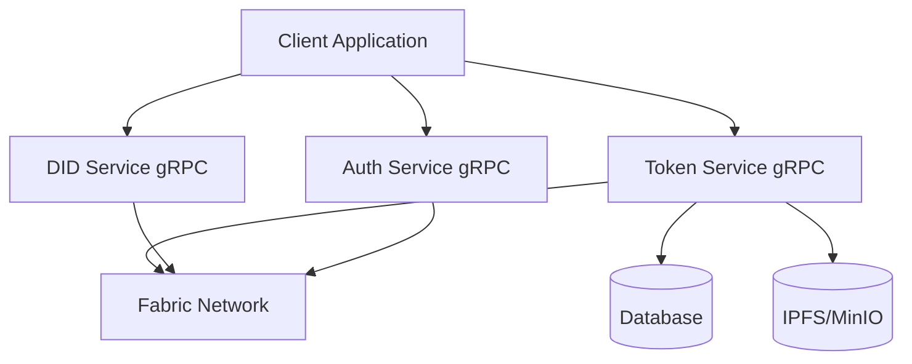

# Technical Design Document - Digital Asset Management System

## 1. System Architecture

### 1.1 High-Level Architecture



### 1.2 Component Overview

* **Client Application**
  * Web-based frontend (React/Next.js)
  * Mobile application (React Native)
  * Admin dashboard
  * gRPC client integration

* **Token Service**
  * gRPC server
  * Token lifecycle management
  * Transaction processing
  * Asset metadata handling
  * Event management

* **Auth Service**
  * gRPC server
  * JWT token management
  * Role-based access control (RBAC)
  * Permission management
  * Session handling

* **DID Service**
  * gRPC server
  * Identity management
  * Certificate handling
  * MSP integration
  * KYC/AML integration

* **Fabric Network**
  * Private blockchain network
  * Smart contracts
  * Token SDK integration
  * Event system

---

## 2. Technical Stack

### 2.1 Backend Services

* **Token Service**
  * Golang
  * gRPC
  * Fabric SDK
  * PostgreSQL
  * Redis (caching)

* **Auth Service**
  * Golang
  * gRPC
  * JWT
  * Redis (session storage)
  * PostgreSQL (user data)

* **DID Service**
  * Golang
  * gRPC
  * Fabric SDK
  * PostgreSQL
  * IPFS/MinIO

### 2.2 Frontend

* **Web Application**
  * React/Next.js
  * TypeScript
  * Material-UI/Tailwind CSS
  * gRPC-web client
  * Redux/Context API

* **Mobile Application**
  * React Native
  * TypeScript
  * Native Base
  * gRPC client
  * Redux

### 2.3 Infrastructure

* **Database**
  * PostgreSQL (main database)
  * Redis (caching)
  * MongoDB (optional for analytics)

* **Storage**
  * IPFS/MinIO (metadata storage)
  * S3-compatible storage

* **Blockchain**
  * Hyperledger Fabric
  * Fabric Token SDK
  * Chaincode (Go)

---

## 3. Detailed Component Design

### 3.1 Token Service

#### 3.1.1 Core Components

```go
// Token Service Interface
type TokenService interface {
    // Token Management
    CreateToken(ctx context.Context, asset *Asset) (*Token, error)
    TransferToken(ctx context.Context, transfer *TransferRequest) (*Transaction, error)
    BurnToken(ctx context.Context, burn *BurnRequest) (*Transaction, error)
    
    // Query Operations
    GetTokenBalance(ctx context.Context, wallet string) (*Balance, error)
    GetTransactionHistory(ctx context.Context, filters *QueryFilters) ([]*Transaction, error)
    
    // Event Handling
    SubscribeToEvents(callback EventCallback) error
    ProcessEvents(event *TokenEvent) error
}

// Token Service Implementation
type tokenServiceImpl struct {
    fabricClient *fabric.Client
    db          *sql.DB
    cache       *redis.Client
    logger      *zap.Logger
    grpcServer  *grpc.Server
}

// Asset represents a digital asset
type Asset struct {
    ID          string          `json:"id"`
    OwnerID     string          `json:"owner_id"`
    TokenType   string          `json:"token_type"`
    Amount      decimal.Decimal `json:"amount"`
    Metadata    json.RawMessage `json:"metadata"`
    CreatedAt   time.Time       `json:"created_at"`
    UpdatedAt   time.Time       `json:"updated_at"`
}

// Transaction represents a token transaction
type Transaction struct {
    ID              string          `json:"id"`
    TokenID         string          `json:"token_id"`
    FromWallet      string          `json:"from_wallet"`
    ToWallet        string          `json:"to_wallet"`
    Amount          decimal.Decimal `json:"amount"`
    TransactionType string          `json:"transaction_type"`
    Status          string          `json:"status"`
    CreatedAt       time.Time       `json:"created_at"`
}

// EventCallback is a function type for handling token events
type EventCallback func(event *TokenEvent) error
```

#### 3.1.2 Database Schema

```sql
-- Tokens Table
CREATE TABLE tokens (
    id UUID PRIMARY KEY,
    asset_id UUID NOT NULL,
    owner_id UUID NOT NULL,
    token_type VARCHAR(50) NOT NULL,
    amount DECIMAL NOT NULL,
    metadata JSONB,
    created_at TIMESTAMP NOT NULL,
    updated_at TIMESTAMP NOT NULL
);

-- Transactions Table
CREATE TABLE transactions (
    id UUID PRIMARY KEY,
    token_id UUID NOT NULL,
    from_wallet VARCHAR(255) NOT NULL,
    to_wallet VARCHAR(255) NOT NULL,
    amount DECIMAL NOT NULL,
    transaction_type VARCHAR(50) NOT NULL,
    status VARCHAR(50) NOT NULL,
    created_at TIMESTAMP NOT NULL
);
```

#### 3.1.3 gRPC Service Implementation

```go
// TokenServiceServer implements the gRPC service
type TokenServiceServer struct {
    pb.UnimplementedTokenServiceServer
    service TokenService
    logger  *zap.Logger
}

// CreateToken implements the CreateToken RPC method
func (s *TokenServiceServer) CreateToken(ctx context.Context, req *pb.CreateTokenRequest) (*pb.Token, error) {
    asset := &Asset{
        ID:        req.AssetId,
        OwnerID:   req.OwnerId,
        TokenType: req.TokenType,
        Amount:    decimal.RequireFromString(req.Amount),
        Metadata:  req.Metadata,
    }

    token, err := s.service.CreateToken(ctx, asset)
    if err != nil {
        s.logger.Error("failed to create token", zap.Error(err))
        return nil, status.Error(codes.Internal, "failed to create token")
    }

    return convertToProtoToken(token), nil
}

// TransferToken implements the TransferToken RPC method
func (s *TokenServiceServer) TransferToken(ctx context.Context, req *pb.TransferRequest) (*pb.Transaction, error) {
    transfer := &TransferRequest{
        TokenID:    req.TokenId,
        FromWallet: req.FromWallet,
        ToWallet:   req.ToWallet,
        Amount:     decimal.RequireFromString(req.Amount),
    }

    transaction, err := s.service.TransferToken(ctx, transfer)
    if err != nil {
        s.logger.Error("failed to transfer token", zap.Error(err))
        return nil, status.Error(codes.Internal, "failed to transfer token")
    }

    return convertToProtoTransaction(transaction), nil
}
```

#### 3.1.4 gRPC Service Definition

```protobuf
syntax = "proto3";

package token;

option go_package = "github.com/metafi/digital-assets-service/token";

service TokenService {
    rpc CreateToken(CreateTokenRequest) returns (Token);
    rpc TransferToken(TransferRequest) returns (Transaction);
    rpc BurnToken(BurnRequest) returns (Transaction);
    rpc GetBalance(BalanceRequest) returns (Balance);
    rpc GetTransactionHistory(HistoryRequest) returns (TransactionList);
    rpc SubscribeToEvents(SubscribeRequest) returns (stream TokenEvent);
}

message CreateTokenRequest {
    string asset_id = 1;
    string owner_id = 2;
    string token_type = 3;
    string amount = 4;
    bytes metadata = 5;
}

message TransferRequest {
    string token_id = 1;
    string from_wallet = 2;
    string to_wallet = 3;
    string amount = 4;
}

message BurnRequest {
    string token_id = 1;
    string wallet = 2;
    string amount = 3;
}

message BalanceRequest {
    string wallet = 1;
}

message HistoryRequest {
    string wallet = 1;
    int32 limit = 2;
    int32 offset = 3;
}

message SubscribeRequest {
    string wallet = 1;
    repeated string event_types = 2;
}

message TokenEvent {
    string event_id = 1;
    string event_type = 2;
    string token_id = 3;
    string wallet = 4;
    string amount = 5;
    int64 timestamp = 6;
    bytes metadata = 7;
}
```

#### 3.1.5 Configuration

```go
// Config represents the configuration for the token service
type Config struct {
    // gRPC Server configuration
    Server struct {
        Port int    `yaml:"port"`
        Host string `yaml:"host"`
    } `yaml:"server"`

    // Database configuration
    Database struct {
        Host     string `yaml:"host"`
        Port     int    `yaml:"port"`
        User     string `yaml:"user"`
        Password string `yaml:"password"`
        Name     string `yaml:"name"`
    } `yaml:"database"`

    // Redis configuration
    Redis struct {
        Host     string `yaml:"host"`
        Port     int    `yaml:"port"`
        Password string `yaml:"password"`
        DB       int    `yaml:"db"`
    } `yaml:"redis"`

    // Fabric configuration
    Fabric struct {
        ChannelID     string `yaml:"channel_id"`
        ChaincodeName string `yaml:"chaincode_name"`
        MSPID         string `yaml:"msp_id"`
        CertPath      string `yaml:"cert_path"`
        KeyPath       string `yaml:"key_path"`
    } `yaml:"fabric"`
}
``` 