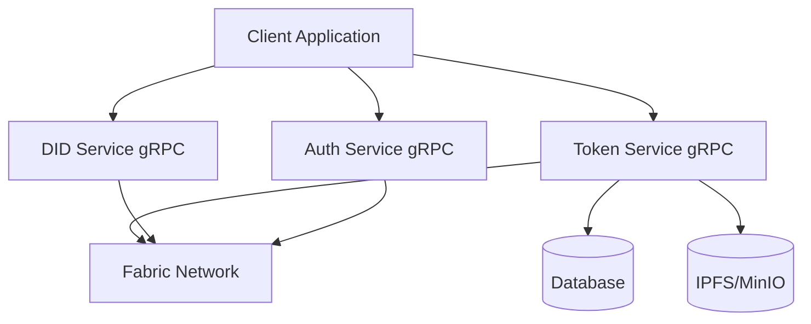
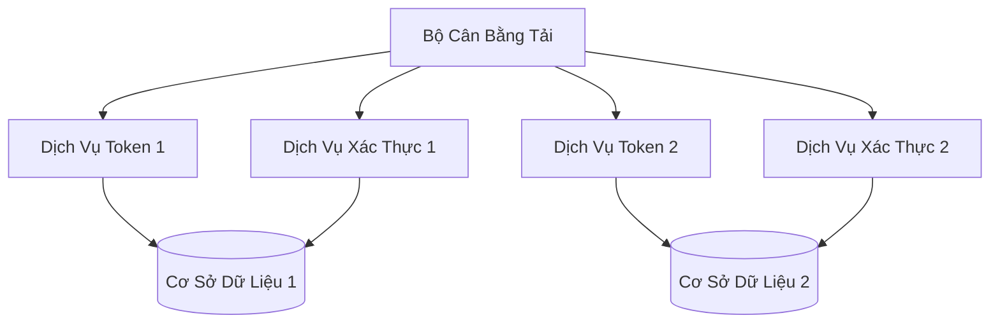

# Tài Liệu Thiết Kế Kỹ Thuật - Hệ Thống Quản Lý Tài Sản Số

## 1. Kiến Trúc Hệ Thống

### 1.1 Kiến Trúc Tổng Quan

### 1.1 High-Level Architecture



### 1.2 Tổng Quan Thành Phần

* **Ứng Dụng Client**
  * Frontend web (React/Next.js)
  * Ứng dụng di động (React Native)
  * Bảng điều khiển quản trị
  * Tích hợp client gRPC

* **Dịch Vụ Token**
  * Máy chủ gRPC
  * Quản lý vòng đời token
  * Xử lý giao dịch
  * Quản lý metadata tài sản
  * Quản lý sự kiện
  * Streaming thời gian thực

* **Dịch Vụ Xác Thực**
  * Máy chủ gRPC
  * Quản lý token JWT
  * Kiểm soát truy cập dựa trên vai trò (RBAC)
  * Quản lý quyền
  * Quản lý phiên

* **Dịch Vụ DID**
  * Máy chủ gRPC
  * Quản lý danh tính
  * Quản lý chứng chỉ
  * Tích hợp MSP
  * Tích hợp KYC/AML

* **Mạng Fabric**
  * Mạng blockchain riêng
  * Hợp đồng thông minh
  * Tích hợp Token SDK
  * Hệ thống sự kiện

---

## 2. Stack Công Nghệ

### 2.1 Dịch Vụ Backend

* **Dịch Vụ Token**
  * Golang
  * gRPC
  * Fabric SDK
  * PostgreSQL
  * Redis (cache)

* **Dịch Vụ Xác Thực**
  * Golang
  * gRPC
  * JWT
  * Redis (lưu trữ phiên)
  * PostgreSQL (dữ liệu người dùng)

* **Dịch Vụ DID**
  * Golang
  * gRPC
  * Fabric SDK
  * PostgreSQL
  * IPFS/MinIO

### 2.2 Frontend

* **Ứng Dụng Web**
  * React/Next.js
  * TypeScript
  * Material-UI/Tailwind CSS
  * gRPC-web client
  * Redux/Context API

* **Ứng Dụng Di Động**
  * React Native
  * TypeScript
  * Native Base
  * gRPC client
  * Redux

### 2.3 Hạ Tầng

* **Cơ Sở Dữ Liệu**
  * PostgreSQL (cơ sở dữ liệu chính)
  * Redis (cache)
  * MongoDB (tùy chọn cho phân tích)

* **Lưu Trữ**
  * IPFS/MinIO (lưu trữ metadata)
  * Lưu trữ tương thích S3

* **Blockchain**
  * Hyperledger Fabric
  * Fabric Token SDK
  * Chaincode (Go)

---

## 3. Thiết Kế Chi Tiết Thành Phần

### 3.1 Dịch Vụ Token

#### 3.1.1 Thành Phần Cốt Lõi

```go
// Giao Diện Dịch Vụ Token
type TokenService interface {
    // Quản Lý Token
    CreateToken(ctx context.Context, asset *Asset) (*Token, error)
    TransferToken(ctx context.Context, transfer *TransferRequest) (*Transaction, error)
    BurnToken(ctx context.Context, burn *BurnRequest) (*Transaction, error)
    
    // Thao Tác Truy Vấn
    GetTokenBalance(ctx context.Context, wallet string) (*Balance, error)
    GetTransactionHistory(ctx context.Context, filters *QueryFilters) ([]*Transaction, error)
    
    // Xử Lý Sự Kiện
    SubscribeToEvents(callback EventCallback) error
    ProcessEvents(event *TokenEvent) error
}

// Triển Khai Dịch Vụ Token
type tokenServiceImpl struct {
    fabricClient *fabric.Client
    db          *sql.DB
    cache       *redis.Client
    logger      *zap.Logger
    grpcServer  *grpc.Server
}

// Asset đại diện cho tài sản số
type Asset struct {
    ID          string          `json:"id"`
    OwnerID     string          `json:"owner_id"`
    TokenType   string          `json:"token_type"`
    Amount      decimal.Decimal `json:"amount"`
    Metadata    json.RawMessage `json:"metadata"`
    CreatedAt   time.Time       `json:"created_at"`
    UpdatedAt   time.Time       `json:"updated_at"`
}

// Transaction đại diện cho giao dịch token
type Transaction struct {
    ID              string          `json:"id"`
    TokenID         string          `json:"token_id"`
    FromWallet      string          `json:"from_wallet"`
    ToWallet        string          `json:"to_wallet"`
    Amount          decimal.Decimal `json:"amount"`
    TransactionType string          `json:"transaction_type"`
    Status          string          `json:"status"`
    CreatedAt       time.Time       `json:"created_at"`
}

// EventCallback là kiểu hàm để xử lý sự kiện token
type EventCallback func(event *TokenEvent) error
```

#### 3.1.2 Schema Cơ Sở Dữ Liệu

```sql
-- Bảng Tokens
CREATE TABLE tokens (
    id UUID PRIMARY KEY,
    asset_id UUID NOT NULL,
    owner_id UUID NOT NULL,
    token_type VARCHAR(50) NOT NULL,
    amount DECIMAL NOT NULL,
    metadata JSONB,
    created_at TIMESTAMP NOT NULL,
    updated_at TIMESTAMP NOT NULL
);

-- Bảng Transactions
CREATE TABLE transactions (
    id UUID PRIMARY KEY,
    token_id UUID NOT NULL,
    from_wallet VARCHAR(255) NOT NULL,
    to_wallet VARCHAR(255) NOT NULL,
    amount DECIMAL NOT NULL,
    transaction_type VARCHAR(50) NOT NULL,
    status VARCHAR(50) NOT NULL,
    created_at TIMESTAMP NOT NULL
);
```

#### 3.1.3 Triển Khai Dịch Vụ gRPC

```go
// TokenServiceServer triển khai dịch vụ gRPC
type TokenServiceServer struct {
    pb.UnimplementedTokenServiceServer
    service TokenService
    logger  *zap.Logger
}

// CreateToken triển khai phương thức RPC CreateToken
func (s *TokenServiceServer) CreateToken(ctx context.Context, req *pb.CreateTokenRequest) (*pb.Token, error) {
    asset := &Asset{
        ID:        req.AssetId,
        OwnerID:   req.OwnerId,
        TokenType: req.TokenType,
        Amount:    decimal.RequireFromString(req.Amount),
        Metadata:  req.Metadata,
    }

    token, err := s.service.CreateToken(ctx, asset)
    if err != nil {
        s.logger.Error("lỗi khi tạo token", zap.Error(err))
        return nil, status.Error(codes.Internal, "lỗi khi tạo token")
    }

    return convertToProtoToken(token), nil
}

// TransferToken triển khai phương thức RPC TransferToken
func (s *TokenServiceServer) TransferToken(ctx context.Context, req *pb.TransferRequest) (*pb.Transaction, error) {
    transfer := &TransferRequest{
        TokenID:    req.TokenId,
        FromWallet: req.FromWallet,
        ToWallet:   req.ToWallet,
        Amount:     decimal.RequireFromString(req.Amount),
    }

    transaction, err := s.service.TransferToken(ctx, transfer)
    if err != nil {
        s.logger.Error("lỗi khi chuyển token", zap.Error(err))
        return nil, status.Error(codes.Internal, "lỗi khi chuyển token")
    }

    return convertToProtoTransaction(transaction), nil
}
```

#### 3.1.4 Định Nghĩa Dịch Vụ gRPC

```protobuf
syntax = "proto3";

package token;

option go_package = "github.com/metafi/digital-assets-service/token";

service TokenService {
    rpc CreateToken(CreateTokenRequest) returns (Token);
    rpc TransferToken(TransferRequest) returns (Transaction);
    rpc BurnToken(BurnRequest) returns (Transaction);
    rpc GetBalance(BalanceRequest) returns (Balance);
    rpc GetTransactionHistory(HistoryRequest) returns (TransactionList);
    rpc SubscribeToEvents(SubscribeRequest) returns (stream TokenEvent);
}

message CreateTokenRequest {
    string asset_id = 1;
    string owner_id = 2;
    string token_type = 3;
    string amount = 4;
    bytes metadata = 5;
}

message TransferRequest {
    string token_id = 1;
    string from_wallet = 2;
    string to_wallet = 3;
    string amount = 4;
}

message BurnRequest {
    string token_id = 1;
    string wallet = 2;
    string amount = 3;
}

message BalanceRequest {
    string wallet = 1;
}

message HistoryRequest {
    string wallet = 1;
    int32 limit = 2;
    int32 offset = 3;
}

message SubscribeRequest {
    string wallet = 1;
    repeated string event_types = 2;
}

message TokenEvent {
    string event_id = 1;
    string event_type = 2;
    string token_id = 3;
    string wallet = 4;
    string amount = 5;
    int64 timestamp = 6;
    bytes metadata = 7;
}
```

#### 3.1.5 Cấu Hình

```go
// Config đại diện cho cấu hình của dịch vụ token
type Config struct {
    // Cấu hình máy chủ gRPC
    Server struct {
        Port int    `yaml:"port"`
        Host string `yaml:"host"`
    } `yaml:"server"`

    // Cấu hình cơ sở dữ liệu
    Database struct {
        Host     string `yaml:"host"`
        Port     int    `yaml:"port"`
        User     string `yaml:"user"`
        Password string `yaml:"password"`
        Name     string `yaml:"name"`
    } `yaml:"database"`

    // Cấu hình Redis
    Redis struct {
        Host     string `yaml:"host"`
        Port     int    `yaml:"port"`
        Password string `yaml:"password"`
        DB       int    `yaml:"db"`
    } `yaml:"redis"`

    // Cấu hình Fabric
    Fabric struct {
        ChannelID     string `yaml:"channel_id"`
        ChaincodeName string `yaml:"chaincode_name"`
        MSPID         string `yaml:"msp_id"`
        CertPath      string `yaml:"cert_path"`
        KeyPath       string `yaml:"key_path"`
    } `yaml:"fabric"`
}
```

### 3.2 Dịch Vụ DID

#### 3.2.1 Thành Phần Cốt Lõi

```go
// Giao Diện Dịch Vụ DID
type DIDService interface {
    // Quản Lý Danh Tính
    CreateIdentity(ctx context.Context, user *User) (*Identity, error)
    VerifyIdentity(ctx context.Context, identity *Identity) (bool, error)
    
    // Quản Lý Chứng Chỉ
    IssueCertificate(ctx context.Context, identity *Identity) (*Certificate, error)
    RevokeCertificate(ctx context.Context, certificate *Certificate) error
    
    // Tích Hợp KYC
    PerformKYC(ctx context.Context, user *User) (*KYCResult, error)
    VerifyKYCStatus(ctx context.Context, user *User) (*KYCStatus, error)
}
```

### 3.3 Dịch Vụ Xác Thực

#### 3.3.1 Thành Phần Cốt Lõi

```go
// Giao Diện Dịch Vụ Xác Thực
type AuthService interface {
    // Xác Thực
    Authenticate(ctx context.Context, credentials *Credentials) (*AuthToken, error)
    ValidateToken(ctx context.Context, token string) (bool, error)
    
    // Phân Quyền
    CheckPermission(ctx context.Context, user *User, resource *Resource) (bool, error)
    AssignRole(ctx context.Context, user *User, role *Role) error
    
    // Quản Lý Phiên
    CreateSession(ctx context.Context, user *User) (*Session, error)
    InvalidateSession(ctx context.Context, session *Session) error
}
```

---

## 4. Thiết Kế Bảo Mật

### 4.1 Xác Thực

* Xác thực dựa trên JWT
* Xác thực đa yếu tố (MFA)
* Quản lý phiên
* Cơ chế làm mới token

### 4.2 Phân Quyền

* Kiểm soát truy cập dựa trên vai trò (RBAC)
* Quyền cấp tài nguyên
* Bảo vệ dịch vụ gRPC
* Giới hạn tốc độ

### 4.3 Bảo Mật Dữ Liệu

* Mã hóa dữ liệu khi lưu trữ
* TLS cho dữ liệu truyền tải
* Quản lý khóa bảo mật
* Kiểm tra bảo mật định kỳ

### 4.4 Bảo Mật Blockchain

* Quản lý danh tính dựa trên MSP
* Ký giao dịch
* Bảo mật hợp đồng thông minh
* Bảo mật mạng

---

## 5. Kiến Trúc Triển Khai

### 5.1 Hạ Tầng



### 5.2 Chiến Lược Triển Khai

* Triển khai dựa trên Kubernetes
* Điều phối container
* Tự động mở rộng
* Cân bằng tải
* Tính sẵn sàng cao

### 5.3 Giám Sát

* Số liệu Prometheus
* Bảng điều khiển Grafana
* Stack ELK cho ghi log
* Quản lý cảnh báo

---

## 6. Hướng Dẫn Phát Triển

### 6.1 Tiêu Chuẩn Mã Nguồn

* Go
* gRPC
* Protocol Buffers
* Kiểm thử đơn vị
* Kiểm thử tích hợp

### 6.2 Quy Trình Git

* Quy trình nhánh tính năng
* Đánh giá pull request
* Pipeline CI/CD
* Kiểm thử tự động
* Kiểm tra chất lượng mã

### 6.3 Tài Liệu

* Tài liệu API
* Tài liệu mã nguồn
* Tài liệu kiến trúc
* Hướng dẫn triển khai
* Hướng dẫn người dùng

*Cập nhật: 31/05/2025* 