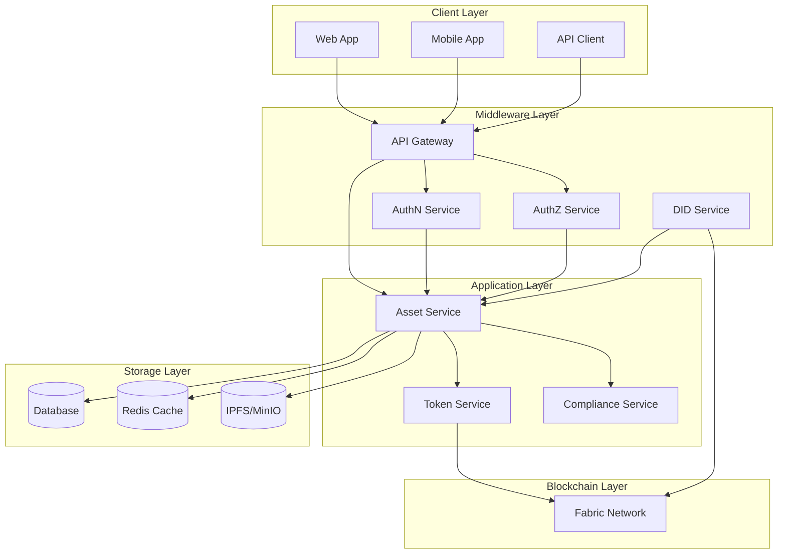

# Tài Liệu Thiết Kế Kỹ Thuật - Hệ Thống Quản Lý Tài Sản Số

## 1. Kiến Trúc Hệ Thống

### 1.1 Kiến Trúc Tổng Quan



### 1.2 Tổng Quan Thành Phần

* **Ứng Dụng Client**
  * Frontend web (React/Next.js)
  * Ứng dụng di động (React Native)
  * Bảng điều khiển quản trị

* **Asset Service**
  * Máy chủ gRPC
  * Quản lý metadata tài sản
  * Xác thực DID chủ sở hữu
  * Quản lý vòng đời tài sản
  * Xử lý từ chối và yêu cầu sửa đổi
  * Quản lý tài sản phân đoạn
  * Ghi log audit
  * Streaming thời gian thực

* **Token Service** (External Service)
  * Giao tiếp qua gRPC
  * Quản lý vòng đời token
  * Tích hợp với Fabric Network

* **AuthN**
  * Quản lý token JWT
  * Quản lý phiên

* **AuthZ**
  * Kiểm soát truy cập dựa trên vai trò (RBAC)
  * Quản lý quyền

* **DID Service**
  * Quản lý danh tính (DID)
  * Quản lý chứng chỉ
  * Tích hợp MSP
  * Xác thực KYC
  * Cấp phát MSP Identity

* **Fabric Network**
  * Mạng blockchain riêng
  * ChainCode
  * Tích hợp Token SDK
  * Hệ thống sự kiện

## 2. Stack Công Nghệ

### 2.1 Backend Services

* **Asset Service**
  * Golang
  * gRPC
  * PostgreSQL
  * Redis (cache)
  * IPFS/MinIO (storage)
  * Prometheus/Grafana (monitoring)

* **AuthN/AuthZ**
  * Golang
  * gRPC
  * JWT
  * Redis (session)
  * PostgreSQL

* **DID Service**
  * Golang
  * gRPC
  * Fabric SDK
  * PostgreSQL

### 2.2 Frontend

* **Ứng Dụng Web**
  * React/Next.js
  * TypeScript
  * Material-UI/Tailwind CSS
  * gRPC-web client
  * Redux/Context API

* **Ứng Dụng Di Động**
  * React Native
  * TypeScript
  * Native Base
  * gRPC client
  * Redux

### 2.3 Hạ Tầng

* **Cơ Sở Dữ Liệu**
  * PostgreSQL (cơ sở dữ liệu chính)
  * Redis (cache)
  * MongoDB (tùy chọn cho phân tích)

* **Lưu Trữ**
  * IPFS/MinIO (lưu trữ metadata)
  * Lưu trữ tương thích S3

* **Blockchain**
  * Hyperledger Fabric
  * Fabric Token SDK
  * Chaincode (Go)

## 3. Thiết Kế Chi Tiết

### 3.1 Asset Service

#### 3.1.1 Vai Trò Chính

- Quản lý metadata tài sản
- Quản lý vòng đời tài sản: tạo, cập nhật, token hóa, phân đoạn
- Kiểm tra quyền sở hữu qua DID
- Tích hợp ComplianceService và TokenService
- Cung cấp API/gRPC cho frontend và các dịch vụ khác

#### 3.1.2 Giao Diện Dịch Vụ

```go
// Giao Diện Dịch Vụ Asset
interface AssetService {
    // Quản lý tài sản
    CreateAsset(ctx context.Context, req *CreateAssetRequest) (*Asset, error)
    UpdateAsset(ctx context.Context, req *UpdateAssetRequest) (*Asset, error)
    GetAsset(ctx context.Context, id string) (*Asset, error)
    ListAssets(ctx context.Context, filter *AssetFilter) ([]*Asset, error)
    
    // Token hóa và phân đoạn
    TokenizeAsset(ctx context.Context, req *TokenizeAssetRequest) (*Asset, error)
    CreateFraction(ctx context.Context, req *FractionRequest) (*FractionResponse, error)
    TransferOwnership(ctx context.Context, req *TransferOwnershipRequest) error
    
    // Quản lý trạng thái
    UpdateAssetState(ctx context.Context, req *UpdateStateRequest) error
    RejectAsset(ctx context.Context, req *RejectRequest) error
    RequestModification(ctx context.Context, req *ModificationRequest) error
    
    // Quản lý sự kiện
    SubscribeToEvents(callback EventCallback) error
    ProcessEvents(event *AssetEvent) error
}

// Cấu trúc dữ liệu
type Asset struct {
    ID          string          `json:"id"`
    Name        string          `json:"name"`
    Type        string          `json:"type"`
    OwnerDID    string          `json:"owner_did"`
    Value       decimal.Decimal `json:"value"`
    Status      string          `json:"status"` // DRAFT, SUBMITTED, APPROVED, REJECTED, AWAITING_FIX, TOKENIZED, ARCHIVED
    Metadata    json.RawMessage `json:"metadata"`
    CreatedAt   time.Time       `json:"created_at"`
    UpdatedAt   time.Time       `json:"updated_at"`
}

type FractionResponse struct {
    AssetID        string                     `json:"asset_id"`
    TotalFractions int                        `json:"total_fractions"`
    FractionTokens []string                   `json:"fraction_token_ids"`
    OwnerMapping   map[string]float64         `json:"ownership_map"`
}
```

#### 3.1.3 Schema Cơ Sở Dữ Liệu

```sql
-- Bảng Assets
CREATE TABLE assets (
    id UUID PRIMARY KEY,
    name TEXT NOT NULL,
    type TEXT NOT NULL,
    owner_did TEXT NOT NULL,
    value DECIMAL NOT NULL,
    status TEXT NOT NULL,
    metadata JSONB,
    created_at TIMESTAMP NOT NULL,
    updated_at TIMESTAMP NOT NULL
);

-- Bảng Asset Events
CREATE TABLE asset_events (
    id UUID PRIMARY KEY,
    asset_id UUID REFERENCES assets(id),
    event_type TEXT NOT NULL,
    data JSONB,
    created_at TIMESTAMP NOT NULL
);

-- Bảng Asset Fractions
CREATE TABLE asset_fractions (
    id UUID PRIMARY KEY,
    asset_id UUID REFERENCES assets(id),
    token_id TEXT NOT NULL,
    owner_did TEXT NOT NULL,
    amount DECIMAL NOT NULL,
    total_fractions INTEGER NOT NULL,
    created_at TIMESTAMP NOT NULL,
    updated_at TIMESTAMP NOT NULL
);

-- Bảng Asset Audit Logs
CREATE TABLE asset_audit_logs (
    id UUID PRIMARY KEY,
    asset_id UUID REFERENCES assets(id),
    trace_id TEXT NOT NULL,
    operation TEXT NOT NULL,
    level TEXT NOT NULL,
    message TEXT NOT NULL,
    error TEXT,
    metadata JSONB,
    ip_address TEXT,
    user_agent TEXT,
    session_id TEXT,
    created_at TIMESTAMP NOT NULL
);
```

#### 3.1.4 Token Service Interface (gRPC)

```protobuf
// Interface giao tiếp với Token Service
service TokenService {
    // Quản lý token
    rpc CreateToken(CreateTokenRequest) returns (Token);
    rpc TransferToken(TransferRequest) returns (Transaction);
    rpc BurnToken(BurnRequest) returns (Transaction);
    
    // Quản lý fraction
    rpc CreateFraction(CreateFractionRequest) returns (Fraction);
    rpc TransferFraction(TransferFractionRequest) returns (Transaction);
    rpc GetFractionBalance(BalanceRequest) returns (Balance);
    
    // Truy vấn
    rpc GetTokenBalance(BalanceRequest) returns (Balance);
    rpc GetTransactionHistory(HistoryRequest) returns (TransactionList);
    
    // Sự kiện
    rpc SubscribeToEvents(SubscribeRequest) returns (stream TokenEvent);
}

message CreateTokenRequest {
    string asset_id = 1;
    string owner_did = 2;
    string type = 3;
    string amount = 4;
    bytes metadata = 5;
}

message TransferRequest {
    string token_id = 1;
    string from_did = 2;
    string to_did = 3;
    string amount = 4;
}

message TokenEvent {
    string event_id = 1;
    string event_type = 2;
    string token_id = 3;
    bytes data = 4;
    int64 timestamp = 5;
}
```

### 3.2 Monitoring và Logging

#### 3.2.1 Metrics

```go
// Định nghĩa metrics
type Metrics struct {
    // Asset metrics
    AssetCreation     *prometheus.CounterVec
    AssetStateChanges *prometheus.CounterVec
    AssetOperations   *prometheus.HistogramVec
    
    // System metrics
    RequestLatency    *prometheus.HistogramVec
    ErrorRate         *prometheus.CounterVec
    ActiveConnections *prometheus.GaugeVec
}

// Khởi tạo metrics
func NewMetrics() *Metrics {
    return &Metrics{
        AssetCreation: prometheus.NewCounterVec(
            prometheus.CounterOpts{
                Name: "asset_creation_total",
                Help: "Tổng số tài sản được tạo",
            },
            []string{"type", "status"},
        ),
        // ... other metrics
    }
}
```

#### 3.2.2 Logging

```go
// Cấu trúc log event
type LogEvent struct {
    TraceID    string                 `json:"trace_id"`
    Service    string                 `json:"service"`
    Operation  string                 `json:"operation"`
    Level      string                 `json:"level"`
    Message    string                 `json:"message"`
    Error      string                 `json:"error,omitempty"`
    Metadata   map[string]interface{} `json:"metadata,omitempty"`
    IPAddress  string                 `json:"ip_address,omitempty"`
    UserAgent  string                 `json:"user_agent,omitempty"`
    SessionID  string                 `json:"session_id,omitempty"`
    Timestamp  time.Time             `json:"timestamp"`
}

// Xử lý log event
func (s *serviceImpl) logEvent(level zapcore.Level, operation string, message string, err error, metadata map[string]interface{}) {
    event := &LogEvent{
        TraceID:    trace.SpanContextFromContext(s.ctx).TraceID().String(),
        Service:    s.serviceName,
        Operation:  operation,
        Level:      level.String(),
        Message:    message,
        Timestamp:  time.Now(),
        Metadata:   metadata,
        IPAddress:  s.getClientIP(),
        UserAgent:  s.getUserAgent(),
        SessionID:  s.getSessionID(),
    }
    
    if err != nil {
        event.Error = err.Error()
    }
    
    // Ghi log vào hệ thống
    s.logger.Log(level, message, zap.Any("event", event))
    
    // Ghi log audit nếu cần
    if s.shouldAudit(level, operation) {
        s.auditLogger.Log(event)
    }
    
    // Cập nhật metrics
    s.metrics.AuditLogVolume.WithLabelValues(
        event.Service,
        event.Operation,
        event.Level,
    ).Inc()
}
```

*Cập nhật: 31/05/2025* 