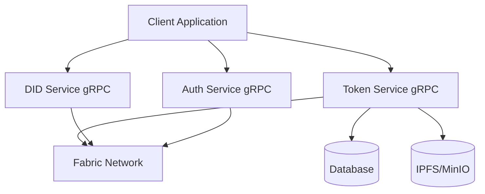

# Technical Specification - Digital Asset Management System

## 1. System Overview

### 1.1 Architecture Overview



### 1.2 System Components

* **Client Layer**
  * Web Application (React/Next.js)
  * Mobile Application (React Native)
  * Admin Dashboard
  * gRPC Client Integration

* **Service Layer**
  * Token Service (gRPC)
  * Auth Service (gRPC)
  * DID Service (gRPC)

* **Blockchain Layer**
  * Fabric Network
  * Smart Contracts
  * Token SDK

* **Storage Layer**
  * PostgreSQL
  * Redis
  * IPFS/MinIO

## 2. Service Specifications

### 2.1 Token Service

#### 2.1.1 Service Interface

```go
// Token Service Interface
type TokenService interface {
    // Token Management
    CreateToken(ctx context.Context, asset *Asset) (*Token, error)
    TransferToken(ctx context.Context, transfer *TransferRequest) (*Transaction, error)
    BurnToken(ctx context.Context, burn *BurnRequest) (*Transaction, error)
    
    // Query Operations
    GetTokenBalance(ctx context.Context, wallet string) (*Balance, error)
    GetTransactionHistory(ctx context.Context, filters *QueryFilters) ([]*Transaction, error)
    
    // Event Handling
    SubscribeToEvents(callback EventCallback) error
    ProcessEvents(event *TokenEvent) error
}
```

#### 2.1.2 Data Models

```go
// Asset represents a digital asset
type Asset struct {
    ID          string          `json:"id"`
    OwnerID     string          `json:"owner_id"`
    TokenType   string          `json:"token_type"`
    Amount      decimal.Decimal `json:"amount"`
    Metadata    json.RawMessage `json:"metadata"`
    CreatedAt   time.Time       `json:"created_at"`
    UpdatedAt   time.Time       `json:"updated_at"`
}

// Transaction represents a token transaction
type Transaction struct {
    ID              string          `json:"id"`
    TokenID         string          `json:"token_id"`
    FromWallet      string          `json:"from_wallet"`
    ToWallet        string          `json:"to_wallet"`
    Amount          decimal.Decimal `json:"amount"`
    TransactionType string          `json:"transaction_type"`
    Status          string          `json:"status"`
    CreatedAt       time.Time       `json:"created_at"`
}
```

#### 2.1.3 Database Schema

```sql
-- Tokens Table
CREATE TABLE tokens (
    id UUID PRIMARY KEY,
    asset_id UUID NOT NULL,
    owner_id UUID NOT NULL,
    token_type VARCHAR(50) NOT NULL,
    amount DECIMAL NOT NULL,
    metadata JSONB,
    created_at TIMESTAMP NOT NULL,
    updated_at TIMESTAMP NOT NULL
);

-- Transactions Table
CREATE TABLE transactions (
    id UUID PRIMARY KEY,
    token_id UUID NOT NULL,
    from_wallet VARCHAR(255) NOT NULL,
    to_wallet VARCHAR(255) NOT NULL,
    amount DECIMAL NOT NULL,
    transaction_type VARCHAR(50) NOT NULL,
    status VARCHAR(50) NOT NULL,
    created_at TIMESTAMP NOT NULL
);
```

#### 2.1.4 gRPC Service Definition

```protobuf
syntax = "proto3";

package token;

option go_package = "github.com/metafi/digital-assets-service/token";

service TokenService {
    rpc CreateToken(CreateTokenRequest) returns (Token);
    rpc TransferToken(TransferRequest) returns (Transaction);
    rpc BurnToken(BurnRequest) returns (Transaction);
    rpc GetBalance(BalanceRequest) returns (Balance);
    rpc GetTransactionHistory(HistoryRequest) returns (TransactionList);
    rpc SubscribeToEvents(SubscribeRequest) returns (stream TokenEvent);
}

message CreateTokenRequest {
    string asset_id = 1;
    string owner_id = 2;
    string token_type = 3;
    string amount = 4;
    bytes metadata = 5;
}

message TransferRequest {
    string token_id = 1;
    string from_wallet = 2;
    string to_wallet = 3;
    string amount = 4;
}

message TokenEvent {
    string event_id = 1;
    string event_type = 2;
    string token_id = 3;
    string wallet = 4;
    string amount = 5;
    int64 timestamp = 6;
    bytes metadata = 7;
}
```

### 2.2 Auth Service

#### 2.2.1 Service Interface

```go
// Auth Service Interface
type AuthService interface {
    // Authentication
    Authenticate(ctx context.Context, credentials *Credentials) (*AuthToken, error)
    ValidateToken(ctx context.Context, token string) (bool, error)
    
    // Authorization
    CheckPermission(ctx context.Context, user *User, resource *Resource) (bool, error)
    AssignRole(ctx context.Context, user *User, role *Role) error
    
    // Session Management
    CreateSession(ctx context.Context, user *User) (*Session, error)
    InvalidateSession(ctx context.Context, session *Session) error
}
```

#### 2.2.2 Data Models

```go
// User represents a system user
type User struct {
    ID        string    `json:"id"`
    Username  string    `json:"username"`
    Email     string    `json:"email"`
    Roles     []string  `json:"roles"`
    CreatedAt time.Time `json:"created_at"`
    UpdatedAt time.Time `json:"updated_at"`
}

// Session represents a user session
type Session struct {
    ID        string    `json:"id"`
    UserID    string    `json:"user_id"`
    Token     string    `json:"token"`
    ExpiresAt time.Time `json:"expires_at"`
    CreatedAt time.Time `json:"created_at"`
}
```

### 2.3 DID Service

#### 2.3.1 Service Interface

```go
// DID Service Interface
type DIDService interface {
    // Identity Management
    CreateIdentity(ctx context.Context, user *User) (*Identity, error)
    VerifyIdentity(ctx context.Context, identity *Identity) (bool, error)
    
    // Certificate Management
    IssueCertificate(ctx context.Context, identity *Identity) (*Certificate, error)
    RevokeCertificate(ctx context.Context, certificate *Certificate) error
    
    // KYC Integration
    PerformKYC(ctx context.Context, user *User) (*KYCResult, error)
    VerifyKYCStatus(ctx context.Context, user *User) (*KYCStatus, error)
}
```

## 3. Implementation Details

### 3.1 Token Service Implementation

#### 3.1.1 Token Creation

```go
func (s *tokenServiceImpl) CreateToken(ctx context.Context, asset *Asset) (*Token, error) {
    // Validate asset
    if err := s.validateAsset(asset); err != nil {
        return nil, err
    }

    // Create token on Fabric
    tokenID, err := s.fabricClient.CreateToken(ctx, asset)
    if err != nil {
        return nil, fmt.Errorf("failed to create token on Fabric: %w", err)
    }

    // Store metadata
    token := &Token{
        ID:        tokenID,
        AssetID:   asset.ID,
        OwnerID:   asset.OwnerID,
        TokenType: asset.TokenType,
        Amount:    asset.Amount,
        Metadata:  asset.Metadata,
        CreatedAt: time.Now(),
        UpdatedAt: time.Now(),
    }

    if err := s.db.CreateToken(ctx, token); err != nil {
        return nil, fmt.Errorf("failed to store token metadata: %w", err)
    }

    return token, nil
}
```

#### 3.1.2 Token Transfer

```go
func (s *tokenServiceImpl) TransferToken(ctx context.Context, transfer *TransferRequest) (*Transaction, error) {
    // Validate transfer request
    if err := s.validateTransfer(transfer); err != nil {
        return nil, err
    }

    // Check balance
    balance, err := s.GetTokenBalance(ctx, transfer.FromWallet)
    if err != nil {
        return nil, err
    }
    if balance.Amount.LessThan(transfer.Amount) {
        return nil, ErrInsufficientBalance
    }

    // Execute transfer on Fabric
    txID, err := s.fabricClient.TransferToken(ctx, transfer)
    if err != nil {
        return nil, fmt.Errorf("failed to transfer token on Fabric: %w", err)
    }

    // Record transaction
    transaction := &Transaction{
        ID:              txID,
        TokenID:         transfer.TokenID,
        FromWallet:      transfer.FromWallet,
        ToWallet:        transfer.ToWallet,
        Amount:          transfer.Amount,
        TransactionType: "TRANSFER",
        Status:          "CONFIRMED",
        CreatedAt:       time.Now(),
    }

    if err := s.db.CreateTransaction(ctx, transaction); err != nil {
        return nil, fmt.Errorf("failed to record transaction: %w", err)
    }

    return transaction, nil
}
```

### 3.2 Event Processing

```go
func (s *tokenServiceImpl) ProcessEvents(event *TokenEvent) error {
    // Cache event
    if err := s.cache.SetEvent(event); err != nil {
        return fmt.Errorf("failed to cache event: %w", err)
    }

    // Notify subscribers
    for _, callback := range s.eventCallbacks {
        if err := callback(event); err != nil {
            s.logger.Error("failed to process event callback", zap.Error(err))
        }
    }

    return nil
}
```

## 4. Security Implementation

### 4.1 Authentication

```go
func (s *authServiceImpl) Authenticate(ctx context.Context, credentials *Credentials) (*AuthToken, error) {
    // Validate credentials
    user, err := s.validateCredentials(ctx, credentials)
    if err != nil {
        return nil, err
    }

    // Generate JWT token
    token, err := s.generateJWT(user)
    if err != nil {
        return nil, err
    }

    // Create session
    session := &Session{
        ID:        uuid.New().String(),
        UserID:    user.ID,
        Token:     token,
        ExpiresAt: time.Now().Add(24 * time.Hour),
        CreatedAt: time.Now(),
    }

    if err := s.db.CreateSession(ctx, session); err != nil {
        return nil, err
    }

    return &AuthToken{
        Token:     token,
        ExpiresAt: session.ExpiresAt,
    }, nil
}
```

### 4.2 Authorization

```go
func (s *authServiceImpl) CheckPermission(ctx context.Context, user *User, resource *Resource) (bool, error) {
    // Get user roles
    roles, err := s.db.GetUserRoles(ctx, user.ID)
    if err != nil {
        return false, err
    }

    // Check permissions for each role
    for _, role := range roles {
        permissions, err := s.db.GetRolePermissions(ctx, role)
        if err != nil {
            return false, err
        }

        for _, permission := range permissions {
            if permission.Resource == resource.Type && permission.Action == resource.Action {
                return true, nil
            }
        }
    }

    return false, nil
}
```

## 5. Deployment Configuration

### 5.1 Kubernetes Deployment

```yaml
apiVersion: apps/v1
kind: Deployment
metadata:
  name: token-service
spec:
  replicas: 3
  selector:
    matchLabels:
      app: token-service
  template:
    metadata:
      labels:
        app: token-service
    spec:
      containers:
      - name: token-service
        image: metafi/token-service:latest
        ports:
        - containerPort: 50051
        env:
        - name: DB_HOST
          valueFrom:
            configMapKeyRef:
              name: token-service-config
              key: db_host
        - name: REDIS_HOST
          valueFrom:
            configMapKeyRef:
              name: token-service-config
              key: redis_host
```

### 5.2 Service Configuration

```yaml
# token-service-config.yaml
server:
  port: 50051
  host: "0.0.0.0"

database:
  host: "postgres-service"
  port: 5432
  user: "token_service"
  password: "${DB_PASSWORD}"
  name: "token_service"

redis:
  host: "redis-service"
  port: 6379
  password: "${REDIS_PASSWORD}"
  db: 0

fabric:
  channel_id: "token-channel"
  chaincode_name: "token-cc"
  msp_id: "Org1MSP"
  cert_path: "/etc/fabric/cert.pem"
  key_path: "/etc/fabric/key.pem"
```

## 6. Monitoring and Logging

### 6.1 Metrics Collection

```go
func (s *tokenServiceImpl) recordMetrics(operation string, duration time.Duration, err error) {
    s.metrics.OperationDuration.WithLabelValues(operation).Observe(duration.Seconds())
    if err != nil {
        s.metrics.OperationErrors.WithLabelValues(operation).Inc()
    }
}
```

### 6.2 Logging Configuration

```go
func setupLogger() (*zap.Logger, error) {
    config := zap.NewProductionConfig()
    config.OutputPaths = []string{
        "stdout",
        "/var/log/token-service/app.log",
    }
    config.ErrorOutputPaths = []string{
        "stderr",
        "/var/log/token-service/error.log",
    }
    return config.Build()
}
```

*Last Updated: 31/05/2025* 