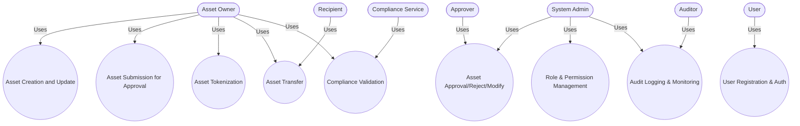

# Digital Asset Management System - Use Cases

## Use Case Table

| Use Case Name                | Description                                                                 | Actors                        | Preconditions                        | Main Flow (Summary)                                                                                 |
|------------------------------|-----------------------------------------------------------------------------|-------------------------------|---------------------------------------|-----------------------------------------------------------------------------------------------------|
| Asset Creation and Update    | Create and update asset information (metadata, type, ownership, etc.)        | Asset Owner, System Admin     | User is registered and authenticated  | User submits asset info, system validates, verifies DID, saves as Draft, allows update in Draft/AwaitingFix |
| Asset Submission for Approval| Submit an asset for approval before tokenization                            | Asset Owner                   | Asset in Draft/AwaitingFix status     | User submits asset, system checks permission, updates status to Submitted                           |
| Asset Approval/Reject/Modify | Approve, reject, or request modification for a submitted asset               | System Admin, Approver        | Asset is in Submitted status          | Approver reviews, approves (triggers tokenization), rejects (records reason), or requests modification |
| Asset Tokenization           | Tokenize an approved asset, minting tokens on blockchain                     | Asset Owner, System           | Asset is Approved                     | System checks KYC/compliance, requests tokenization, mints tokens, stores status/tx hash            |
| Asset Transfer (Fractional/Full) | Transfer ownership (full or fractional) of an asset via token transfer   | Asset Owner (Sender), Recipient| Sender owns asset/fraction            | Sender initiates transfer, system checks permission, requests token transfer, updates status         |
| User Registration & Auth     | Register new users and authenticate existing users                           | User                          | None                                  | User registers, system verifies identity, creates account, user logs in, receives JWT                |
| Role & Permission Management | Manage user roles and permissions for access control                         | System Admin                  | Admin is authenticated                | Admin assigns roles, configures permissions, system enforces on all operations                      |
| Audit Logging & Monitoring   | Track and store all critical actions for security and compliance             | System, Auditor               | System is operational                 | System logs actions, stores logs securely, auditors review and report                                |
| Compliance Validation        | Validate compliance (KYC, AML, regulatory) before tokenization/transfer      | System, Compliance Service    | Asset or user action requires check    | System sends validation request, compliance service checks, system proceeds or aborts                |

---

## Use Case Diagram

