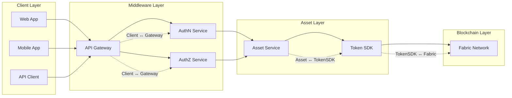
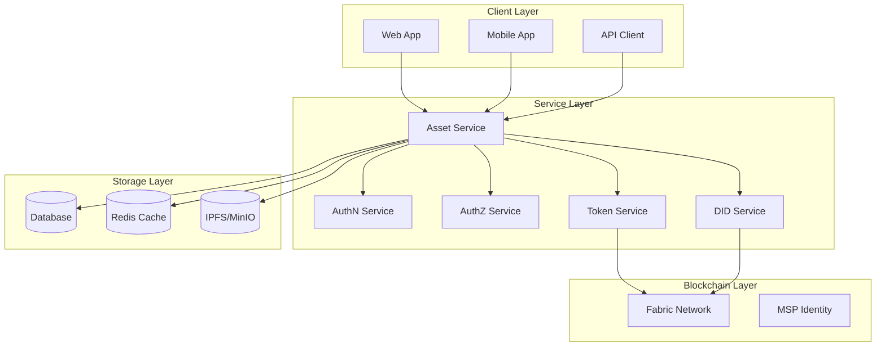
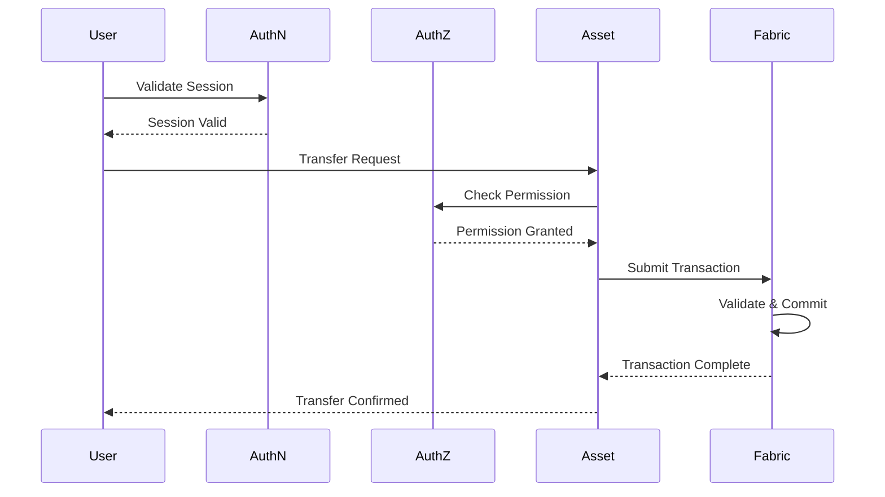
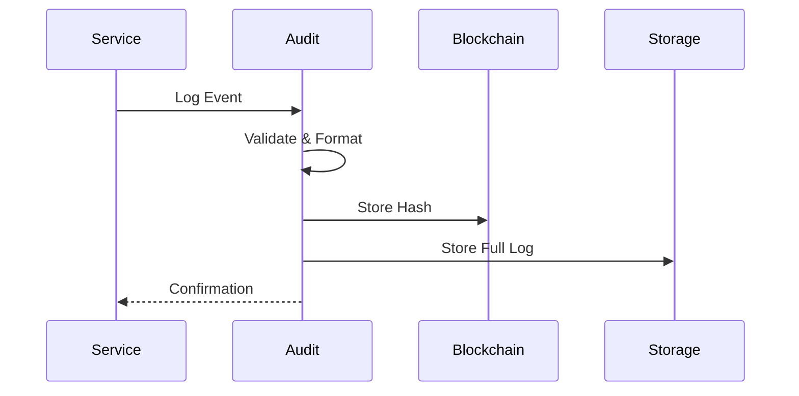
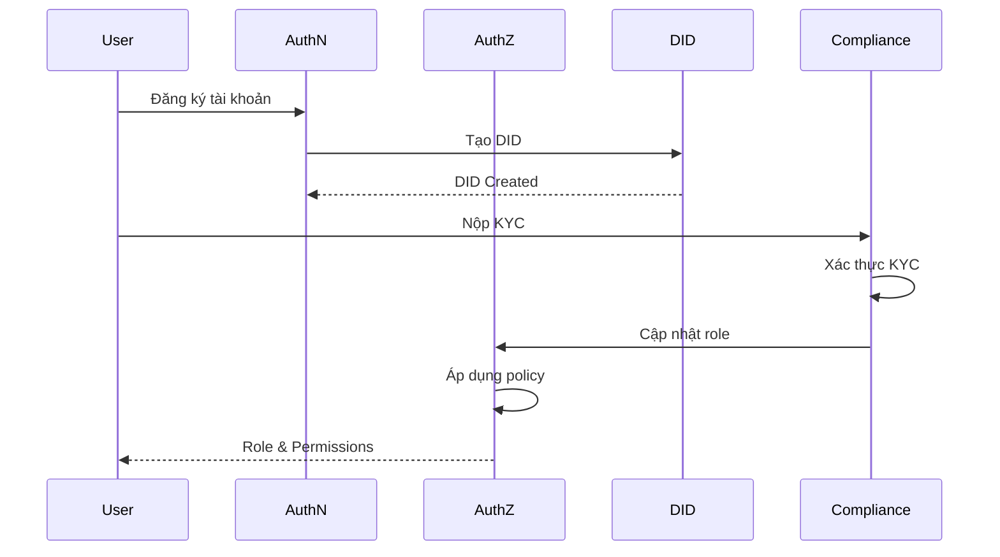
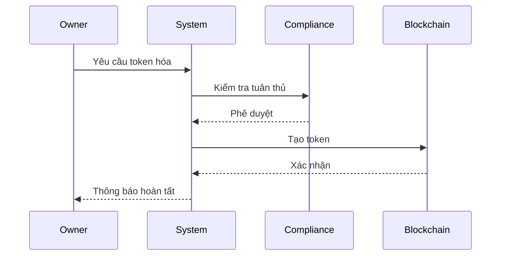
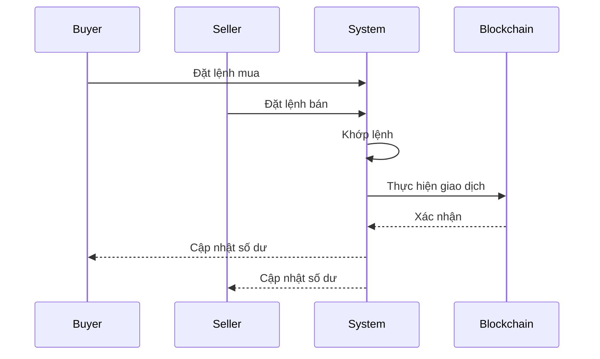
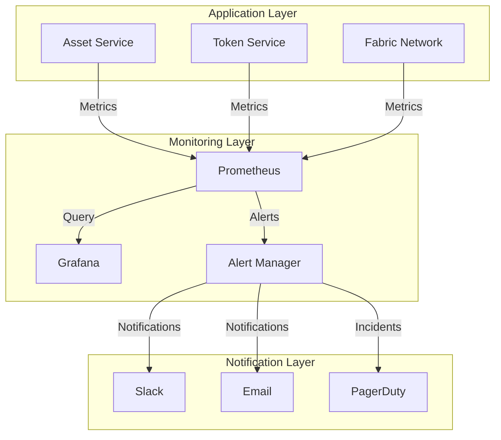

# Tài Liệu Yêu Cầu Chức Năng - Hệ Thống Quản Lý Tài Sản Số

## Mục lục
1. [Tổng quan](#1-tổng-quan)
2. [Kiến trúc hệ thống](#2-kiến-trúc-hệ-thống)
3. [Yêu cầu chức năng](#3-yêu-cầu-chức-năng)
4. [Yêu cầu phi chức năng](#4-yêu-cầu-phi-chức-năng)
5. [Interface giữa các Service](#5-interface-giữa-các-service)
6. [Vai trò người dùng và Phân quyền](#6-vai-trò-người-dùng-và-phân-quyền)
7. [Quy trình nghiệp vụ](#7-quy-trình-nghiệp-vụ)
8. [Triển khai và Vận hành](#8-triển-khai-và-vận-hành)

## 1. Tổng quan

### 1.1 Mục tiêu
Xây dựng hệ thống quản lý tài sản số (Digital Asset Service) tích hợp với các dịch vụ xác thực và phân quyền, hỗ trợ việc token hóa và quản lý tài sản truyền thống như bất động sản, chứng chỉ tiền gửi, và quỹ đầu tư.

### 1.2 Phạm vi
* Token hóa tài sản vật lý và tài chính
* Quản lý quyền sở hữu và giao dịch
* Tích hợp với AuthN Service cho xác thực người dùng
* Tích hợp với AuthZ Service cho phân quyền truy cập
* Tích hợp với DID Service cho quản lý danh tính

### 1.3 Đối tượng người dùng
* Chủ sở hữu tài sản
* Nhà đầu tư
* Quản trị viên hệ thống
* Đối tác và bên thứ ba

## 2. Kiến trúc hệ thống

### 2.1 Sơ đồ hệ thống tổng quan

#### 2.1.1 Sơ đồ high-level



#### 2.1.2 Sơ đồ chi tiết



### 2.2 Các thành phần chính

### 2.2.1 Asset Service
* Quản lý thông tin và metadata của tài sản (real estate, CD, fund...)
* Xác thực DID chủ sở hữu tài sản khi tạo và cập nhật
* Kích hoạt quá trình token hóa bằng cách gọi Token Service khi tài sản được phê duyệt
* Ghi thông tin tài sản (metadata hash, approval event...) lên Fabric nếu cần đảm bảo tính bất biến
* Quản lý trạng thái vòng đời tài sản (Draft → Submitted → Approved → Tokenized → Archived)

#### 2.2.2 Token Service
* Quản lý lifecycle của token tách biệt khỏi metadata tài sản
* Cung cấp chức năng: mint, burn, transfer, balance, history
* Tương tác với Hyperledger Fabric thông qua chaincode ERC-20 hoặc Token SDK
* Có khả năng mở rộng các chức năng như marketplace, staking, hoặc phân phối lợi nhuận


#### 2.2.4 AuthN Service
* Xác thực người dùng
* Quản lý phiên
* Cấp phát JWT

#### 2.2.5 AuthZ Service
* Phân quyền truy cập
* Quản lý vai trò
* Kiểm tra quyền

#### 2.2.6 DID Service
* Quản lý danh tính
* Xác thực KYCsequenceDiagram
    participant User
    participant AuthN
    participant AuthZ
    participant DID
    participant Asset
    participant Token
    participant Fabric

    User->>AuthN: Đăng nhập
    AuthN-->>User: JWT Token

    User->>Asset: Gửi yêu cầu tạo tài sản (metadata, loại tài sản)
    Asset->>AuthN: Validate JWT
    AuthN-->>Asset: OK

    Asset->>DID: Xác thực DID chủ sở hữu
    DID-->>Asset: DID hợp lệ + MSP Identity

    Asset->>AuthZ: Kiểm tra quyền tạo tài sản
    AuthZ-->>Asset: Được phép

    Asset->>Asset: Lưu metadata vào DB (trạng thái: Draft)

    User->>Asset: Submit tài sản để phê duyệt
    Asset->>AuthZ: Kiểm tra quyền phê duyệt
    AuthZ-->>Asset: OK

    Asset->>Asset: Cập nhật trạng thái → Approved

    Asset->>Token: Gọi Mint token (kèm asset_id, owner_did, amount...)
    Token->>Fabric: Gửi giao dịch mint
    Fabric-->>Token: Mint thành công

    Token-->>Asset: Trả về token_id, tx_hash, status
    Asset->>Fabric: (tuỳ chọn) ghi metadata hash (immutability proof)

    Asset-->>User: Thông báo tài sản đã tokenized
```

### 2.4 Luồng giao dịch



## 3. Yêu cầu chức năng

### 3.1 Quản lý tài sản
* Tạo và cập nhật thông tin tài sản
* Token hóa tài sản
* Quản lý quyền sở hữu
* Theo dõi trạng thái tài sản

### 3.2 Quản lý token
* Phát hành token (mint)
* Hủy token (burn)
* Chuyển token (transfer)
* Quản lý số dư
* Lịch sử giao dịch

### 3.3 Quản lý người dùng
* Đăng ký và xác thực
* Phân quyền truy cập
* Quản lý danh tính
* KYC/AML

### 3.4 Giao dịch
* Đặt lệnh mua/bán
* Khớp lệnh
* Thực hiện giao dịch
* Xác nhận giao dịch

## 4. Yêu cầu phi chức năng

### 4.1 Hiệu năng
* Thời gian phản hồi < 500ms
* Xử lý đồng thời > 1000 TPS
* Độ trễ giao dịch < 2s

### 4.2 Bảo mật
* Mã hóa end-to-end
* Xác thực đa yếu tố
* Kiểm soát truy cập
* Audit logging

#### 4.2.1 Audit Logging cho Token Actions

##### 4.2.1.1 Các sự kiện cần audit
* **Token Mint**:
  * Thông tin người thực hiện (DID, role)
  * Thời gian mint
  * Số lượng token
  * Asset ID liên quan
  * Lý do mint
  * Trạng thái giao dịch
  * Transaction hash

* **Token Transfer**:
  * Thông tin người gửi (DID, role)
  * Thông tin người nhận (DID, role)
  * Thời gian transfer
  * Số lượng token
  * Token ID
  * Lý do transfer
  * Trạng thái giao dịch
  * Transaction hash

##### 4.2.1.2 Cấu trúc Audit Log
```protobuf
message TokenAuditLog {
    string event_id = 1;
    string event_type = 2;  // MINT, TRANSFER, BURN
    string actor_did = 3;
    string actor_role = 4;
    string target_did = 5;  // For transfer
    int64 timestamp = 6;
    string token_id = 7;
    double amount = 8;
    string asset_id = 9;
    string reason = 10;
    string status = 11;
    string transaction_hash = 12;
    map<string, string> metadata = 13;
}
```

##### 4.2.1.3 Yêu cầu lưu trữ
* Lưu trữ immutable trên blockchain
* Backup định kỳ
* Retention policy: 7 năm
* Index cho tìm kiếm nhanh
* Mã hóa dữ liệu nhạy cảm

##### 4.2.1.4 Quy trình xử lý


##### 4.2.1.5 Monitoring và Alerting
* Alert khi có sự kiện bất thường
* Báo cáo định kỳ
* Phát hiện pattern bất thường
* Theo dõi volume giao dịch

### 4.3 Khả năng mở rộng
* Horizontal scaling
* Load balancing
* Microservices architecture
* Container orchestration

### 4.4 Độ tin cậy
* High availability
* Fault tolerance
* Disaster recovery
* Data backup

## 5. Interface giữa các Service

### 5.1 Asset ↔ AuthN Interface


```

### 5.2 Asset ↔ AuthZ Interface

```protobuf
service AuthZService {
    // Kiểm tra quyền truy cập
    rpc CheckPermission(CheckPermissionRequest) returns (CheckPermissionResponse);
    
    // Lấy danh sách quyền của user
    rpc GetUserPermissions(GetUserPermissionsRequest) returns (GetUserPermissionsResponse);
    
    // Kiểm tra quyền sở hữu tài sản
    rpc CheckAssetOwnership(CheckAssetOwnershipRequest) returns (CheckAssetOwnershipResponse);
}

message CheckPermissionRequest {
    string user_id = 1;
    string resource = 2;
    string action = 3;
}

message CheckPermissionResponse {
    bool allowed = 1;
    string reason = 2;
}

message GetUserPermissionsRequest {
    string user_id = 1;
}

message GetUserPermissionsResponse {
    repeated string permissions = 1;
    map<string, string> constraints = 2;
}

message CheckAssetOwnershipRequest {
    string user_id = 1;
    string asset_id = 2;
}

message CheckAssetOwnershipResponse {
    bool is_owner = 1;
    string ownership_type = 2; // FULL, PARTIAL, NONE
    double ownership_percentage = 3;
}
```

### 5.3 Asset ↔ Token Interface

```protobuf
service AssetService {
    // Existing Operations
    rpc CreateAsset(CreateAssetRequest) returns (CreateAssetResponse);
    rpc UpdateAsset(UpdateAssetRequest) returns (UpdateAssetResponse);
    rpc GetAsset(GetAssetRequest) returns (GetAssetResponse);
    rpc VerifyOwnership(VerifyOwnershipRequest) returns (VerifyOwnershipResponse);
    
    // Token Integration Operations
    rpc RequestTokenization(RequestTokenizationRequest) returns (RequestTokenizationRequest);
    rpc GetTokenizationStatus(GetTokenizationStatusRequest) returns (GetTokenizationStatusResponse);
    rpc UpdateTokenState(UpdateTokenStateRequest) returns (UpdateTokenStateResponse);
    rpc GetTokenInfo(GetTokenInfoRequest) returns (GetTokenInfoResponse);
    
    // Compliance Operations
    rpc ValidateCompliance(ValidateComplianceRequest) returns (ValidateComplianceResponse);
    rpc UpdateComplianceStatus(UpdateComplianceStatusRequest) returns (UpdateComplianceStatusResponse);
}

// Token Integration Messages
message RequestTokenizationRequest {
    string asset_id = 1;
    string owner_did = 2;
    TokenType token_type = 3;
    double initial_supply = 4;
    map<string, string> metadata = 5;
}

message RequestTokenizationResponse {
    string tokenization_id = 1;
    string status = 2;
    string message = 3;
    int64 expires_at = 4;
}

message GetTokenizationStatusRequest {
    string tokenization_id = 1;
    string asset_id = 2;
}

message GetTokenizationStatusResponse {
    string status = 1;
    string token_id = 2;
    string message = 3;
    map<string, string> details = 4;
}

message UpdateTokenStateRequest {
    string asset_id = 1;
    string token_id = 2;
    AssetState new_state = 3;
    string reason = 4;
    map<string, string> metadata = 5;
}

message UpdateTokenStateResponse {
    string status = 1;
    string message = 2;
    string transaction_hash = 3;
}

message GetTokenInfoRequest {
    string asset_id = 1;
    string token_id = 2;
}

message GetTokenInfoResponse {
    string token_id = 1;
    string token_address = 2;
    TokenType token_type = 3;
    double total_supply = 4;
    string owner_did = 5;
    AssetState state = 6;
    map<string, string> metadata = 7;
}

// Compliance Messages
message ValidateComplianceRequest {
    string asset_id = 1;
    string token_id = 2;
    ComplianceType compliance_type = 3;
    map<string, string> parameters = 4;
}

message ValidateComplianceResponse {
    bool valid = 1;
    repeated string violations = 2;
    string message = 3;
    map<string, string> details = 4;
}

message UpdateComplianceStatusRequest {
    string asset_id = 1;
    string token_id = 2;
    ComplianceStatus status = 3;
    string report_id = 4;
    map<string, string> details = 5;
}

message UpdateComplianceStatusResponse {
    string status = 1;
    string message = 2;
    int64 updated_at = 3;
}

// Enums
enum TokenType {
    ERC20 = 0;
    ERC721 = 1;
    ERC1155 = 2;
}

enum AssetState {
    ACTIVE = 0;
    FROZEN = 1;
    SUSPENDED = 2;
    REVOKED = 3;
    COMPLIANCE_HOLD = 4;
}

enum ComplianceType {
    KYC = 0;
    AML = 1;
    SANCTIONS = 2;
    REGULATORY = 3;
}

enum ComplianceStatus {
    COMPLIANT = 0;
    NON_COMPLIANT = 1;
    PENDING_REVIEW = 2;
    EXEMPTED = 3;
}
```

### 5.4 Lưu ý triển khai

* **gRPC Communication**:
  * Sử dụng gRPC cho tất cả internal service communication
  * Implement retry mechanism cho các gọi service
  * Sử dụng circuit breaker pattern
  * Implement timeout cho mọi request

* **Error Handling**:
  * Định nghĩa rõ error codes cho từng service
  * Implement proper error propagation
  * Log đầy đủ thông tin lỗi
  * Có cơ chế retry cho các lỗi tạm thời

* **Security**:
  * Mã hóa tất cả internal communication
  * Implement service-to-service authentication
  * Validate input data
  * Rate limiting cho mọi endpoint

* **Monitoring**:
  * Track latency cho mọi service call
  * Monitor error rates
  * Alert khi có vấn đề
  * Log đầy đủ thông tin cho debugging

## 6. Vai trò người dùng và Phân quyền

### 6.1 Định nghĩa vai trò

```protobuf
enum UserRole {
    // Vai trò quản trị hệ thống
    SYSTEM_ADMIN = 0;      // Quản trị viên hệ thống
    COMPLIANCE_OFFICER = 1; // Nhân viên tuân thủ
    AUDITOR = 2;           // Kiểm toán viên
    
    // Vai trò quản lý tài sản
    ASSET_OWNER = 10;      // Chủ sở hữu tài sản
    ASSET_MANAGER = 11;    // Người quản lý tài sản
    ASSET_OPERATOR = 12;   // Người vận hành tài sản
    
    // Vai trò đầu tư
    INVESTOR = 20;         // Nhà đầu tư
    INSTITUTIONAL_INVESTOR = 21; // Nhà đầu tư tổ chức
    RETAIL_INVESTOR = 22;  // Nhà đầu tư cá nhân
    
    // Vai trò đối tác
    BROKER = 30;           // Môi giới
    CUSTODIAN = 31;        // Người giữ tài sản
    LEGAL_ADVISOR = 32;    // Cố vấn pháp lý
}
```

### 6.2 Quyền hạn theo vai trò

#### 6.2.1 Quản trị hệ thống
* **SYSTEM_ADMIN**:
  * Quản lý toàn bộ hệ thống
  * Cấu hình các tham số hệ thống
  * Quản lý người dùng và vai trò
  * Xem toàn bộ logs và metrics
  * Có quyền cao nhất trong hệ thống

* **COMPLIANCE_OFFICER**:
  * Xem xét và phê duyệt KYC
  * Giám sát các giao dịch
  * Báo cáo tuân thủ
  * Đánh giá rủi ro
  * Không có quyền thay đổi cấu hình hệ thống

* **AUDITOR**:
  * Xem toàn bộ lịch sử giao dịch
  * Truy xuất logs hệ thống
  * Tạo báo cáo kiểm toán
  * Không có quyền thực hiện thay đổi

#### 6.2.2 Quản lý tài sản
* **ASSET_OWNER**:
  * Tạo và quản lý tài sản
  * Phát hành token
  * Quyết định chính sách phân phối
  * Xem báo cáo tài sản
  * Không thể thay đổi cấu hình hệ thống

* **ASSET_MANAGER**:
  * Quản lý hoạt động tài sản
  * Thực hiện giao dịch
  * Tạo báo cáo quản lý
  * Không thể phát hành token mới

* **ASSET_OPERATOR**:
  * Thực hiện các hoạt động vận hành
  * Cập nhật trạng thái tài sản
  * Không có quyền quản lý tài chính

#### 6.2.3 Nhà đầu tư
* **INVESTOR** (Base role):
  * Xem thông tin tài sản
  * Thực hiện giao dịch
  * Xem báo cáo đầu tư
  * Không thể tạo tài sản mới

* **INSTITUTIONAL_INVESTOR**:
  * Tất cả quyền của INVESTOR
  * Giao dịch số lượng lớn
  * Truy cập API riêng
  * Yêu cầu KYC nâng cao

* **RETAIL_INVESTOR**:
  * Giao dịch giới hạn
  * Truy cập thông tin cơ bản
  * Yêu cầu KYC cơ bản

#### 6.2.4 Đối tác
* **BROKER**:
  * Tạo và quản lý đơn hàng
  * Xem thông tin thị trường
  * Không thể thực hiện giao dịch trực tiếp

* **CUSTODIAN**:
  * Quản lý tài sản vật lý
  * Xác nhận quyền sở hữu
  * Không có quyền giao dịch

* **LEGAL_ADVISOR**:
  * Xem tài liệu pháp lý
  * Tạo báo cáo pháp lý
  * Không có quyền thực hiện thay đổi

### 6.3 Quy trình phân quyền



### 6.4 Policy Management

```protobuf
message RolePolicy {
    string role = 1;
    repeated string permissions = 2;
    map<string, string> constraints = 3;
    int64 max_transaction_amount = 4;
    repeated string allowed_asset_types = 5;
}

message UserPolicy {
    string user_id = 1;
    string role = 2;
    KYCStatus kyc_status = 3;
    repeated string additional_permissions = 4;
    map<string, string> custom_constraints = 5;
}
```

### 6.5 Lưu ý triển khai

* **Role Hierarchy**:
  * Implement role inheritance
  * Hỗ trợ custom roles
  * Có thể override permissions
  * Audit log cho mọi thay đổi

* **KYC Integration**:
  * KYC level ảnh hưởng đến quyền
  * Tự động cập nhật role sau KYC
  * Hỗ trợ KYC nâng cao
  * Lưu trữ KYC history

* **Compliance**:
  * Kiểm tra tuân thủ theo role
  * Giới hạn giao dịch theo role
  * Báo cáo vi phạm
  * Alert khi có bất thường

* **Monitoring**:
  * Track role changes
  * Monitor permission usage
  * Alert on policy violations
  * Regular compliance reports

## 7. Quy trình nghiệp vụ

### 7.1 Quy trình token hóa tài sản


### 7.2 Quy trình giao dịch


## 8. Triển khai và Vận hành

### 8.1 Yêu cầu triển khai
* Kubernetes cluster
* Hyperledger Fabric network
* Database cluster
* Monitoring system

### 8.2 Quy trình vận hành
* Monitoring và alerting
* Backup và restore
* Scaling và load balancing
* Security patching

#### 8.2.1 Monitoring với Prometheus + Grafana

##### 8.2.1.1 Metrics cần theo dõi

* **Service Metrics**:
  * Request rate (RPS)
  * Response time (p50, p90, p99)
  * Error rate
  * Service uptime
  * Resource usage (CPU, Memory, Disk)

* **Token Metrics**:
  * Token mint rate
  * Token transfer volume
  * Token burn rate
  * Active token holders
  * Token transaction latency

* **Blockchain Metrics**:
  * Transaction throughput
  * Block confirmation time
  * Network latency
  * Peer status
  * Chaincode performance

* **Business Metrics**:
  * Daily active users
  * Transaction volume
  * Asset tokenization rate
  * User growth rate
  * Error distribution

##### 8.2.1.2 Prometheus Configuration

```yaml
global:
  scrape_interval: 15s
  evaluation_interval: 15s

scrape_configs:
  - job_name: 'asset-service'
    static_configs:
      - targets: ['asset-service:8080']
    metrics_path: '/metrics'
    
  - job_name: 'token-service'
    static_configs:
      - targets: ['token-service:8080']
    metrics_path: '/metrics'
    
  - job_name: 'fabric-network'
    static_configs:
      - targets: ['fabric-peer:8080']
    metrics_path: '/metrics'
```

##### 8.2.1.3 Grafana Dashboards

* **Service Overview**:
  * System health
  * Resource utilization
  * Error rates
  * Response times

* **Token Operations**:
  * Mint/Transfer/Burn rates
  * Transaction volume
  * Token holder statistics
  * Transaction latency

* **Blockchain Health**:
  * Network status
  * Peer health
  * Transaction throughput
  * Block metrics

* **Business Analytics**:
  * User activity
  * Transaction trends
  * Asset tokenization
  * Error analysis

##### 8.2.1.4 Alerting Rules

```yaml
groups:
  - name: service_alerts
    rules:
      - alert: HighErrorRate
        expr: rate(http_requests_total{status=~"5.."}[5m]) > 0.1
        for: 5m
        labels:
          severity: critical
        annotations:
          summary: High error rate detected
          
      - alert: HighLatency
        expr: http_request_duration_seconds{quantile="0.9"} > 1
        for: 5m
        labels:
          severity: warning
        annotations:
          summary: High latency detected
          
      - alert: ServiceDown
        expr: up == 0
        for: 1m
        labels:
          severity: critical
        annotations:
          summary: Service is down
```

##### 8.2.1.5 Monitoring Architecture



##### 8.2.1.6 Lưu ý triển khai

* **Metrics Collection**:
  * Sử dụng client libraries cho Prometheus
  * Implement custom metrics cho business logic
  * Tối ưu sampling rate
  * Cấu hình retention policy

* **Dashboard Design**:
  * Tạo dashboards theo role
  * Tối ưu query performance
  * Implement drill-down views
  * Tự động refresh

* **Alert Management**:
  * Phân loại alert theo severity
  * Cấu hình notification channels
  * Implement alert grouping
  * Tự động resolve

* **Performance**:
  * Scale Prometheus theo data volume
  * Tối ưu query patterns
  * Implement data retention
  * Monitor monitoring system

### 8.3 Kế hoạch triển khai
* Phase 1: Core services
* Phase 2: Token management
* Phase 3: Trading features
* Phase 4: Advanced features

*Cập nhật: 31/05/2025*
