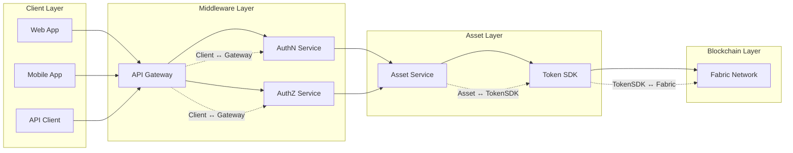
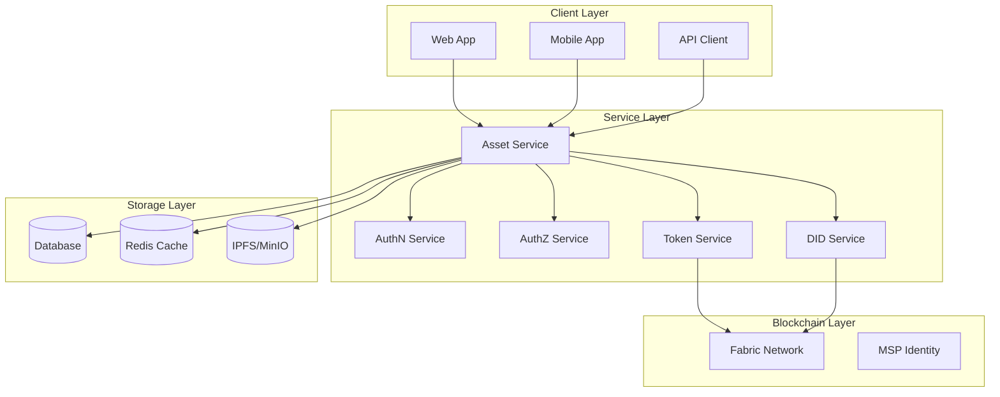
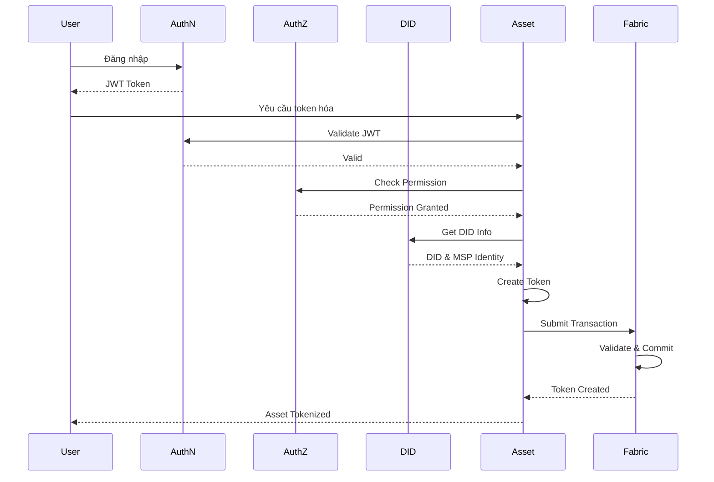
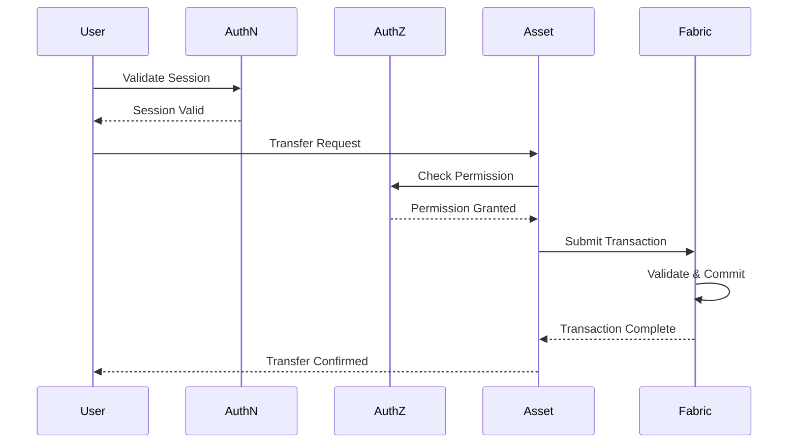
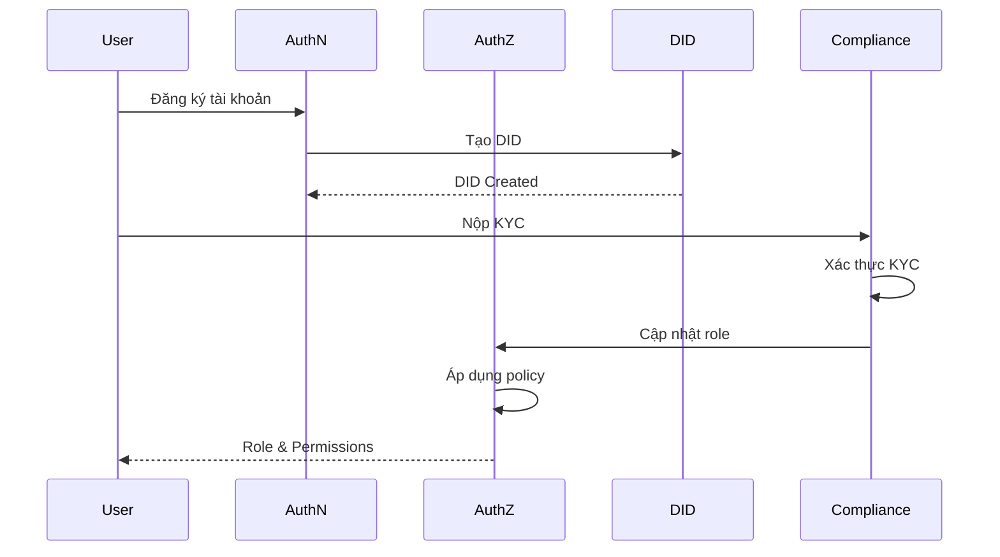
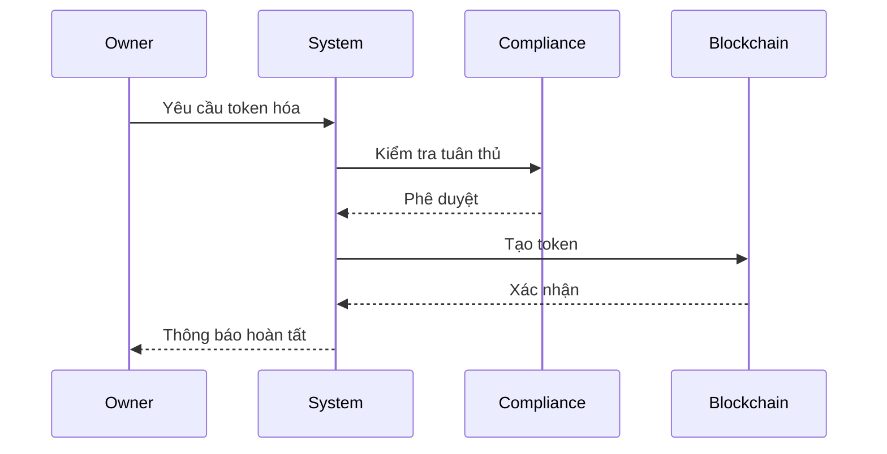
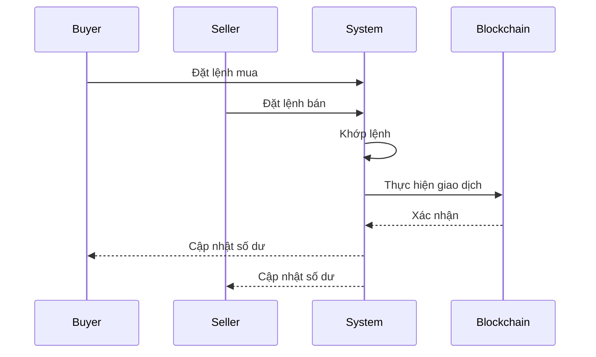

# Tài Liệu Yêu Cầu Chức Năng - Hệ Thống Quản Lý Tài Sản Số

## Mục lục
1. [Tổng quan](#1-tổng-quan)
2. [Kiến trúc hệ thống](#2-kiến-trúc-hệ-thống)
3. [Yêu cầu chức năng](#3-yêu-cầu-chức-năng)
4. [Yêu cầu phi chức năng](#4-yêu-cầu-phi-chức-năng)
5. [Interface giữa các Service](#5-interface-giữa-các-service)
6. [Vai trò người dùng và Phân quyền](#6-vai-trò-người-dùng-và-phân-quyền)
7. [Quy trình nghiệp vụ](#7-quy-trình-nghiệp-vụ)
8. [Triển khai và Vận hành](#8-triển-khai-và-vận-hành)

## 1. Tổng quan

### 1.1 Mục tiêu
Xây dựng hệ thống quản lý tài sản số (Digital Asset Service) tích hợp với các dịch vụ xác thực và phân quyền, hỗ trợ việc token hóa và quản lý tài sản truyền thống như bất động sản, chứng chỉ tiền gửi, và quỹ đầu tư.

### 1.2 Phạm vi
* Token hóa tài sản vật lý và tài chính
* Quản lý quyền sở hữu và giao dịch
* Tích hợp với AuthN Service cho xác thực người dùng
* Tích hợp với AuthZ Service cho phân quyền truy cập
* Tích hợp với DID Service cho quản lý danh tính

### 1.3 Đối tượng người dùng
* Chủ sở hữu tài sản
* Nhà đầu tư
* Quản trị viên hệ thống
* Đối tác và bên thứ ba

## 2. Kiến trúc hệ thống

### 2.1 Sơ đồ hệ thống tổng quan

#### 2.1.1 Sơ đồ high-level



#### 2.1.2 Sơ đồ chi tiết



### 2.2 Các thành phần chính

#### 2.2.1 Asset Service
* Quản lý thông tin tài sản và metadata
* Xử lý token hóa và quản lý vòng đời token thông qua Token SDK
* Xử lý giao dịch token trên Fabric Network
* Tích hợp với Fabric và DID Service
* Quản lý số dư và trạng thái

#### 2.2.2 Token Service
* Quản lý lifecycle của token tách biệt khỏi metadata tài sản
* Cung cấp chức năng: mint, burn, transfer, balance, history
* Tương tác với Hyperledger Fabric thông qua chaincode ERC-20 hoặc Token SDK
* Có khả năng mở rộng các chức năng như marketplace, staking, hoặc phân phối lợi nhuận

#### 2.2.3 Token SDK/Chaincode
* Cung cấp hàm logic chuẩn để mint, transfer, burn token
* Được gọi trực tiếp bởi Token Service
* Được đóng gói dưới dạng chaincode để triển khai lên Hyperledger Fabric
* Không phải là một service độc lập
* Cung cấp các hàm cơ bản cho token (mint, transfer, burn)
* Quản lý trạng thái token trên blockchain
* Xác thực giao dịch token
* Tích hợp với Fabric Network

#### 2.2.4 AuthN Service
* Xác thực người dùng
* Quản lý phiên
* Cấp phát JWT

#### 2.2.5 AuthZ Service
* Phân quyền truy cập
* Quản lý vai trò
* Kiểm tra quyền

#### 2.2.6 DID Service
* Quản lý danh tính
* Xác thực KYC
* Cấp phát MSP Identity

### 2.3 Luồng xử lý tài sản



### 2.4 Luồng giao dịch



## 3. Yêu cầu chức năng

### 3.1 Quản lý tài sản
* Tạo và cập nhật thông tin tài sản
* Token hóa tài sản
* Quản lý quyền sở hữu
* Theo dõi trạng thái tài sản

### 3.2 Quản lý token
* Phát hành token (mint)
* Hủy token (burn)
* Chuyển token (transfer)
* Quản lý số dư
* Lịch sử giao dịch

### 3.3 Quản lý người dùng
* Đăng ký và xác thực
* Phân quyền truy cập
* Quản lý danh tính
* KYC/AML

### 3.4 Giao dịch
* Đặt lệnh mua/bán
* Khớp lệnh
* Thực hiện giao dịch
* Xác nhận giao dịch

## 4. Yêu cầu phi chức năng

### 4.1 Hiệu năng
* Thời gian phản hồi < 500ms
* Xử lý đồng thời > 1000 TPS
* Độ trễ giao dịch < 2s

### 4.2 Bảo mật
* Mã hóa end-to-end
* Xác thực đa yếu tố
* Kiểm soát truy cập
* Audit logging

### 4.3 Khả năng mở rộng
* Horizontal scaling
* Load balancing
* Microservices architecture
* Container orchestration

### 4.4 Độ tin cậy
* High availability
* Fault tolerance
* Disaster recovery
* Data backup

## 5. Interface giữa các Service

### 5.1 Asset ↔ AuthN Interface

```protobuf
service AuthNService {
    // Xác thực JWT token
    rpc ValidateToken(ValidateTokenRequest) returns (ValidateTokenResponse);
    
    // Lấy thông tin người dùng từ token
    rpc GetUserInfo(GetUserInfoRequest) returns (GetUserInfoResponse);
    
    // Kiểm tra phiên làm việc
    rpc ValidateSession(ValidateSessionRequest) returns (ValidateSessionResponse);
}

message ValidateTokenRequest {
    string jwt_token = 1;
}

message ValidateTokenResponse {
    bool is_valid = 1;
    string user_id = 2;
    repeated string roles = 3;
    int64 expires_at = 4;
}

message GetUserInfoRequest {
    string user_id = 1;
}

message GetUserInfoResponse {
    string user_id = 1;
    string email = 2;
    string full_name = 3;
    repeated string roles = 4;
    bool is_active = 5;
}

message ValidateSessionRequest {
    string session_id = 1;
}

message ValidateSessionResponse {
    bool is_valid = 1;
    string user_id = 2;
    int64 expires_at = 3;
}
```

### 5.2 Asset ↔ AuthZ Interface

```protobuf
service AuthZService {
    // Kiểm tra quyền truy cập
    rpc CheckPermission(CheckPermissionRequest) returns (CheckPermissionResponse);
    
    // Lấy danh sách quyền của user
    rpc GetUserPermissions(GetUserPermissionsRequest) returns (GetUserPermissionsResponse);
    
    // Kiểm tra quyền sở hữu tài sản
    rpc CheckAssetOwnership(CheckAssetOwnershipRequest) returns (CheckAssetOwnershipResponse);
}

message CheckPermissionRequest {
    string user_id = 1;
    string resource = 2;
    string action = 3;
}

message CheckPermissionResponse {
    bool allowed = 1;
    string reason = 2;
}

message GetUserPermissionsRequest {
    string user_id = 1;
}

message GetUserPermissionsResponse {
    repeated string permissions = 1;
    map<string, string> constraints = 2;
}

message CheckAssetOwnershipRequest {
    string user_id = 1;
    string asset_id = 2;
}

message CheckAssetOwnershipResponse {
    bool is_owner = 1;
    string ownership_type = 2; // FULL, PARTIAL, NONE
    double ownership_percentage = 3;
}
```

### 5.3 Asset ↔ DID Interface

```protobuf
service AssetService {
    // Tạo tài sản mới
    rpc CreateAsset(CreateAssetRequest) returns (CreateAssetResponse);
    
    // Cập nhật thông tin tài sản
    rpc UpdateAsset(UpdateAssetRequest) returns (UpdateAssetResponse);
    
    // Lấy thông tin tài sản
    rpc GetAsset(GetAssetRequest) returns (GetAssetResponse);
    
    // Xác thực quyền sở hữu
    rpc VerifyOwnership(VerifyOwnershipRequest) returns (VerifyOwnershipResponse);
}

message CreateAssetRequest {
    string owner_did = 1;
    AssetType asset_type = 2;
    string metadata_uri = 3;
    map<string, string> properties = 4;
}

message CreateAssetResponse {
    string asset_id = 1;
    string token_id = 2;
    string status = 3;
}

enum AssetType {
    REAL_ESTATE = 0;
    CERTIFICATE_OF_DEPOSIT = 1;
    INVESTMENT_FUND = 2;
    STABLECOIN = 3;
}
```

### 5.4 Lưu ý triển khai

* **gRPC Communication**:
  * Sử dụng gRPC cho tất cả internal service communication
  * Implement retry mechanism cho các gọi service
  * Sử dụng circuit breaker pattern
  * Implement timeout cho mọi request

* **Error Handling**:
  * Định nghĩa rõ error codes cho từng service
  * Implement proper error propagation
  * Log đầy đủ thông tin lỗi
  * Có cơ chế retry cho các lỗi tạm thời

* **Security**:
  * Mã hóa tất cả internal communication
  * Implement service-to-service authentication
  * Validate input data
  * Rate limiting cho mọi endpoint

* **Monitoring**:
  * Track latency cho mọi service call
  * Monitor error rates
  * Alert khi có vấn đề
  * Log đầy đủ thông tin cho debugging

## 6. Vai trò người dùng và Phân quyền

### 6.1 Định nghĩa vai trò

```protobuf
enum UserRole {
    // Vai trò quản trị hệ thống
    SYSTEM_ADMIN = 0;      // Quản trị viên hệ thống
    COMPLIANCE_OFFICER = 1; // Nhân viên tuân thủ
    AUDITOR = 2;           // Kiểm toán viên
    
    // Vai trò quản lý tài sản
    ASSET_OWNER = 10;      // Chủ sở hữu tài sản
    ASSET_MANAGER = 11;    // Người quản lý tài sản
    ASSET_OPERATOR = 12;   // Người vận hành tài sản
    
    // Vai trò đầu tư
    INVESTOR = 20;         // Nhà đầu tư
    INSTITUTIONAL_INVESTOR = 21; // Nhà đầu tư tổ chức
    RETAIL_INVESTOR = 22;  // Nhà đầu tư cá nhân
    
    // Vai trò đối tác
    BROKER = 30;           // Môi giới
    CUSTODIAN = 31;        // Người giữ tài sản
    LEGAL_ADVISOR = 32;    // Cố vấn pháp lý
}
```

### 6.2 Quyền hạn theo vai trò

#### 6.2.1 Quản trị hệ thống
* **SYSTEM_ADMIN**:
  * Quản lý toàn bộ hệ thống
  * Cấu hình các tham số hệ thống
  * Quản lý người dùng và vai trò
  * Xem toàn bộ logs và metrics
  * Có quyền cao nhất trong hệ thống

* **COMPLIANCE_OFFICER**:
  * Xem xét và phê duyệt KYC
  * Giám sát các giao dịch
  * Báo cáo tuân thủ
  * Đánh giá rủi ro
  * Không có quyền thay đổi cấu hình hệ thống

* **AUDITOR**:
  * Xem toàn bộ lịch sử giao dịch
  * Truy xuất logs hệ thống
  * Tạo báo cáo kiểm toán
  * Không có quyền thực hiện thay đổi

#### 6.2.2 Quản lý tài sản
* **ASSET_OWNER**:
  * Tạo và quản lý tài sản
  * Phát hành token
  * Quyết định chính sách phân phối
  * Xem báo cáo tài sản
  * Không thể thay đổi cấu hình hệ thống

* **ASSET_MANAGER**:
  * Quản lý hoạt động tài sản
  * Thực hiện giao dịch
  * Tạo báo cáo quản lý
  * Không thể phát hành token mới

* **ASSET_OPERATOR**:
  * Thực hiện các hoạt động vận hành
  * Cập nhật trạng thái tài sản
  * Không có quyền quản lý tài chính

#### 6.2.3 Nhà đầu tư
* **INVESTOR** (Base role):
  * Xem thông tin tài sản
  * Thực hiện giao dịch
  * Xem báo cáo đầu tư
  * Không thể tạo tài sản mới

* **INSTITUTIONAL_INVESTOR**:
  * Tất cả quyền của INVESTOR
  * Giao dịch số lượng lớn
  * Truy cập API riêng
  * Yêu cầu KYC nâng cao

* **RETAIL_INVESTOR**:
  * Giao dịch giới hạn
  * Truy cập thông tin cơ bản
  * Yêu cầu KYC cơ bản

#### 6.2.4 Đối tác
* **BROKER**:
  * Tạo và quản lý đơn hàng
  * Xem thông tin thị trường
  * Không thể thực hiện giao dịch trực tiếp

* **CUSTODIAN**:
  * Quản lý tài sản vật lý
  * Xác nhận quyền sở hữu
  * Không có quyền giao dịch

* **LEGAL_ADVISOR**:
  * Xem tài liệu pháp lý
  * Tạo báo cáo pháp lý
  * Không có quyền thực hiện thay đổi

### 6.3 Quy trình phân quyền



### 6.4 Policy Management

```protobuf
message RolePolicy {
    string role = 1;
    repeated string permissions = 2;
    map<string, string> constraints = 3;
    int64 max_transaction_amount = 4;
    repeated string allowed_asset_types = 5;
}

message UserPolicy {
    string user_id = 1;
    string role = 2;
    KYCStatus kyc_status = 3;
    repeated string additional_permissions = 4;
    map<string, string> custom_constraints = 5;
}
```

### 6.5 Lưu ý triển khai

* **Role Hierarchy**:
  * Implement role inheritance
  * Hỗ trợ custom roles
  * Có thể override permissions
  * Audit log cho mọi thay đổi

* **KYC Integration**:
  * KYC level ảnh hưởng đến quyền
  * Tự động cập nhật role sau KYC
  * Hỗ trợ KYC nâng cao
  * Lưu trữ KYC history

* **Compliance**:
  * Kiểm tra tuân thủ theo role
  * Giới hạn giao dịch theo role
  * Báo cáo vi phạm
  * Alert khi có bất thường

* **Monitoring**:
  * Track role changes
  * Monitor permission usage
  * Alert on policy violations
  * Regular compliance reports

## 7. Quy trình nghiệp vụ

### 7.1 Quy trình token hóa tài sản


### 7.2 Quy trình giao dịch


## 8. Triển khai và Vận hành

### 8.1 Yêu cầu triển khai
* Kubernetes cluster
* Hyperledger Fabric network
* Database cluster
* Monitoring system

### 8.2 Quy trình vận hành
* Monitoring và alerting
* Backup và restore
* Scaling và load balancing
* Security patching

### 8.3 Kế hoạch triển khai
* Phase 1: Core services
* Phase 2: Token management
* Phase 3: Trading features
* Phase 4: Advanced features

*Cập nhật: 31/05/2025*
