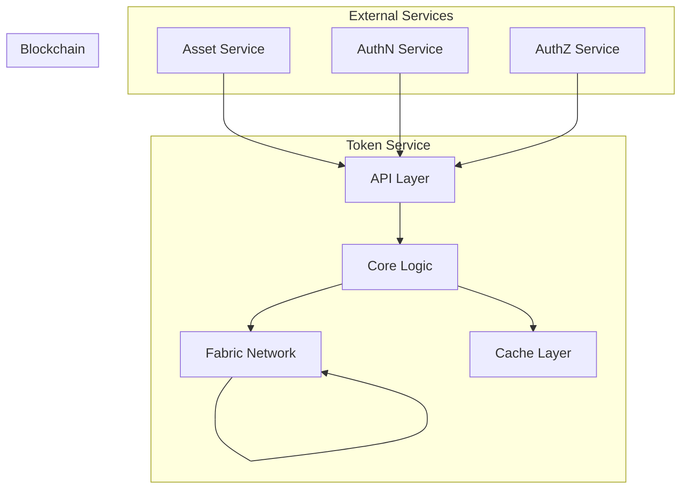

# Tài Liệu Yêu Cầu Chức Năng - Token Service

## Mục lục
1. [Tổng quan](#1-tổng-quan)
2. [Kiến trúc](#2-kiến-trúc)
3. [Yêu cầu chức năng](#3-yêu-cầu-chức-năng)
4. [API Specification](#4-api-specification)
5. [Xử lý lỗi](#5-xử-lý-lỗi)
6. [Monitoring và Logging](#6-monitoring-và-logging)
7. [Yêu cầu phi chức năng](#7-yêu-cầu-phi-chức-năng)

## 1. Tổng quan

### 1.1 Mục tiêu
Token Service là thành phần trung tâm trong hệ thống quản lý tài sản số, chịu trách nhiệm quản lý vòng đời của token, bao gồm việc tạo mới, chuyển giao, và hủy token. Service này đảm bảo tính toàn vẹn và bảo mật của các giao dịch token trên blockchain.

### 1.2 Phạm vi
* Quản lý vòng đời token (mint, burn, transfer)
* Tương tác với Hyperledger Fabric
* Quản lý số dư và lịch sử giao dịch
* Tích hợp với các service khác (Asset, AuthN, AuthZ)

### 1.3 Đối tượng người dùng
* Asset Service
* Trading Service
* Compliance Service
* Admin Dashboard

## 2. Kiến trúc

### 2.1 Sơ đồ kiến trúc



### 2.2 Các thành phần chính

#### 2.2.1 API Layer
* RESTful API endpoints
* gRPC service definitions
* Request validation
* Response formatting

#### 2.2.2 Core Logic
* Token lifecycle management
* Transaction processing
* Balance management
* History tracking

#### 2.2.3 Fabric Client
* Chaincode interaction
* Transaction submission
* Event listening
* State querying

#### 2.2.4 Cache Layer
* Balance caching
* Transaction history caching
* State caching

## 3. Yêu cầu chức năng

### 3.1 Token Management

#### 3.1.1 Mint Token
* Tạo token mới cho tài sản
* Xác thực quyền mint
* Ghi log audit
* Cập nhật số dư

#### 3.1.2 Burn Token
* Hủy token
* Xác thực quyền burn
* Ghi log audit
* Cập nhật số dư

#### 3.1.3 Transfer Token
* Chuyển token giữa các địa chỉ
* Xác thực số dư
* Kiểm tra quyền
* Ghi log audit

### 3.2 Balance Management

#### 3.2.1 Get Balance
* Lấy số dư token
* Cache optimization
* Real-time updates

#### 3.2.2 Balance History
* Lịch sử số dư
* Filtering options
* Pagination support

### 3.3 Transaction Management

#### 3.3.1 Transaction History
* Lịch sử giao dịch
* Filtering và sorting
* Export functionality

#### 3.3.2 Transaction Status
* Real-time status updates
* Transaction confirmation
* Error handling

## 4. API Specification

### 4.1 REST API Endpoints

#### 4.1.1 Token Operations

```http
POST /api/v1/tokens/mint
POST /api/v1/tokens/burn
POST /api/v1/tokens/transfer
GET /api/v1/tokens/{tokenId}
GET /api/v1/tokens/{tokenId}/balance
GET /api/v1/tokens/{tokenId}/history
```

#### 4.1.2 Transaction Operations

```http
GET /api/v1/transactions/{txId}
GET /api/v1/transactions
POST /api/v1/transactions/batch
```

### 4.2 gRPC Service Definition

```protobuf
service TokenService {
    // Token Operations
    rpc MintToken(MintTokenRequest) returns (MintTokenResponse);
    rpc BurnToken(BurnTokenRequest) returns (BurnTokenResponse);
    rpc TransferToken(TransferTokenRequest) returns (TransferTokenResponse);
    
    // Balance Operations
    rpc GetBalance(GetBalanceRequest) returns (GetBalanceResponse);
    rpc GetBalanceHistory(GetBalanceHistoryRequest) returns (GetBalanceHistoryResponse);
    
    // Transaction Operations
    rpc GetTransaction(GetTransactionRequest) returns (GetTransactionResponse);
    rpc GetTransactionHistory(GetTransactionHistoryRequest) returns (GetTransactionHistoryResponse);
}

message MintTokenRequest {
    string asset_id = 1;
    string owner_did = 2;
    double amount = 3;
    string reason = 4;
}

message TransferTokenRequest {
    string token_id = 1;
    string from_did = 2;
    string to_did = 3;
    double amount = 4;
    string reason = 5;
}
```

## 5. Xử lý lỗi

### 5.1 Error Codes

```protobuf
enum ErrorCode {
    // General Errors
    UNKNOWN_ERROR = 0;
    INVALID_REQUEST = 1;
    UNAUTHORIZED = 2;
    FORBIDDEN = 3;
    
    // Token Errors
    TOKEN_NOT_FOUND = 100;
    INSUFFICIENT_BALANCE = 101;
    INVALID_AMOUNT = 102;
    DUPLICATE_TRANSACTION = 103;
    
    // Blockchain Errors
    BLOCKCHAIN_ERROR = 200;
    TRANSACTION_FAILED = 201;
    NETWORK_ERROR = 202;
}
```

### 5.2 Error Response Format

```json
{
    "error": {
        "code": "INSUFFICIENT_BALANCE",
        "message": "Insufficient token balance",
        "details": {
            "current_balance": "100.00",
            "required_amount": "150.00"
        }
    }
}
```

## 6. Monitoring và Logging

### 6.1 Metrics

#### 6.1.1 Service Metrics
* Request rate
* Response time
* Error rate
* Active connections

#### 6.1.2 Token Metrics
* Mint rate
* Burn rate
* Transfer volume
* Active token holders

#### 6.1.3 Blockchain Metrics
* Transaction throughput
* Block confirmation time
* Network latency
* Peer status

### 6.2 Logging

#### 6.2.1 Log Levels
* ERROR: Lỗi nghiêm trọng
* WARN: Cảnh báo
* INFO: Thông tin hoạt động
* DEBUG: Thông tin debug

#### 6.2.2 Log Format
```json
{
    "timestamp": "2024-03-20T10:00:00Z",
    "level": "INFO",
    "service": "token-service",
    "operation": "transfer",
    "token_id": "123",
    "from": "did:example:123",
    "to": "did:example:456",
    "amount": "100.00",
    "transaction_id": "tx123"
}
```

## 7. Yêu cầu phi chức năng

### 7.1 Hiệu năng
* Thời gian phản hồi < 200ms
* Xử lý > 1000 TPS
* Độ trễ giao dịch < 2s
* Cache hit ratio > 90%

### 7.2 Bảo mật
* Mã hóa end-to-end
* Xác thực mọi request
* Rate limiting
* Audit logging

### 7.3 Khả năng mở rộng
* Horizontal scaling
* Load balancing
* Database sharding
* Cache distribution

### 7.4 Độ tin cậy
* 99.99% uptime
* Automatic failover
* Data consistency
* Transaction atomicity

### 7.5 Compliance
* KYC/AML integration
* Transaction monitoring
* Regulatory reporting
* Audit trail

## 8. Triển khai

### 8.1 Yêu cầu hệ thống
* Kubernetes cluster
* Redis cluster
* PostgreSQL database
* Monitoring stack

### 8.2 Quy trình triển khai
1. Development
2. Testing
3. Staging
4. Production

### 8.3 Monitoring
* Prometheus metrics
* Grafana dashboards
* Alerting rules
* Log aggregation

### 8.4 Backup và Recovery
* Database backup
* State backup
* Disaster recovery
* Business continuity

*Cập nhật: 20/03/2024* 