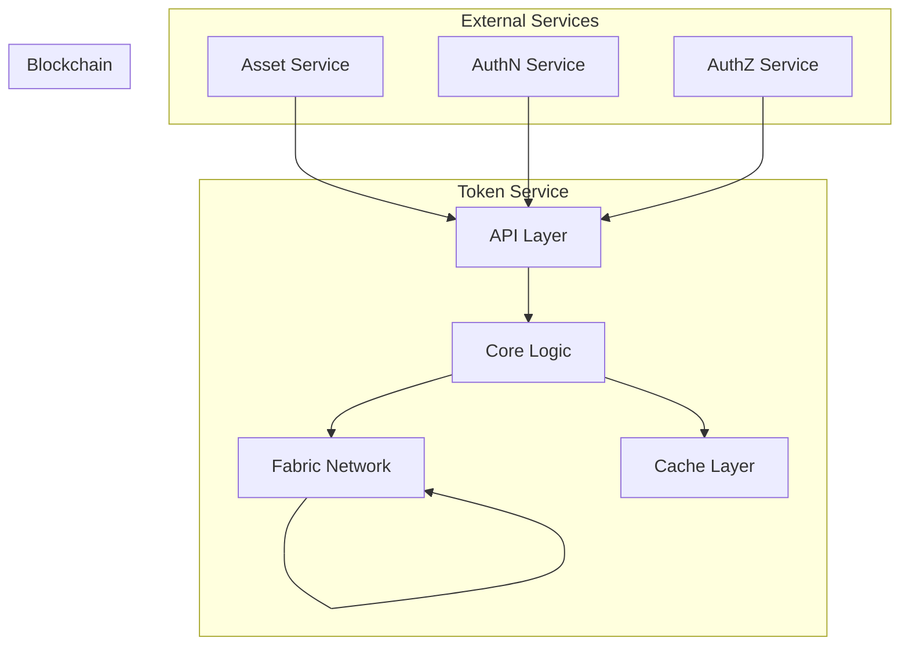
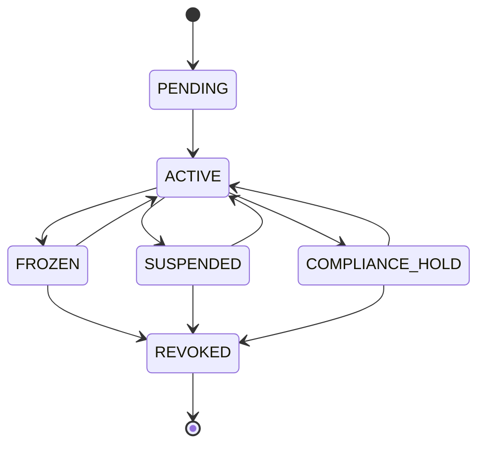
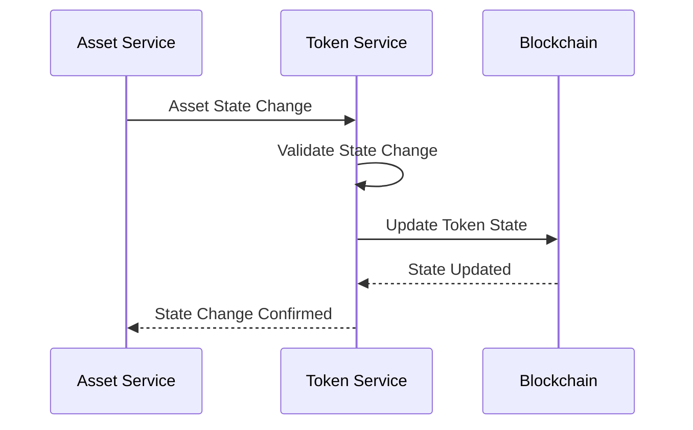

# Tài Liệu Yêu Cầu Chức Năng - Token Service

## Mục lục
1. [Tổng quan](#1-tổng-quan)
2. [Kiến trúc](#2-kiến-trúc)
3. [Yêu cầu chức năng](#3-yêu-cầu-chức-năng)
4. [API Specification](#4-api-specification)
5. [Xử lý lỗi](#5-xử-lý-lỗi)
6. [Monitoring và Logging](#6-monitoring-và-logging)
7. [Yêu cầu phi chức năng](#7-yêu-cầu-phi-chức-năng)
8. [Tích hợp với Asset Service](#9-tích-hợp-với-asset-service)

## 1. Tổng quan

### 1.1 Mục tiêu
Token Service là thành phần trung tâm trong hệ thống quản lý tài sản số, chịu trách nhiệm quản lý vòng đời của token, bao gồm việc tạo mới, chuyển giao, và hủy token. Service này đảm bảo tính toàn vẹn và bảo mật của các giao dịch token trên blockchain.

### 1.2 Phạm vi
* Quản lý vòng đời token (mint, burn, transfer)
* Tương tác với Hyperledger Fabric
* Quản lý số dư và lịch sử giao dịch
* Tích hợp với các service khác (Asset, AuthN, AuthZ)

### 1.3 Đối tượng người dùng
* Asset Service
* Trading Service
* Compliance Service
* Admin Dashboard

## 2. Kiến trúc

### 2.1 Sơ đồ kiến trúc



### 2.2 Các thành phần chính

#### 2.2.1 API Layer
* RESTful API endpoints
* gRPC service definitions
* Request validation
* Response formatting

#### 2.2.2 Core Logic
* Token lifecycle management
* Transaction processing
* Balance management
* History tracking

#### 2.2.3 Fabric Client
* Chaincode interaction
* Transaction submission
* Event listening
* State querying

#### 2.2.4 Cache Layer
* Balance caching
* Transaction history caching
* State caching

### 2.3 Mở rộng hỗ trợ các chuẩn token

#### 2.3.1 Soulbound Token (SBT)
* Token không thể chuyển nhượng, gắn vĩnh viễn với một DID (chứng chỉ, danh hiệu, KYC...)
* Hỗ trợ mint, revoke/burn, lưu trữ metadata chứng chỉ
* API gợi ý: mint-soulbound, revoke, kiểm tra trạng thái SBT

#### 2.3.2 Fractional NFT
* Chia nhỏ quyền sở hữu NFT thành nhiều phần nhỏ (fractional token, thường dựa trên ERC20)
* Hỗ trợ fractionalize, transfer/trade, redeem NFT gốc
* Quản lý mapping giữa NFT gốc và fractional token, lock NFT khi fractionalize

#### 2.3.3 ERC4626 (Vault/DeFi)
* Chuẩn vault cho DeFi: gửi/rút tài sản vào vault, nhận share token đại diện
* Hỗ trợ deposit, withdraw, reward calculation, minh bạch phần thưởng
* Tích hợp smart contract chuẩn ERC4626

#### 2.3.4 ERC777 (Token nâng cao)
* Chuẩn token nâng cấp ERC20, hỗ trợ operator, hooks (callback), gửi dữ liệu kèm giao dịch
* Hỗ trợ mint, operator, send-with-data, kiểm tra bảo mật khi dùng operator/hook

#### 2.3.5 Chuẩn token của blockchain khác (Multi-chain)
* Hỗ trợ các chuẩn token ngoài Ethereum: BEP20 (BSC), SPL (Solana), TRC20 (Tron), CW20 (Cosmos)...
* Hỗ trợ mint/burn/transfer cho từng chuẩn, cross-chain bridge, module adapter cho từng blockchain
* Quản lý mapping token giữa các chain, đảm bảo bảo mật khi tích hợp bridge

## 3. Yêu cầu chức năng

### 3.1 Token Management

#### 3.1.1 Token States
```protobuf
enum TokenState {
    ACTIVE = 0;           // Token đang hoạt động bình thường
    FROZEN = 1;          // Token bị đóng băng tạm thời
    SUSPENDED = 2;       // Token bị tạm ngưng
    REVOKED = 3;         // Token bị thu hồi vĩnh viễn
    PENDING = 4;         // Token đang chờ xử lý
    COMPLIANCE_HOLD = 5; // Token đang bị giữ do vấn đề tuân thủ
}
```

#### 3.1.2 State Management
* **Freeze Token**
  * Đóng băng tạm thời token
  * Chỉ cho phép unfreeze bởi admin hoặc compliance officer
  * Ghi log audit cho mọi thay đổi trạng thái
  * Thông báo cho chủ sở hữu

* **Suspend Token**
  * Tạm ngưng hoạt động token
  * Yêu cầu lý do và thời gian tạm ngưng
  * Có thể tự động unfreeze sau thời gian định sẵn
  * Gửi thông báo cho các bên liên quan

* **Revoke Token**
  * Thu hồi vĩnh viễn token
  * Yêu cầu phê duyệt từ compliance officer
  * Không thể khôi phục sau khi revoke
  * Tạo báo cáo tuân thủ

* **Compliance Hold**
  * Tạm giữ token do vấn đề tuân thủ
  * Yêu cầu xác minh KYC/AML
  * Có thể kéo dài đến khi vấn đề được giải quyết
  * Tự động thông báo cho compliance team

#### 3.1.3 State Transition Rules


#### 3.1.4 State Change API
```http
POST /api/v1/tokens/{tokenId}/freeze
POST /api/v1/tokens/{tokenId}/unfreeze
POST /api/v1/tokens/{tokenId}/suspend
POST /api/v1/tokens/{tokenId}/revoke
POST /api/v1/tokens/{tokenId}/compliance-hold
```

#### 3.1.5 State Change Request Format
```json
{
    "reason": "Suspicious activity detected",
    "duration": "24h",  // Optional, for temporary states
    "metadata": {
        "compliance_case_id": "CASE123",
        "officer_id": "OFF123",
        "notes": "Pending investigation"
    }
}
```

#### 3.1.6 State Change Response Format
```json
{
    "token_id": "token123",
    "previous_state": "ACTIVE",
    "new_state": "FROZEN",
    "changed_at": "2024-03-20T10:00:00Z",
    "changed_by": "did:example:admin123",
    "reason": "Suspicious activity detected",
    "expires_at": "2024-03-21T10:00:00Z",  // For temporary states
    "transaction_id": "tx123"
}
```

#### 3.1.7 State Change Validation Rules
* Chỉ admin và compliance officer có quyền thay đổi trạng thái
* Mọi thay đổi trạng thái phải có lý do
* Thay đổi trạng thái phải được ghi log đầy đủ
* Thông báo cho chủ sở hữu token
* Tạo báo cáo tuân thủ khi cần thiết

#### 3.1.8 Error Handling for State Changes
```protobuf
enum TokenStateError {
    INVALID_STATE_TRANSITION = 0;
    UNAUTHORIZED_STATE_CHANGE = 1;
    INVALID_DURATION = 2;
    MISSING_REASON = 3;
    COMPLIANCE_CHECK_FAILED = 4;
    TOKEN_ALREADY_IN_STATE = 5;
}
```

#### 3.1.9 State Change Notifications
* Email notification cho chủ sở hữu
* In-app notification
* Compliance team alert
* Audit log entry
* Blockchain event emission

#### 3.1.1 Mint Token
* Tạo token mới cho tài sản
* Xác thực quyền mint
* Ghi log audit
* Cập nhật số dư

#### 3.1.2 Burn Token
* Hủy token
* Xác thực quyền burn
* Ghi log audit
* Cập nhật số dư

#### 3.1.3 Transfer Token
* Chuyển token giữa các địa chỉ
* Xác thực số dư
* Kiểm tra quyền
* Ghi log audit

### 3.2 Balance Management

#### 3.2.1 Get Balance
* Lấy số dư token
* Cache optimization
* Real-time updates

#### 3.2.2 Balance History
* Lịch sử số dư
* Filtering options
* Pagination support

### 3.3 Transaction Management

#### 3.3.1 Transaction History
* Lịch sử giao dịch
* Filtering và sorting
* Export functionality

#### 3.3.2 Transaction Status
* Real-time status updates
* Transaction confirmation
* Error handling

## 4. API Specification

### 4.1 REST API Endpoints

#### 4.1.1 Token Operations

```http
POST /api/v1/tokens/mint
POST /api/v1/tokens/burn
POST /api/v1/tokens/transfer
GET /api/v1/tokens/{tokenId}
GET /api/v1/tokens/{tokenId}/balance
GET /api/v1/tokens/{tokenId}/history
```

#### 4.1.2 Transaction Operations

```http
GET /api/v1/transactions/{txId}
GET /api/v1/transactions
POST /api/v1/transactions/batch
```

### 4.2 gRPC Service Definition

```protobuf
service TokenService {
    // Token Operations
    rpc MintToken(MintTokenRequest) returns (MintTokenResponse);
    rpc BurnToken(BurnTokenRequest) returns (BurnTokenResponse);
    rpc TransferToken(TransferTokenRequest) returns (TransferTokenResponse);
    
    // Balance Operations
    rpc GetBalance(GetBalanceRequest) returns (GetBalanceResponse);
    rpc GetBalanceHistory(GetBalanceHistoryRequest) returns (GetBalanceHistoryResponse);
    
    // Transaction Operations
    rpc GetTransaction(GetTransactionRequest) returns (GetTransactionResponse);
    rpc GetTransactionHistory(GetTransactionHistoryRequest) returns (GetTransactionHistoryResponse);
    
    // Asset Integration Operations
    rpc InitiateTokenization(InitiateTokenizationRequest) returns (InitiateTokenizationResponse);
    rpc ConfirmTokenization(ConfirmTokenizationRequest) returns (ConfirmTokenizationResponse);
    rpc SyncAssetState(SyncAssetStateRequest) returns (SyncAssetStateResponse);
    rpc GetAssetTokenStatus(GetAssetTokenStatusRequest) returns (GetAssetTokenStatusResponse);
    
    // Compliance Operations
    rpc CheckCompliance(CheckComplianceRequest) returns (CheckComplianceResponse);
    rpc ReportComplianceStatus(ReportComplianceStatusRequest) returns (ReportComplianceStatusResponse);
}

message MintTokenRequest {
    string asset_id = 1;
    string owner_did = 2;
    double amount = 3;
    string reason = 4;
}

message TransferTokenRequest {
    string token_id = 1;
    string from_did = 2;
    string to_did = 3;
    double amount = 4;
    string reason = 5;
}

// Asset Integration Messages
message InitiateTokenizationRequest {
    string asset_id = 1;
    string owner_did = 2;
    TokenType token_type = 3;
    double initial_supply = 4;
    map<string, string> metadata = 5;
}

message InitiateTokenizationResponse {
    string tokenization_id = 1;
    string status = 2;
    string message = 3;
    int64 expires_at = 4;
}

message ConfirmTokenizationRequest {
    string tokenization_id = 1;
    string asset_id = 2;
    string owner_did = 3;
    string transaction_hash = 4;
}

message ConfirmTokenizationResponse {
    string token_id = 1;
    string status = 2;
    string message = 3;
}

message SyncAssetStateRequest {
    string asset_id = 1;
    string token_id = 2;
    AssetState new_state = 3;
    string reason = 4;
    map<string, string> metadata = 5;
}

message SyncAssetStateResponse {
    string status = 1;
    string message = 2;
    string transaction_hash = 3;
}

// Compliance Messages
message CheckComplianceRequest {
    string asset_id = 1;
    string token_id = 2;
    ComplianceType compliance_type = 3;
    map<string, string> parameters = 4;
}

message CheckComplianceResponse {
    bool compliant = 1;
    repeated string violations = 2;
    string message = 3;
    map<string, string> details = 4;
}

message ReportComplianceStatusRequest {
    string asset_id = 1;
    string token_id = 2;
    ComplianceStatus status = 3;
    string report_id = 4;
    map<string, string> details = 5;
}

message ReportComplianceStatusResponse {
    string status = 1;
    string message = 2;
    int64 reported_at = 3;
}

// Enums
enum TokenType {
    ERC20 = 0;
    ERC721 = 1;
    ERC1155 = 2;
}

enum AssetState {
    ACTIVE = 0;
    FROZEN = 1;
    SUSPENDED = 2;
    REVOKED = 3;
    COMPLIANCE_HOLD = 4;
}

enum ComplianceType {
    KYC = 0;
    AML = 1;
    SANCTIONS = 2;
    REGULATORY = 3;
}

enum ComplianceStatus {
    COMPLIANT = 0;
    NON_COMPLIANT = 1;
    PENDING_REVIEW = 2;
    EXEMPTED = 3;
}
```

## 5. Xử lý lỗi

### 5.1 Error Codes

```protobuf
enum ErrorCode {
    // General Errors
    UNKNOWN_ERROR = 0;
    INVALID_REQUEST = 1;
    UNAUTHORIZED = 2;
    FORBIDDEN = 3;
    
    // Token Errors
    TOKEN_NOT_FOUND = 100;
    INSUFFICIENT_BALANCE = 101;
    INVALID_AMOUNT = 102;
    DUPLICATE_TRANSACTION = 103;
    
    // Blockchain Errors
    BLOCKCHAIN_ERROR = 200;
    TRANSACTION_FAILED = 201;
    NETWORK_ERROR = 202;
    
    // Token State Errors
    INVALID_STATE_TRANSITION = 300;
    UNAUTHORIZED_STATE_CHANGE = 301;
    INVALID_DURATION = 302;
    MISSING_REASON = 303;
    COMPLIANCE_CHECK_FAILED = 304;
    TOKEN_ALREADY_IN_STATE = 305;
}
```

### 5.2 Error Response Format

```json
{
    "error": {
        "code": "INSUFFICIENT_BALANCE",
        "message": "Insufficient token balance",
        "details": {
            "current_balance": "100.00",
            "required_amount": "150.00"
        }
    }
}
```

## 6. Monitoring và Logging

### 6.1 Metrics

#### 6.1.1 Service Metrics
* Request rate
* Response time
* Error rate
* Active connections

#### 6.1.2 Token Metrics
* Mint rate
* Burn rate
* Transfer volume
* Active token holders

#### 6.1.3 Blockchain Metrics
* Transaction throughput
* Block confirmation time
* Network latency
* Peer status

### 6.2 Logging

#### 6.2.1 Log Levels
* ERROR: Lỗi nghiêm trọng
* WARN: Cảnh báo
* INFO: Thông tin hoạt động
* DEBUG: Thông tin debug

#### 6.2.2 Log Format
```json
{
    "timestamp": "2024-03-20T10:00:00Z",
    "level": "INFO",
    "service": "token-service",
    "operation": "transfer",
    "token_id": "123",
    "from": "did:example:123",
    "to": "did:example:456",
    "amount": "100.00",
    "transaction_id": "tx123"
}
```

## 7. Yêu cầu phi chức năng

### 7.1 Hiệu năng
* Thời gian phản hồi < 200ms
* Xử lý > 1000 TPS
* Độ trễ giao dịch < 2s
* Cache hit ratio > 90%

### 7.2 Bảo mật
* Mã hóa end-to-end
* Xác thực mọi request
* Rate limiting
* Audit logging

### 7.3 Khả năng mở rộng
* Horizontal scaling
* Load balancing
* Database sharding
* Cache distribution

### 7.4 Độ tin cậy
* 99.99% uptime
* Automatic failover
* Data consistency
* Transaction atomicity

### 7.5 Compliance
* KYC/AML integration
* Transaction monitoring
* Regulatory reporting
* Audit trail

## 8. Triển khai

### 8.1 Yêu cầu hệ thống
* Kubernetes cluster
* Redis cluster
* PostgreSQL database
* Monitoring stack

### 8.2 Quy trình triển khai
1. Development
2. Testing
3. Staging
4. Production

### 8.3 Monitoring
* Prometheus metrics
* Grafana dashboards
* Alerting rules
* Log aggregation

### 8.4 Backup và Recovery
* Database backup
* State backup
* Disaster recovery
* Business continuity

*Cập nhật: 20/03/2024*

## 9. Tích hợp với Asset Service

### 9.1 Asset Service Integration

#### 9.1.1 Asset Events
```protobuf
message AssetEvent {
    string asset_id = 1;
    AssetEventType event_type = 2;
    string token_id = 3;
    string owner_did = 4;
    int64 timestamp = 5;
    map<string, string> metadata = 6;
}

enum AssetEventType {
    ASSET_CREATED = 0;
    ASSET_UPDATED = 1;
    ASSET_FROZEN = 2;
    ASSET_SUSPENDED = 3;
    ASSET_REVOKED = 4;
    ASSET_COMPLIANCE_HOLD = 5;
    ASSET_DELETED = 6;
}
```

#### 9.1.2 Asset-Token Mapping
```protobuf
message AssetTokenMapping {
    string asset_id = 1;
    string token_id = 2;
    TokenState token_state = 3;
    string owner_did = 4;
    int64 created_at = 5;
    int64 updated_at = 6;
    map<string, string> metadata = 7;
}
```

### 9.2 Asset Service API Integration

#### 9.2.1 Asset Service Endpoints
```http
GET /api/v1/assets/{assetId}/token
POST /api/v1/assets/{assetId}/tokenize
POST /api/v1/assets/{assetId}/detokenize
GET /api/v1/assets/{assetId}/token-history
```

#### 9.2.2 Asset Tokenization Request
```json
{
    "asset_id": "asset123",
    "owner_did": "did:example:123",
    "token_type": "ERC20",
    "initial_supply": 1000000,
    "metadata": {
        "asset_type": "REAL_ESTATE",
        "location": "123 Main St",
        "valuation": 1000000
    }
}
```

#### 9.2.3 Asset Tokenization Response
```json
{
    "asset_id": "asset123",
    "token_id": "token123",
    "token_address": "0x123...",
    "initial_supply": 1000000,
    "owner_did": "did:example:123",
    "status": "SUCCESS",
    "transaction_id": "tx123"
}
```

### 9.3 Asset-Token State Synchronization

#### 9.3.1 State Synchronization Rules
* Token state phải đồng bộ với Asset state
* Asset bị frozen → Token bị frozen
* Asset bị suspended → Token bị suspended
* Asset bị revoked → Token bị revoked
* Asset compliance hold → Token compliance hold

#### 9.3.2 State Change Flow


### 9.4 Error Handling

#### 9.4.1 Asset Integration Errors
```protobuf
enum AssetIntegrationError {
    ASSET_NOT_FOUND = 400;
    ASSET_ALREADY_TOKENIZED = 401;
    INVALID_ASSET_STATE = 402;
    TOKENIZATION_FAILED = 403;
    DETOKENIZATION_FAILED = 404;
    STATE_SYNC_FAILED = 405;
}
```

#### 9.4.2 Error Response Format
```json
{
    "error": {
        "code": "ASSET_ALREADY_TOKENIZED",
        "message": "Asset is already tokenized",
        "details": {
            "asset_id": "asset123",
            "existing_token_id": "token123",
            "tokenized_at": "2024-03-20T10:00:00Z"
        }
    }
}
```

### 9.5 Monitoring và Logging

#### 9.5.1 Asset-Token Metrics
* Tokenization success rate
* State synchronization latency
* Asset-Token mapping accuracy
* Integration error rate

#### 9.5.2 Integration Log Format
```json
{
    "timestamp": "2024-03-20T10:00:00Z",
    "event_type": "ASSET_TOKENIZED",
    "asset_id": "asset123",
    "token_id": "token123",
    "source_service": "asset-service",
    "target_service": "token-service",
    "status": "SUCCESS",
    "duration_ms": 150,
    "metadata": {
        "asset_type": "REAL_ESTATE",
        "token_type": "ERC20"
    }
}
```

### 9.6 Compliance và Audit

#### 9.6.1 Asset-Token Compliance Rules
* Mọi thay đổi trạng thái phải được ghi log
* Yêu cầu phê duyệt cho các thay đổi quan trọng
* Tạo báo cáo tuân thủ định kỳ
* Lưu trữ lịch sử thay đổi

#### 9.6.2 Audit Trail
* Asset creation và tokenization
* State changes
* Ownership changes
* Compliance actions

### 9.7 Recovery và Rollback

#### 9.7.1 Recovery Procedures
* Asset-Token state mismatch recovery
* Failed tokenization recovery
* State synchronization recovery
* Transaction rollback

#### 9.7.2 Rollback Rules
* Chỉ cho phép rollback trong thời gian giới hạn
* Yêu cầu phê duyệt từ admin
* Ghi log đầy đủ quá trình rollback
* Thông báo cho các bên liên quan
